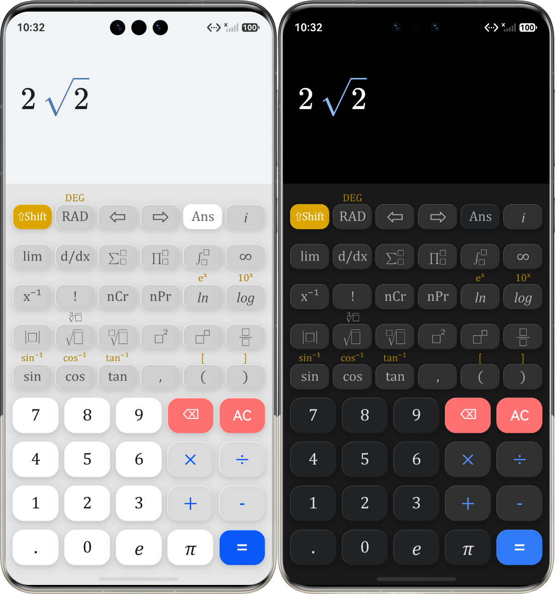

# CalculatorPro 🚀  
  
## 📝 项目简介  

CalculatorPro 是一款高性能专业科学计算器。本项目采用现代化的“前端 UI + Web 渲染 + 底层 C++ 计算”三层架构，致力于提供媲美实体科学计算器的交互体验和出版级的数学公式排版。  

  

## 💡 开发环境 

DevEco Studio (HarmonyOS)

## 🏗️ 核心架构体系  
  
本项目摒弃了传统的纯前端计算方案，采用深度融合架构：  
  
1. **🧠 UI 控制层 (ArkTS / ArkUI)**  
    * 采用声明式 UI 构建原生键盘与功能面板。  
   * 实现了完善的交互逻辑，包含 `⇧Shift` 状态机拦截、动态字体路由（根据功能按需切换 `Cambria Math` / `Cambria Italic` / 无衬线字体）。  
2. **🎨 渲染引擎层 (Web Component)**  
    * 采用 `Web` 组件挂载本地沙箱内的 HTML 文件。  
   * 核心渲染器使用全本地部署的 [MathLive](https://mathlive.io/) 库（`mathlive.min.js`），支持完全离线运行。  
   * 支持通过 ArkTS 的 `runJavaScript` 进行跨端 DOM 操作与光标控制。  
1. **⚙️ 计算引擎层 (C++ & N-API) 
    * 底层通过 `CMakeLists.txt` 配置，使用 C++ 进行硬核的高级数学计算。  
   * 计划实现对 LaTeX 字符串的 AST（抽象语法树）解析，并将计算结果通过 N-API 回传给 ArkTS 层。  
  
## 📂 核心目录结构  
  
```text  
CalculatorPro/  
├── entry/src/main/  
│   ├── ets/                           # ArkTS 前端逻辑层  
│   │   ├── pages/  
│   │   │   └── Index.ets              # 主页面：负责整体布局编排、状态流转以及与 Web 容器的跨端通信  
│   │   ├── components/  
│   │   │   ├── TopKeyboard.ets        # 自定义组件：上方科学计算与微积分键盘（支持 Shift 状态机）  
│   │   │   └── BottomKeyboard.ets     # 自定义组件：下方基础数字与四则运算键盘
│   │   └── utils/  
│   │       └── CalculatorConfigs.ets  # 配置文件：按键数组、SVG 资源声明、颜色/字体/字号等样式路由逻辑  
│   │  
│   ├── cpp/                           # C++ 底层计算引擎层 (N-API)
│   │   ├── CMakeLists.txt             # 编译配置：动态库链接与构建规则  
│   │   └── engine.cpp                 # 核心模块：目前包含 addFraction 概念验证，即将作为 LaTeX AST 解析器入口  
│   │  
│   └── resources/  
│       └── rawfile/                   # 本地 Web 沙箱渲染层  
│           ├── calculator.html        # MathLive 渲染容器：负责承载出版级数学公式的显示  
│           ├── mathlive.min.js        # 核心依赖：离线公式渲染库  
│           ├── fonts/                 # 字体资源：Cambria Math 等专属数学字体
│           └── math-icons/            # 图标资源：定制的积分、求和、根号等 SVG 图标  
```  
  
## 🚀 当前开发进度  

- [x] 完成 ArkTS 网格键盘布局，支持主功能与 ⇧Shift 副功能展示。  
- [x] 打通 ArkTS 与 Webview 的通信，实现所有纯文本按键和 SVG 图标向 MathLive 的 LaTeX 指令映射。  
- [x] 重构 Index.ets 代码，将文件拆分。
- [x] 尝试连接 C++ 引擎，实现 N-API 数据通信。  
- [x] 在 C++ 端编写或接入 AST 解析器，啃下 LaTeX 字符串。 
- [ ] 优化界面显示，将手绘按钮换成系统自带的组件，以实现系统光效、浅/深色模式等等。
- [ ] 添加“设置”功能，用户可以设定：角度制/弧度制、页面布局颜色等等。
- [ ] 添加“历史记录”功能。
- [ ] 待定