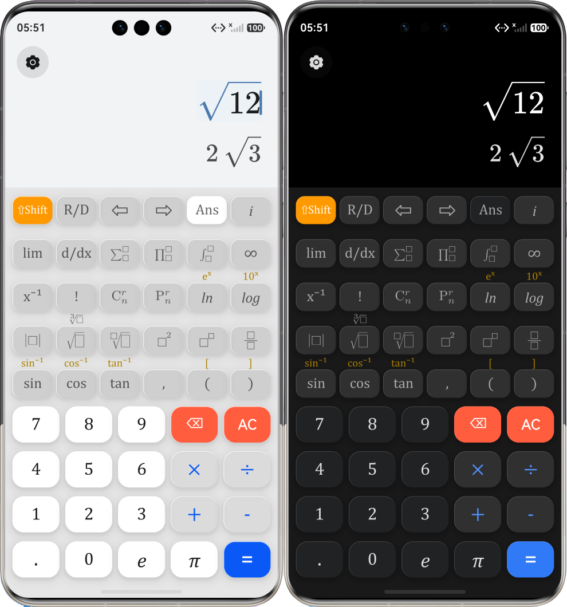

# CalculatorX 🚀  
  
## 📝 项目简介  
  
CalculatorX 是一款高性能专业科学计算器。本项目采用现代化的“前端 UI + Web 渲染 + C++ 计算”三层架构，致力于提供媲美实体科学计算器的交互体验和出版级的数学公式排版。 

## 🖼️界面展示

1. 深浅模式



2. 设置界面


3. 排列与组合选择样式


## 💡 开发环境  
  
DevEco Studio (HarmonyOS)  
  
## 🏗️ 核心架构体系  
  
本项目摒弃了传统的纯前端计算方案，采用深度融合架构:  
  
1. **🧠 UI 控制层 (ArkTS / ArkUI)**  
   * 采用声明式 UI 构建原生键盘与功能面板。  
   * 实现了完善的交互逻辑，包含 `⇧Shift` 状态机拦截、动态字体路由（根据功能按需切换 `Cambria Math` / `Cambria Italic` / 无衬线字体）。  
2. **🎨 渲染引擎层 (Web Component)**  
   * 采用 `Web` 组件挂载本地沙箱内的 HTML 文件。  
   * 核心渲染器使用全本地部署的 [MathLive](https://mathlive.io/) 库（`mathlive.min.js`），支持完全离线运行。  
   * 支持通过 ArkTS 的 `runJavaScript` 进行跨端 DOM 操作与光标控制。  
3. **⚙️ 计算引擎层 (C++ & N-API)  
   * 底层通过 `CMakeLists.txt` 配置，使用 C++ 进行硬核的高级数学计算。  
   * 计划实现对 LaTeX 字符串的 AST（抽象语法树）解析，并将计算结果通过 N-API 回传给 ArkTS 层。  
  
## 📂 核心目录结构  
  
```text  CalculatorX/  ├── AppScope/                              # 全局作用域配置  
│   ├── app.json5                          # 全局配置：定义了商业级专属包名 com.startyi.calcx 等  
│   └── resources/base/element/string.json # 全局字符串：定义了全局 app_name 为 CalcX│  
├── entry/src/main/  │   ├── ets/                               # ArkTS 前端逻辑与视图层  │   │   ├── pages/  │   │   │   ├── settings/                  # 设置相关页面  
│   │   │   │   ├── Settings.ets           # 设置主页  
│   │   │   │   └── About.ets              # 关于页  
│   │   │   ├── Index.ets                  # 主页面：处理按键逻辑、调用 Webview/C++，参数状态映射  
│   │   │   └── DocViewer.ets              # 文档展示页：系统级 WebView，负责加载云端协议网页  
│   │   │  
│   │   ├── components/  │   │   │   ├── TopKeyboard.ets            # 上方科学计算  │   │   │   └── BottomKeyboard.ets         # 下方基础数字与四则运算  
│   │   │  
│   │   └── utils/  │   │       └── CalculatorConfigs.ets      # 配置文件  
│   │  │   ├── cpp/                               # C++ 计算机代数系统 (CAS) 引擎层  
│   │   ├── CMakeLists.txt                 # 构建脚本：配置 N-API，链接 SymEngine 及 Boost│   │   ├── engine.cpp                     # 核心计算引擎  
│   │   ├── boost_1_82_0.tar.gz            # 离线依赖：纯头文件的高性能大数库 (供 SymEngine 使用)  
│   │   └── include/  │   │       └── json.hpp                   # 核心依赖：nlohmann/json，解析 MathJSON 字符串  
│   │  │   ├── resources/  │   │   ├── base/  
│   │   │   ├── profile/  
│   │   │   │   └── main_pages.json        # 页面注册表：已注册 settings/Settings 和 settings/About│   │   │   ├── media/  
│   │   │   │   └── calculator_logo.png    # 静态资源：真实的 App 图标  
│   │   │   └── element/  
│   │   │       └── string.json            # 局部字符串：定义了桌面图标显示的 EntryAbility_label (CalcX)│   │   │  
│   │   └── rawfile/                       # 本地 Web 沙箱渲染与降维层  │   │       ├── calculator.html            # MathLive 容器：负责 LaTeX 公式的高清渲染及 MathJSON 降维导出  
│   │       ├── mathlive.min.js            # 核心依赖：离线 Web 数学排版与解析库  │   │       ├── fonts/                     # 字体资源：专属数学字体  
│   │       └── math-icons/                # 图标资源：定制的积分、求和、根号等 SVG 图标  
│   │  
│   └── module.json5                       # 模块配置：声明了 ohos.permission.INTERNET 与 VIBRATE 权限  
│  
└── 外部云端部署 (calcx.startyi.com)        # 独立托管页面，由 App 内的 DocViewer.ets 拉取展示  
    ├── /help/index.html                   # 使用帮助  
    ├── /privacy/index.html                # 隐私声明  
    └── /agreement/index.html              # 用户协议  
```    
## 🚀 当前开发进度  
  
- [x] **基础 UI 构建**：完成 ArkTS 网格键盘布局，支持主功能与 ⇧Shift 副功能平滑切换与展示。  
- [x] **跨端通信打通**：实现 ArkTS 与 Webview 的双向通信，将纯文本按键和 SVG 图标精准映射为 MathLive 的 LaTeX 指令。  
- [x] **前端代码重构**：将臃肿的 `Index.ets` 成功拆分为独立的组件 (Components) 与配置文件 (Utils)，实现高内聚低耦合。  
- [x] **N-API 通道建立**：完成 ArkTS 向 C++ 引擎的数据通信链路搭建。  
- [x] **数据降维处理**：利用 Web 容器将复杂的二维 LaTeX 公式转化为结构化的 MathJSON，极大降低底层解析难度。  
- [x] **引入顶级 CAS 引擎**：克服交叉编译与网络环境障碍，在 C++ 端成功静态链接工业级计算机代数系统 **SymEngine** 与 **Boost** 库。  
- [x] **构建 C++ 解析翻译官**：手写 `parseAST` 引擎，支持将 MathJSON 完美转换为 SymEngine 内部的表达式树，涵盖四则运算、高阶根号、三角函数、对数及常数 (π, e)。  
- [x] **计算结果可视化闭环**：引擎实现精确符号计算（如自动展开多项式、化简根号），直接输出标准的 LaTeX 字符串返回给 Webview 实现完美排版。  
- [x] **异常处理**：构建健壮的拦截机制，将无法识别的节点优雅降级为 `Unknown_xxx` 代数符号并在前端渲染，杜绝闪退与静默失败。  
- [x] **原生 UI 动效重构**：将手绘区域替换为鸿蒙系统原生组件（如 `Button`），以无缝接入系统级点击光效、触控震动反馈。  
- [x] **深/浅色模式适配**：重构配色方案，跟随鸿蒙系统状态自动切换 Dark/Light 主题。  
- [x] **全局系统设置（添加“设置”功能）**：  
  - [x] 增加 **角度制 (Deg) / 弧度制 (Rad)** 状态机，并在 C++ 计算引擎中实现对应的三角函数传参逻辑转换。  
  - [x] 实现主题颜色、页面布局的自定义选项。  
- [ ] **历史记录功能**：实现计算过程（输入 LaTeX 与结果 LaTeX）的持久化存储与列表展示，并支持一键回填至当前计算器屏幕。  
- [ ] **进阶数学能力解锁** ：针对目前已跑通的 SymEngine，进一步放开高级指令（如 `Solve` 解方程、`Derivative` 求导、`Integral` 积分）的解析映射。  
- [ ] **待定**