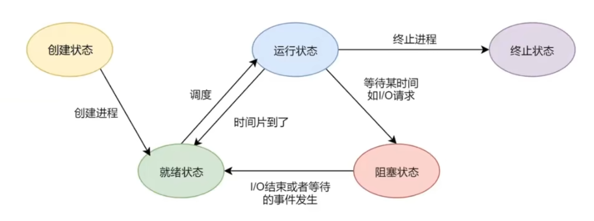

# 1 操作系统概述

#### 操作系统的特征
- **并发**：是指两个或多个活动在同一给定的时间间隔中进行
- **共享**：是指计算机系统中的资源被多个进程所共用
- **异步**：进程以不可预知的速度向前推进。
- **虚拟**：把一个物理上的实体变为若干个逻辑上的对应物。
- **最基本特征**：并发、共享(两者互为存在条件)

#### 操作系统的功能
- **处理机管理**：主要功能包括进程控制、进程同步、进程通信、死锁处理、处理机调度等。
- **存储器管理**：主要包括内存分配、地址映射、内存保护与共享和内存扩充等功能。
- **文件管理**：主要功能包括文件存储空间的管理、目录管理及文件读写管理和保护等。
- **设备管理**：主要包括缓冲管理、设备分配、设备处理和虚拟设备等功能。

#### 操作系统的历程
0. 手工操作阶段(此阶段无操作系统缺点:人机速度矛盾批处理阶段(操作系统开始出现)
1. **单道批处理阶段**：
   - 优点：缓解人机速度矛盾缺点：系统资源利用率依然低。
2. **多道批处理阶段**(操作系统正式诞生)
   - 优点：多道程序并发执行，资源利用率高缺点：不提供人机交互能力(缺少交互性）
3. **分时操作系统**(不可以插队，有了人机交互)
   - 优点:提供人机交互(交互性)缺点:不能优先处理紧急事务
4. **实时操作系统**(可以插队)
   - 硬实时系统：必须在被控制对象规定时间内完成(火箭发射)
   - 软实时系统：可以松一些(订票)
   - 优点:能优先处理紧急任务，从可靠性看实时操作系统更强，从交互性看分时操作系统更强

#### 基本概念
- 特权指令：不允许用户程序使用(只允许操作系统使用)如IO指令、中断指令
- 非特权指令:普通的运算指令
- 内核程序：系统的管理者，可执行一切指令、运行在核心态
- 应用程序：普通用户程序只能执行非特权指令，运行在用户态

#### 处理机状态
- 用户态(目态)：CPU只能执行非特权指令
- 核心态(又称管态、内核态):可以执行所有指令
- 用户态到核心态:通过中断(是硬件完成的)
- 核心态到用户态：特权指令psw的标志位，0用户态，1核心态(仅做了解)
- 常考谁在用户态执行，谁在核心态执行

#### 原语
1. 处在操作系统的最底层，是最接近硬件的部分
2. 这些程序的运行具有原子性，其操作只能一气呵成
3. 这些程序的运行时间都较短，而且调用频繁

#### 中断、系统调用、体系结构

- 内中断(异常，信号来自内部)
   - 自愿中断-----指令中断
   - 强迫中断：硬件中断、软件中断(eg:0除以0)
- 外中断(中断，信号来自外部)：外设请求、人工干预(打印机等)系统调用系统给程序员(应用程序)提供的唯一接口，可获得OS的服务，在用户态发生核心态处理
- 体系结构体系结构：大内核、微内核

# 2 进程管理 ⭐

## 2.1 进程的概念、状态、调度

#### 概念
- 从理论角度看，是对正在运行的程序过程的抽象：
- 从实现角度看，是一种数据结构，目的在于清晰地刻画动态系统的内在规律，有效管理和调度进入计算机系统主存储器运行的程序。
- **动态性**：进程的实质是程序在多道程序系统中的一次执行过程，进程是动态产生，动态消亡的。
- **并发性**：任何进程都可以同其他进程一起并发执行
- **独立性**：进程是一个能独立运行的基本单位，同时也是系统分配资源和调度的独立单位：
- **异步性**：由于进程间的相互制约，使进程具有执行的间断性，即进程按各自独立的、不可预知的速度向前推进
- 结构特征：PCB（进程控制）：保存进程运行期间相关的数据，是进程存在的唯一标志；程序段：能被进程调度到CPU的代码；数据段：存放数据

#### 进程的状态 ⭐⭐⭐
- 运行态：进程正在占用CPU
- 就绪态：进程已处于准备运行的状态，即进程获得了除处理机外的一切所需资源一旦得到处理机即可运行阻塞态:进程由于等待某一事件不能享用CPU
- 创建状态：进程正在被创建
- 结束状态：进程正在从系统消失
- 就绪态->运行态：处于就绪态的进程被调度后，获得处理机资源(分派处理机时间片)
- 运行态->就绪态：时间片用完或在可剥夺系统中有更高级的进程进入
- 运行态->阻塞态：进程需要的某一资源还没有准备好阻塞态->就绪态:进程等待的事件到来时

#### 程序、进程的区别
- 进程是动态的，程序是静态的，程序是有序代码的集合。
- 进程是程序的执行，进程是暂时的，程序的永久的，进程是一个状态变化的过程，程序可长久保存；
- 进程与程序的组成不同，进程的组成包括程序、数据和进程控制块(即进程状态信息)，通过多次执行，一个程序可对应多个进程，通过调用关系，一个进程可包括多个程序。

#### 处理机调度
是对处理机进行分配，即从就绪队列中按照定的算法(公平、高效)选择一个进程并将处理机分配给它运行，以实现进程并发地执行。

- 分类：高级调度(作业调度)、中级调度(内存置换)、低级调度(进程调度)
- 调度方式：剥夺式、非剥夺式
- 调度准则：CPU利用率、系统吞吐量、周转时间、等待时间、应时间
- 算法：
- 

## 2.2 进程的同步、互斥

## 2.3 线程的定义

**进程**是操作系统进行**资源分配**的最小单元，**线程**是操作系统进行**运算调度**的最小单元。

# 3 內存管理

# 4 文件系统

# 5 I/O设备管理

