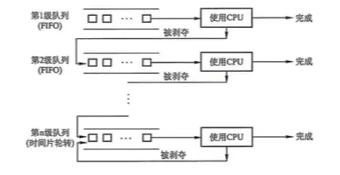
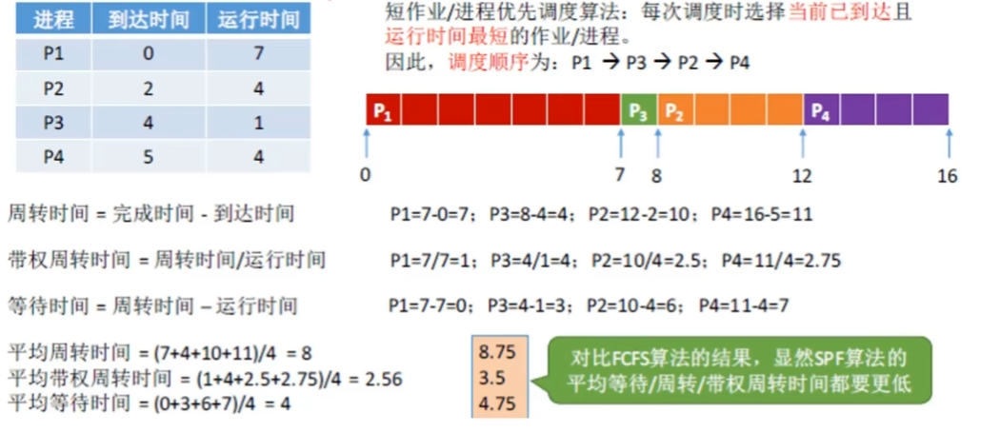

# 1 操作系统概述


#### 操作系统的特征
- **并发**：是指两个或多个活动在同一给定的时间间隔中进行
- **共享**：是指计算机系统中的资源被多个进程所共用
- **异步**：进程以不可预知的速度向前推进。
- **虚拟**：把一个物理上的实体变为若干个逻辑上的对应物。
- **最基本特征**：并发、共享(两者互为存在条件)

#### 操作系统的功能
- **处理机管理**：主要功能包括进程控制、进程同步、进程通信、死锁处理、处理机调度等。
- **存储器管理**：主要包括内存分配、地址映射、内存保护与共享和内存扩充等功能。
- **文件管理**：主要功能包括文件存储空间的管理、目录管理及文件读写管理和保护等。
- **设备管理**：主要包括缓冲管理、设备分配、设备处理和虚拟设备等功能。


#### 操作系统的历程
0. 手工操作阶段(此阶段无操作系统缺点:人机速度矛盾批处理阶段(操作系统开始出现)
1. **单道批处理阶段**：
   - 优点：缓解人机速度矛盾缺点：系统资源利用率依然低。
2. **多道批处理阶段**(操作系统正式诞生)
   - 优点：多道程序并发执行，资源利用率高缺点：不提供人机交互能力(缺少交互性）
3. **分时操作系统**(不可以插队，有了人机交互)
   - 优点:提供人机交互(交互性)缺点:不能优先处理紧急事务
4. **实时操作系统**(可以插队)
   - 硬实时系统：必须在被控制对象规定时间内完成(火箭发射)
   - 软实时系统：可以松一些(订票)
   - 优点:能优先处理紧急任务，从可靠性看实时操作系统更强，从交互性看分时操作系统更强

#### 基本概念
- 特权指令：不允许用户程序使用(只允许操作系统使用)如IO指令、中断指令
- 非特权指令:普通的运算指令
- 内核程序：系统的管理者，可执行一切指令、运行在核心态
- 应用程序：普通用户程序只能执行非特权指令，运行在用户态

#### 处理机状态
- 用户态(目态)：CPU只能执行非特权指令
- 核心态(又称管态、内核态):可以执行所有指令
- 用户态到核心态:通过中断(是硬件完成的)
- 核心态到用户态：特权指令psw的标志位，0用户态，1核心态(仅做了解)
- 常考谁在用户态执行，谁在核心态执行

#### 原语
1. 处在操作系统的最底层，是最接近硬件的部分
2. 这些程序的运行具有原子性，其操作只能一气呵成
3. 这些程序的运行时间都较短，而且调用频繁

#### 中断、系统调用、体系结构

- 内中断(异常，信号来自内部)
   - 自愿中断-----指令中断
   - 强迫中断：硬件中断、软件中断(eg:0除以0)
- 外中断(中断，信号来自外部)：外设请求、人工干预(打印机等)系统调用系统给程序员(应用程序)提供的唯一接口，可获得OS的服务，在用户态发生核心态处理
- 体系结构体系结构：大内核、微内核

# 2 进程管理 
#### 概念
- 从理论角度看，是对正在运行的程序过程的抽象：
- 从实现角度看，是一种数据结构，目的在于清晰地刻画动态系统的内在规律，有效管理和调度进入计算机系统主存储器运行的程序。
- **动态性**：进程的实质是程序在多道程序系统中的一次执行过程，进程是动态产生，动态消亡的。
- **并发性**：任何进程都可以同其他进程一起并发执行
- **独立性**：进程是一个能独立运行的基本单位，同时也是系统分配资源和调度的独立单位：
- **异步性**：由于进程间的相互制约，使进程具有执行的间断性，即进程按各自独立的、不可预知的速度向前推进
- 结构特征：PCB（进程控制）：保存进程运行期间相关的数据，是进程存在的唯一标志；程序段：能被进程调度到CPU的代码；数据段：存放数据

#### 进程的状态 ⭐⭐⭐
- 运行态：进程正在占用CPU
- 就绪态：进程已处于准备运行的状态，即进程获得了除处理机外的一切所需资源一旦得到处理机即可运行阻塞态:进程由于等待某一事件不能享用CPU
- 创建状态：进程正在被创建
- 结束状态：进程正在从系统消失
- 就绪态->运行态：处于就绪态的进程被调度后，获得处理机资源(分派处理机时间片)
- 运行态->就绪态：时间片用完或在可剥夺系统中有更高级的进程进入
- 运行态->阻塞态：进程需要的某一资源还没有准备好阻塞态->就绪态:进程等待的事件到来时


#### 程序、进程的区别
- 进程是动态的，程序是静态的，程序是有序代码的集合。
- 进程是程序的执行，进程是暂时的，程序的永久的，进程是一个状态变化的过程，程序可长久保存；
- 进程与程序的组成不同，进程的组成包括程序、数据和进程控制块(即进程状态信息)，通过多次执行，一个程序可对应多个进程，通过调用关系，一个进程可包括多个程序。

#### 处理机调度
是对处理机进行分配，即从就绪队列中按照定的算法(公平、高效)选择一个进程并将处理机分配给它运行，以实现进程并发地执行。

- 分类：高级调度(作业调度)、中级调度(内存置换)、低级调度(进程调度)
- 调度方式：剥夺式、非剥夺式
- 调度准则：CPU利用率、系统吞吐量、周转时间、等待时间、应时间
- 算法：
  - 先来先服务（FCFS）：将用户作业和就绪进程按提交顺序或变为就绪状态的先后排成队列，并按照先来先服务的方式进行调度处理，是一种最普遍和最简单的方法。它优先考虑在系统中等待时间最长的作业，而不管要求运行时间的长短。
  - 短作业优先（SJF）：该算法总是优先调度要求运行时间最短的作业。优先级调度算法：优先级高者先调度。
  - 高响应比优先调度算法时间片轮转（HRN）：最高响应比作业优先算法是对FCFS方式和SJF方式的一种综合平衡响应比R定义为系统对作业的响应时间与作业要求运行时间的比值。
  - 多级反馈队列调度算法：
  

#### 例题：⭐⭐⭐⭐⭐⭐

各进程到达就绪队列的时间、需要的运行时间如下表所示。使用**非抢占式**的**短作业优先**调度算法，计算各进程的等待时间、平均等待时间、周转时间、平均周转时间、带权周转时间、平均带权周转时间。



#### 进程同步

**进程同步**，就是操作系统制定的一套“交通规则”，用来协调多个并发执行的进程：

1. **防止撞车（互斥）**：确保不能同时共享的资源，大家排队轮流用。
2. **协调步伐（同步）**：确保需要合作的进程，能够按照正确的先后顺序执行。
##### 临界区的作用
- 保护共享资源：临界区通过互斥访问机制，确保在任意时刻只有一个线程能够访问和修改共享资源，从而保护资源的一致性和完整性。
- 防止竞态条件：竞态条件是指多个线程同时访问共享资源时，由于执行顺序的不确定性而导致程序结果不可预测的情况。临界区通过确保同一时间只有一个线程执行，从而避免了竞态条件的发生。
- 提高程序稳定性：通过合理设置临界区，可以减少并发程序中的错误和异常，提高程序的稳定性和可靠性。
- 临界区的实现通常依赖于同步机制，如**互斥锁（Mutex）、信号量（Semaphore）或条件变量（Condition Variable）**等
- 互斥锁（Mutex）：互斥锁是最常用的同步机制之一。当一个线程进入临界区时，它会获取一个互斥锁；当该线程退出临界区时，它会释放互斥锁。其他线程在尝试进入临界区时，如果互斥锁已被占用，则会被阻塞，直到互斥锁被释放。
- 信号量（Semaphore）：信号量是一种更通用的同步机制，它可以用来控制多个线程对多个资源的访问。在临界区场景中，信号量可以被设置为1，以模拟互斥锁的行为。
- 条件变量（Condition Variable）：条件变量通常与互斥锁一起使用，用于在多个线程之间传递信号。虽然条件变量本身不直接用于实现临界区，但它可以在线程等待进入临界区时提供有效的等待和唤醒机制

#### 临界区互斥

##### 1. 原则

- (1) **空间让进**：如果有若干进程要求进入空闲的临界区，一次仅允许一个进程进入。
- (2) **忙则等待**：任何时候，处于临界区内的进程不可多于一个。如已有进程进入自己的临界区，则其它所有试图进入临界区的进程必须等待。
- (3) **有限等待**：进入临界区的进程要在有限时间内退出，以便其它进程能及时进入自己的临界区。
- (4) **让权等待**：如果进程不能进入自己的临界区，则让出CPU，避免进程出现“忙等”现象。

##### 2. 基本方法

信号量：利用PV操作实现互斥。

用户进程可以通过使用操作系统提供的一对原语来对信号量进行操作，从而很方便地实现进程互斥、进程同步。信号量其实就是一个变量（可以是一个整数，也可以是更复杂的记录型变量），可以用一个信号量来表示系统中某种资源的数量。比如：系统中只有一台打印机，那就可以设置一个初始值为1的信号量。

信号量是操作系统提供的一种协调共享资源访问的方法。通常信号量表示资源的数量，对应的变量是一个整型（sem）变量。

##### 3. PV操作

还有两个原子操作的系统调用函数来控制信号量，分别是：

- **P 操作**：将 sem 减 1，相减后，如果 sem < 0，则进程/线程进入阻塞等待，否则继续。表明 P 操作可能会阻塞。
- **V 操作**：将 sem 加 1，相加后，如果 sem <= 0，唤醒一个等待中的进程/线程。表明 V 操作不会阻塞。

P 操作是用于在进入临界区之前，V 操作是用于在离开临界区之后，这两个操作是必须成对出现的。

##### 4. 原语

原语是一种特殊的程序段，由开/关中断指令实现，其执行只能一气呵成。


#### PV操作
##### P操作的主要动作是：
1. S减1；  
2. 若S减1后仍大于或等于0，则进程继续执行；  
3. 若S减1后小于0，则该进程被阻塞后放入等待该信号量的等待队列中，然后进程调度。
##### V操作的主要动作是：
1. S加1；  
2. 若S加1后结果大于0，则进程继续执行；  
3. 若S加1后结果小于或等于0，则从该信号量的等待队列中释放一个等待进程，然后再返回原进程继续执行或转进程调度。
##### 【题】什么是临界区？
答:每个进程中访问临界资源的(2分)那段代码(1分)称为临界区。
##### 【题】进程同步机制应遵循的原则/准则
空闲让进、忙则等待、有限等待、让权等待。
##### 【题】在操作系统中，实现进程同步的机制有
信号量机制、管程机制。

#### 生产者消费者问题 (Producer-consumer)

也称有限缓冲问题（Bounded-buffer problem），生产者的主要作用是生成一定量的数据放到缓冲区中，然后重复此过程。与此同时，消费者也在缓冲区消耗这些数据。该问题的关键就是要保证生产者不会在缓冲区满时加入数据，消费者也不会在缓冲区中空时消耗数据。

##### 问题分析：

- 在缓冲区为空时，消费者不能再进行消费  
- 在缓冲区为满时，生产者不能再进行生产  
- 在一个线程进行生产或消费时，其余线程不能再进行生产或消费等操作，即保持线程间的同步  
- 注意条件变量与互斥锁的顺序

##### PV操作解决生产者消费者问题

#### PV操作解决生产者消费者问题

生产者和消费者进程共享以下数据结构：

```c
int n;    // 缓冲池有n个缓冲区，每个缓冲区可存一个数据项
semaphore mutex = 1;    // 信号量 mutex 提供缓冲池访问的互斥要求，并初始化为1
semaphore empty = n;    // 信号量 empty 表示空的缓冲区数量
semaphore full = 0;    // 信号量 full 表示满的缓冲区数量
```

**生产者(producer)和消费者(consumer)** 进程结构：

```c
producer(){
    while(1){
        生成一个产品;
        P(empty); //消耗一个空闲缓冲区
        P(mutex);
        把产品放入缓冲区;
        V(mutex);
        V(full); //增加一个产品
    }
}

consumer(){
    while(1){
        P(full); //消耗一个产品
        P(mutex);
        从缓冲区取出一个产品;
        V(mutex);
        V(empty); //增加一个空闲缓冲区
        使用产品;
    }
}
```

#### 死锁

- 定义：多个进程因竞争资源而造成的一种僵局，如果没有外力，这些进程将无法推进  
- 产生的原因：非剥夺资源的竞争和进程的不恰当推进顺序  
- 解决方法（一定都要记住，尤其是预防死锁）  
  - (1) **预防死锁：**  
    - 破坏互斥条件  
    - 破坏不剥夺条件  
    - 破坏请求和保持条件  
    - 破坏循环等待条件  
  - (2) 避免死锁：安全状态、银行家算法  
  - (3) 检测死锁：利用死锁定理  
  - (4) 解除死锁：资源剥夺法、撤销进程法、进程回退法

【题】设某类资源有5个，由3个进程共享，每个进程最多可申请**2**个资源而使系统不会死锁。


#### 银行家算法
当一个进程申请使用资源的时候，银行家算法通过先试探分配给该进程资源，然后通过安全性算法判断分配后的系统是否处于安全状态，若不安全则试探分配作废，让该进程继续等待。

##### 【题】在银行家算法中，若出现下述资源分配情况：

| Process | Allocation | Need | Available |
|---------|------------|------|-----------|
| P0      | 0032       | 0012 | 1622      |
| P1      | 1000       | 1750 |           |
| P2      | 1354       | 2356 |           |
| P3      | 0332       | 0652 |           |
| P4      | 0014       | 0656 |           |

注：题中共四种资源，P0 的 Allocation 为 (0, 0, 3, 2)，表示已分配给 P0 的第一种资源和第二种资源为 0 个，第三种资源 3 个，第四种资源 2 个。

1. 该状态是否安全？
2. 找到一个安全序列。
3. 若进程 P2 提出请求 Request (1, 2, 2, 2) 后，系统能否将资源分配给它？


# 3 內存管理


# 4 文件系统


# 5 I/O设备管理


