# 1 操作系统概述


#### 操作系统的特征
- **并发**：是指两个或多个活动在同一给定的时间间隔中进行
- **共享**：是指计算机系统中的资源被多个进程所共用
- **异步**：进程以不可预知的速度向前推进。
- **虚拟**：把一个物理上的实体变为若干个逻辑上的对应物。
- **最基本特征**：并发、共享(两者互为存在条件)

#### 操作系统的功能
- **处理机管理**：主要功能包括进程控制、进程同步、进程通信、死锁处理、处理机调度等。
- **存储器管理**：主要包括内存分配、地址映射、内存保护与共享和内存扩充等功能。
- **文件管理**：主要功能包括文件存储空间的管理、目录管理及文件读写管理和保护等。
- **设备管理**：主要包括缓冲管理、设备分配、设备处理和虚拟设备等功能。


#### 操作系统的历程
0. 手工操作阶段(此阶段无操作系统缺点:人机速度矛盾批处理阶段(操作系统开始出现)
1. **单道批处理阶段**：
   - 优点：缓解人机速度矛盾缺点：系统资源利用率依然低。
2. **多道批处理阶段**(操作系统正式诞生)
   - 优点：多道程序并发执行，资源利用率高缺点：不提供人机交互能力(缺少交互性）
3. **分时操作系统**(不可以插队，有了人机交互)
   - 优点:提供人机交互(交互性)缺点:不能优先处理紧急事务
4. **实时操作系统**(可以插队)
   - 硬实时系统：必须在被控制对象规定时间内完成(火箭发射)
   - 软实时系统：可以松一些(订票)
   - 优点:能优先处理紧急任务，从可靠性看实时操作系统更强，从交互性看分时操作系统更强

#### 基本概念
- 特权指令：不允许用户程序使用(只允许操作系统使用)如IO指令、中断指令
- 非特权指令:普通的运算指令
- 内核程序：系统的管理者，可执行一切指令、运行在核心态
- 应用程序：普通用户程序只能执行非特权指令，运行在用户态

#### 处理机状态
- 用户态(目态)：CPU只能执行非特权指令
- 核心态(又称管态、内核态):可以执行所有指令
- 用户态到核心态:通过中断(是硬件完成的)
- 核心态到用户态：特权指令psw的标志位，0用户态，1核心态(仅做了解)
- 常考谁在用户态执行，谁在核心态执行

#### 原语
1. 处在操作系统的最底层，是最接近硬件的部分
2. 这些程序的运行具有原子性，其操作只能一气呵成
3. 这些程序的运行时间都较短，而且调用频繁

#### 中断、系统调用、体系结构

- 内中断(异常，信号来自内部)
   - 自愿中断-----指令中断
   - 强迫中断：硬件中断、软件中断(eg:0除以0)
- 外中断(中断，信号来自外部)：外设请求、人工干预(打印机等)系统调用系统给程序员(应用程序)提供的唯一接口，可获得OS的服务，在用户态发生核心态处理
- 体系结构体系结构：大内核、微内核

# 2 进程管理 
#### 概念
- 从理论角度看，是对正在运行的程序过程的抽象：
- 从实现角度看，是一种数据结构，目的在于清晰地刻画动态系统的内在规律，有效管理和调度进入计算机系统主存储器运行的程序。
- **动态性**：进程的实质是程序在多道程序系统中的一次执行过程，进程是动态产生，动态消亡的。
- **并发性**：任何进程都可以同其他进程一起并发执行
- **独立性**：进程是一个能独立运行的基本单位，同时也是系统分配资源和调度的独立单位：
- **异步性**：由于进程间的相互制约，使进程具有执行的间断性，即进程按各自独立的、不可预知的速度向前推进
- 结构特征：PCB（进程控制）：保存进程运行期间相关的数据，是进程存在的唯一标志；程序段：能被进程调度到CPU的代码；数据段：存放数据

#### 进程的状态 ⭐⭐⭐
- 运行态：进程正在占用CPU
- 就绪态：进程已处于准备运行的状态，即进程获得了除处理机外的一切所需资源一旦得到处理机即可运行阻塞态:进程由于等待某一事件不能享用CPU
- 创建状态：进程正在被创建
- 结束状态：进程正在从系统消失
- 就绪态->运行态：处于就绪态的进程被调度后，获得处理机资源(分派处理机时间片)
- 运行态->就绪态：时间片用完或在可剥夺系统中有更高级的进程进入
- 运行态->阻塞态：进程需要的某一资源还没有准备好阻塞态->就绪态:进程等待的事件到来时


#### 程序、进程的区别
- 进程是动态的，程序是静态的，程序是有序代码的集合。
- 进程是程序的执行，进程是暂时的，程序的永久的，进程是一个状态变化的过程，程序可长久保存；
- 进程与程序的组成不同，进程的组成包括程序、数据和进程控制块(即进程状态信息)，通过多次执行，一个程序可对应多个进程，通过调用关系，一个进程可包括多个程序。

#### 处理机调度
是对处理机进行分配，即从就绪队列中按照定的算法(公平、高效)选择一个进程并将处理机分配给它运行，以实现进程并发地执行。

- 分类：高级调度(作业调度)、中级调度(内存置换)、低级调度(进程调度)
- 调度方式：剥夺式、非剥夺式
- 调度准则：CPU利用率、系统吞吐量、周转时间、等待时间、应时间
- 算法：
  - 先来先服务（FCFS）：将用户作业和就绪进程按提交顺序或变为就绪状态的先后排成队列，并按照先来先服务的方式进行调度处理，是一种最普遍和最简单的方法。它优先考虑在系统中等待时间最长的作业，而不管要求运行时间的长短。
  - 短作业优先（SJF）：该算法总是优先调度要求运行时间最短的作业。优先级调度算法：优先级高者先调度。
  - 高响应比优先调度算法时间片轮转（HRN）：最高响应比作业优先算法是对FCFS方式和SJF方式的一种综合平衡响应比R定义为系统对作业的响应时间与作业要求运行时间的比值。
  - 多级反馈队列调度算法：
  

#### 例题：⭐⭐⭐⭐⭐⭐

各进程到达就绪队列的时间、需要的运行时间如下表所示。使用**非抢占式**的**短作业优先**调度算法，计算各进程的等待时间、平均等待时间、周转时间、平均周转时间、带权周转时间、平均带权周转时间。


#### 进程同步

**进程同步**，就是操作系统制定的一套“交通规则”，用来协调多个并发执行的进程：

1. **防止撞车（互斥）**：确保不能同时共享的资源，大家排队轮流用。
2. **协调步伐（同步）**：确保需要合作的进程，能够按照正确的先后顺序执行。
##### 临界区的作用
- 保护共享资源：临界区通过互斥访问机制，确保在任意时刻只有一个线程能够访问和修改共享资源，从而保护资源的一致性和完整性。
- 防止竞态条件：竞态条件是指多个线程同时访问共享资源时，由于执行顺序的不确定性而导致程序结果不可预测的情况。临界区通过确保同一时间只有一个线程执行，从而避免了竞态条件的发生。
- 提高程序稳定性：通过合理设置临界区，可以减少并发程序中的错误和异常，提高程序的稳定性和可靠性。
- 临界区的实现通常依赖于同步机制，如**互斥锁（Mutex）、信号量（Semaphore）或条件变量（Condition Variable）**等
- 互斥锁（Mutex）：互斥锁是最常用的同步机制之一。当一个线程进入临界区时，它会获取一个互斥锁；当该线程退出临界区时，它会释放互斥锁。其他线程在尝试进入临界区时，如果互斥锁已被占用，则会被阻塞，直到互斥锁被释放。
- 信号量（Semaphore）：信号量是一种更通用的同步机制，它可以用来控制多个线程对多个资源的访问。在临界区场景中，信号量可以被设置为1，以模拟互斥锁的行为。
- 条件变量（Condition Variable）：条件变量通常与互斥锁一起使用，用于在多个线程之间传递信号。虽然条件变量本身不直接用于实现临界区，但它可以在线程等待进入临界区时提供有效的等待和唤醒机制

#### 临界区互斥

##### 1. 原则

- (1) **空间让进**：如果有若干进程要求进入空闲的临界区，一次仅允许一个进程进入。
- (2) **忙则等待**：任何时候，处于临界区内的进程不可多于一个。如已有进程进入自己的临界区，则其它所有试图进入临界区的进程必须等待。
- (3) **有限等待**：进入临界区的进程要在有限时间内退出，以便其它进程能及时进入自己的临界区。
- (4) **让权等待**：如果进程不能进入自己的临界区，则让出CPU，避免进程出现“忙等”现象。

##### 2. 基本方法

信号量：利用PV操作实现互斥。

用户进程可以通过使用操作系统提供的一对原语来对信号量进行操作，从而很方便地实现进程互斥、进程同步。信号量其实就是一个变量（可以是一个整数，也可以是更复杂的记录型变量），可以用一个信号量来表示系统中某种资源的数量。比如：系统中只有一台打印机，那就可以设置一个初始值为1的信号量。

信号量是操作系统提供的一种协调共享资源访问的方法。通常信号量表示资源的数量，对应的变量是一个整型（sem）变量。

##### 3. PV操作

还有两个原子操作的系统调用函数来控制信号量，分别是：

- **P 操作**：将 sem 减 1，相减后，如果 sem < 0，则进程/线程进入阻塞等待，否则继续。表明 P 操作可能会阻塞。
- **V 操作**：将 sem 加 1，相加后，如果 sem <= 0，唤醒一个等待中的进程/线程。表明 V 操作不会阻塞。

P 操作是用于在进入临界区之前，V 操作是用于在离开临界区之后，这两个操作是必须成对出现的。

##### 4. 原语

原语是一种特殊的程序段，由开/关中断指令实现，其执行只能一气呵成。


#### PV操作
##### P操作的主要动作是：
1. S减1；  
2. 若S减1后仍大于或等于0，则进程继续执行；  
3. 若S减1后小于0，则该进程被阻塞后放入等待该信号量的等待队列中，然后进程调度。
##### V操作的主要动作是：
1. S加1；  
2. 若S加1后结果大于0，则进程继续执行；  
3. 若S加1后结果小于或等于0，则从该信号量的等待队列中释放一个等待进程，然后再返回原进程继续执行或转进程调度。
##### 【题】什么是临界区？
答:每个进程中访问临界资源的(2分)那段代码(1分)称为临界区。
##### 【题】进程同步机制应遵循的原则/准则
空闲让进、忙则等待、有限等待、让权等待。
##### 【题】在操作系统中，实现进程同步的机制有
信号量机制、管程机制。

#### 生产者消费者问题 (Producer-consumer)

也称有限缓冲问题（Bounded-buffer problem），生产者的主要作用是生成一定量的数据放到缓冲区中，然后重复此过程。与此同时，消费者也在缓冲区消耗这些数据。该问题的关键就是要保证生产者不会在缓冲区满时加入数据，消费者也不会在缓冲区中空时消耗数据。

##### 问题分析：

- 在缓冲区为空时，消费者不能再进行消费  
- 在缓冲区为满时，生产者不能再进行生产  
- 在一个线程进行生产或消费时，其余线程不能再进行生产或消费等操作，即保持线程间的同步  
- 注意条件变量与互斥锁的顺序

##### PV操作解决生产者消费者问题

#### PV操作解决生产者消费者问题

生产者和消费者进程共享以下数据结构：

```c
int n;    // 缓冲池有n个缓冲区，每个缓冲区可存一个数据项
semaphore mutex = 1;    // 信号量 mutex 提供缓冲池访问的互斥要求，并初始化为1
semaphore empty = n;    // 信号量 empty 表示空的缓冲区数量
semaphore full = 0;    // 信号量 full 表示满的缓冲区数量
```

**生产者(producer)和消费者(consumer)** 进程结构：

```c
producer(){
    while(1){
        生成一个产品;
        P(empty); //消耗一个空闲缓冲区
        P(mutex);
        把产品放入缓冲区;
        V(mutex);
        V(full); //增加一个产品
    }
}

consumer(){
    while(1){
        P(full); //消耗一个产品
        P(mutex);
        从缓冲区取出一个产品;
        V(mutex);
        V(empty); //增加一个空闲缓冲区
        使用产品;
    }
}
```

#### 死锁

- 定义：多个进程因竞争资源而造成的一种僵局，如果没有外力，这些进程将无法推进  
- 产生的原因：非剥夺资源的竞争和进程的不恰当推进顺序  
- 解决方法（一定都要记住，尤其是预防死锁）  
  - (1) **预防死锁：**  
    - 破坏互斥条件  
    - 破坏不剥夺条件  
    - 破坏请求和保持条件  
    - 破坏循环等待条件  
  - (2) 避免死锁：安全状态、银行家算法  
  - (3) 检测死锁：利用死锁定理  
  - (4) 解除死锁：资源剥夺法、撤销进程法、进程回退法

【题】设某类资源有5个，由3个进程共享，每个进程最多可申请**2**个资源而使系统不会死锁。


#### 银行家算法
当一个进程申请使用资源的时候，银行家算法通过先试探分配给该进程资源，然后通过安全性算法判断分配后的系统是否处于安全状态，若不安全则试探分配作废，让该进程继续等待。

##### 【题】在银行家算法中，若出现下述资源分配情况：

| Process | Allocation | Need | Available |
|---------|------------|------|-----------|
| P0      | 0032       | 0012 | 1622      |
| P1      | 1000       | 1750 |           |
| P2      | 1354       | 2356 |           |
| P3      | 0332       | 0652 |           |
| P4      | 0014       | 0656 |           |

注：题中共四种资源，P0 的 Allocation 为 (0, 0, 3, 2)，表示已分配给 P0 的第一种资源和第二种资源为 0 个，第三种资源 3 个，第四种资源 2 个。

1. 该状态是否安全？
2. 找到一个安全序列。
3. 若进程 P2 提出请求 Request (1, 2, 2, 2) 后，系统能否将资源分配给它？


# 3 内存管理

#### 内存管理的目的和功能

引入目的：

- 更好的支持多道程序的并发执行，提高系统性能  
- 主要功能：

  - (1) 内存空间的分配与回收  
  - (2) 存储的保护和共享：保证各道作业在各自的存储空间内运行，互不干扰  
  - (3) 地址转换：在多道程序环境下，程序中的逻辑地址与内存中的物理地址不可能一致，因此存储管理必须提供地址变换功能，把逻辑地址转换成相应的物理地址。  
  - (4) 内存扩充：利用虚拟存储技术或自动覆盖技术，从逻辑上扩充内存。

#### 程序的装入

直接用下面这张表格替代你原本那一大段笔记，考前扫一眼就够了：

| **装入方式**  | **地址转换时机**      | **特点与考点（必背）**                                                |
| --------- | --------------- | ------------------------------------------------------------ |
| **绝对装入**  | **编译时**         | 只适用于单道程序。现代操作系统**不用**这个了。                                    |
| **静态重定位** | **装入时** (一次性完成) | **不需要**硬件支持。一旦装入，程序在内存中**不能移动**，且必须分配**连续**空间。               |
| **动态重定位** | **运行时** (真正执行时) | **必须有硬件支持**（重定位寄存器）。允许程序在内存中**移动**，允许**非连续**分配（这是解决内存碎片的关键）。 |
|           |                 |                                                              |

##### 程序的链接

- **静态链接（运行前）：** 运行前把所有目标模块和库函数打包死死地绑在一起。
    
    - _理解：_ 就像写 C++ 项目，最终编译出来的静态库或可执行文件包含了所有依赖，体积大，以后不能拆，别人也没法共享你的库。
        
- **装入时链接（装入时）：** 一边往内存里装，一边把需要的模块链接起来。
    
    - _理解：_ 常用的动态链接库（比如 Windows 的 `.dll` 或 Linux 的 `.so`）多用这种方式。
        
- **运行时链接（执行中）：** 程序跑起来了，真正执行到某一行代码需要某个模块时，才去链接它。
    
    - _理解：_ 就像跑 Java 程序，用到某个具体的类时才会去动态加载（Classloading）。**考点：极其便于修改、更新（打补丁）和代码共享。**
        
##### 地址空间：逻辑地址空间、物理地址空间

- 逻辑地址通俗一点讲就是方便人看的地址。

- 比如有一段代码我是按照0号地址给总代码，1号地址给分代码，2号地址给总代码的逻辑顺序编排的，所以逻辑地址的0号，1号，2号分别有我的代码。

- 但是，逻辑代码进了计算机中，肯定不可能是整个计算机的0号，1号，2号，那他们这些代码块会被分到哪里，我们也不清楚，可能是114514号，4399号和10086号，这些号对用户而言杂乱无章，但是就是物理地址，通俗一点讲，是计算机存储底层看的。

- 提示：第三章的核心概念就是逻辑地址与物理地址，以及两者的转换。

#### 内存空间的分配与回收

##### 连续分配管理方式

  - 固定分区分配：分配到内存不同的固定区域，分区可以相等可以不等，但要求一定是固定。

  - 动态分区分配：
1. **首次适应 (First Fit)**：**“最快”**。不挑食，从头找，碰到第一个能装下的就塞进去。
    - _考点_：综合性能通常最好，因为开销小，但会在内存前端留下很多小碎片。
2. **最佳适应 (Best Fit)**：**“最抠门”**。找一个能装下且**多余空间最小**的空闲区。
    - _考点_：千万别被名字骗了！它每次都挑最合适的，结果就是每次切剩下的空间都极其小，导致产生大量根本无法使用的**极小外部碎片**。
3. **最坏适应 (Worst Fit)**：**“最大方”**。专挑**最大**的空闲区切。
    - _考点_：好处是切剩下的空间还很大，别的进程还能用；坏处是把大块内存都霍霍了，以后如果有大进程来，就没有大空间可用了。
4. **邻近适应 (Next Fit)**：**“最懒”**。接着上次分配的位置继续往后找。
    - _考点_：让内存后半部分也被均匀使用，但同样会破坏大型空闲区。

##### 非连续分配管理方式：

1. **词汇对齐（防坑必备）**：
    - 属于进程自己的逻辑空间叫：**页 (Page) / 页面**。
    - 属于物理内存的真实空间叫：**页框 (Page Frame) / 物理块 / 内存块**。
    - **核心等式**：页面大小 = 页框大小。
2. **页表 (Page Table)**： 既然进程的页面被打散放到了各个不连续的物理块里，那 CPU 运行代码时，怎么知道第 0 页去哪个物理块找呢？
    - **答案是**：操作系统为每个进程建立了一张**页表**。
    - **页表的作用**：它就像一个快递地址映射本，记录着 `[页号 -> 物理块号]` 的对应关系。
3. **地址计算（必考大题）**： 逻辑地址会被拆分为两部分：**\[页号 P, 页内偏移量 W\]**。
    - 物理地址 = (页表查到的物理块号 × 页面大小) + 页内偏移量。

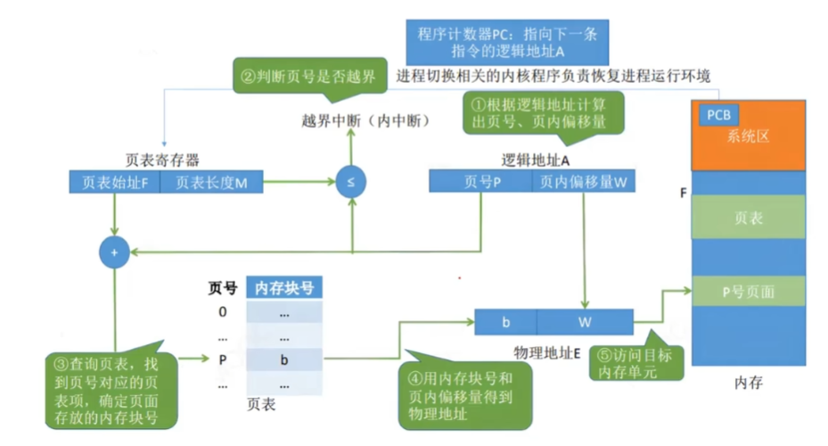


#### 快表

**【核心概念】**

- **快表 (TLB)**：本质是一个位于 CPU 内部的高速缓存（Cache），专门用来存放**最近访问过**的页表项的副本。
- **存在意义**：为了加速逻辑地址到物理地址的转换过程，减少访问内存的次数。
- **理论支撑（必考填空）**：**局部性原理**（时间局部性与空间局部性）。

**【内存访问次数对比（重点防坑）】**

- **无快表时**：每次取数据必须访问 **2次** 内存（1次查页表 + 1次取数据）。
- **有快表且命中时**：访问 **0次** 内存查表（查快表是在 CPU 内完成的）+ **1次** 内存取数据 = 总共只访问 **1次** 内存！
- **有快表但未命中时**：访问 **2次** 内存（1次查页表 + 1次取数据，同时还要更新快表）。

**【有效访问时间 (EAT) 计算公式（必考大题）】**
假设：快表命中率为 $\alpha$，访问快表耗时为 $t$，访问内存耗时为 $m$。
- **公式**：$$EAT = \alpha \times (t + m) + (1 - \alpha) \times (t + m + m)$$

#### 分段存储管理

**【必考大坑：越界中断】**

在计算物理地址时，分段和分页有一步极其关键的**不同点**：

- **逻辑地址结构**：`[段号 S, 段内偏移量 W]`
- **段表记录的内容**：不仅有**基址**（这段内存的起始物理位置），还有**段长**（这段内存有多长）。
- **计算时的保命步骤**：拿到偏移量 W 后，**必须先和“段长”比大小！
    - 如果 `W >= 段长`，说明程序试图访问不属于它的内存，系统会立刻报错，产生**越界中断**。
    - 只有当 `W < 段长` 时，才能进行计算：**物理地址 = 基址 + 偏移量 W**。

**【必背对比表（简答题/选择题狂魔）】**

| **维度**   | **分页 (Paging)**         | **分段 (Segmentation)**      |
| -------- | ----------------------- | -------------------------- |
| **划分目的** | 系统的需要（消除外部碎片，提高内存利用率）   | 用户的需要（方便编程、共享和保护）          |
| **大小**   | **固定**（由操作系统决定）         | **可变**（由用户的程序逻辑决定）         |
| **地址空间** | **一维**（程序员只需给出一个逻辑地址即可） | **二维**（程序员必须给出“段名”和“段内地址”） |
| **碎片产生** | 有**内部碎片**，无外部碎片         | 有**外部碎片**，无内部碎片            |


#### 内存扩充

**【核心考点 1：虚拟内存的基石】** 为什么能用硬盘骗过 CPU？因为有**局部性原理**（前面在快表 TLB 提到过，这里再次出现，必考填空/简答）：

- **时间局部性**：刚刚执行过的指令/数据，大概率马上又要被执行（比如循环）。
- **空间局部性**：刚刚访问过的内存地址，其周围的地址大概率马上会被访问（比如遍历数组）。
- **结论**：因为程序总是“盯着一小块地方薅羊毛”，所以我们只需要把目前正在用的这几页放进物理内存，剩下的全扔在硬盘上即可。

**【核心考点 2：缺页中断 (Page Fault)】
- **定义**：CPU 按照页表去内存里找数据，发现这页数据**不在内存里**（被丢在硬盘上了），就会触发“缺页中断”。
- **坑点（常考选择题辨析）**：普通的中断是在一条指令**执行完毕后**才检查和处理的；而缺页中断是在一条指令**执行期间**突然发现没数据而触发的。

**【核心考点 3：抖动 / 颠簸 (Thrashing)】**
- **定义**：刚被换出内存的页，马上又要被访问，刚换进来，马上又要被换出。系统把大量的时间都浪费在“从硬盘搬运数据到内存”上，导致 CPU 利用率急剧下降。
- **产生原因**：分配给进程的物理块太少，或者置换算法太烂。

##### 👑 绝对重点：页面置换算法（必考计算大题）

当发生缺页中断，且内存已经满了的时候，必须挑一个旧页面踢回硬盘，给新页面腾位置。挑谁？这就是置换算法决定的。

这三种算法你必须闭着眼睛都会算：

1. **最佳置换算法 (OPT, Optimal)**
    - **逻辑**：拥有“预知未来”的超能力。每次都踢掉**未来最长时间内不会被访问**的那个页面。
    - **考点**：这只是一个理想模型，**实际中根本无法实现**（因为系统不可能知道未来发生的事）。考试中通常让你算一遍 OPT，用来作为衡量其他算法好坏的“天花板标杆”。
2. **先进先出算法 (FIFO, First In First Out)**
    - **逻辑**：谁最早进入内存，就先踢谁。
    - **考点（必背概念）**：这是唯一一个会产生 **Belady 异常**的算法！
    - **什么是 Belady 异常？** 按理说，分给你的物理块越多，你缺页的次数应该越少。但 FIFO 算法很奇葩，有时候分给它的物理块变多了，缺页次数反而**增加**了！考卷上如果问“哪个算法有 Belady 异常”，闭着眼选 FIFO。
3. **最近最久未使用算法 (LRU, Least Recently Used)**
    - **逻辑**：没有预知未来的能力，那就“回头看过去”。每次都踢掉**在过去最长一段时间里没有被访问过**的那个页面。
    - **考点**：这是实际应用中最常见、性能最好的算法。考试大题基本就是考你手动模拟 LRU 的替换过程。
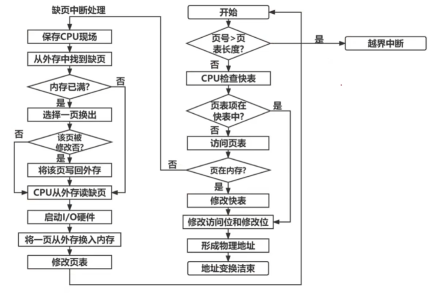


#### 例题1：

分页系统中逻辑页面大小为4KB，逻辑地址空间为16KB，主存地址空间为64KB，部分页表内容如下表2所示。现有逻辑地址LA为5000（十进制），请计算其对应的物理地址 PA 是多少？

| 页号  | 块号  |
| --- | --- |
| 0   | 5   |
| 1   | 2   |
| 2   | 0   |
| 3   | 4   |


**第一步：统一单位（最容易错的一步）**

题目给的逻辑地址是十进制的 5000（单位是字节 Byte），但页面大小给的是 4KB。在计算前，**必须把 KB 换算成 Byte**。
- 页面大小 = $4\text{KB} = 4 \times 1024\text{B} = \mathbf{4096\text{B}}$

**第二步：拆分逻辑地址（求页号和偏移量）**
逻辑地址包含两部分信息：它在第几页（页号 P），以及它在这页的哪个位置（偏移量 W）。
- **页号 (P)** = 逻辑地址 $\div$ 页面大小 （取整数部分）$$P = \lfloor 5000 / 4096 \rfloor = \mathbf{1}$$
    _(说明逻辑地址 5000 落在了第 1 页里)_
- **页内偏移量 (W)** = 逻辑地址 $\bmod$ 页面大小 （取余数）$$W = 5000 \bmod 4096 = \mathbf{904}$$
    _(说明它在第 1 页的第 904 个字节处)_

**第三步：查页表，找物理块号**

拿着刚刚算出来的页号 $P = 1$，去查题目给的表2：
- 查表可知：页号 `1` 对应的块号是 **`2`**。

**第四步：合并计算物理地址 (PA)**

找到物理块号后，直接套用终极公式：
- **物理地址 = 物理块号 $\times$ 页面大小 + 页内偏移量$$PA = 2 \times 4096 + 904 = 8192 + 904 = \mathbf{9096}$$
#### 例题2：

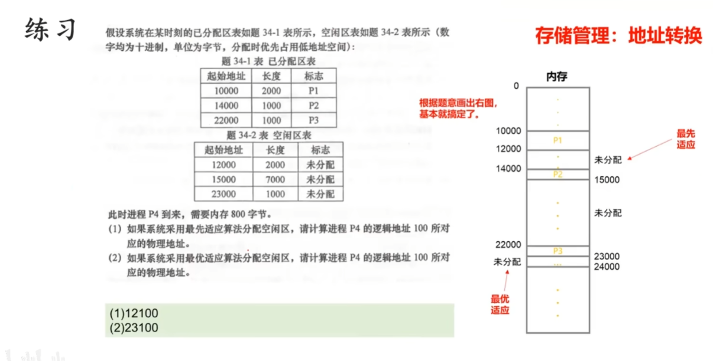


# 4 文件系统


### 一、 文件的逻辑结构（文件内部是怎么排版的）

所谓“逻辑结构”，就是这个文件在你（程序员或用户）眼里长什么样，不用管硬盘底层是怎么存的。

**1. 无结构文件（流式文件）**

- **通俗理解**：这就好比你平时写的 `.cpp` 或 `.java` 源代码文件，或者纯文本的 `.txt`。在系统看来，它就是一长串连在一起的字符（字节流），没有任何表格或字段的概念。你想找里面的某个词，只能从头到尾挨个字符去搜（穷举搜索）。

- **【极简笔记】**
    - **关键字**：字节流、无明显结构。
    - **典型代表**：源代码、目标代码、TXT 文本。
    - **特点**：管理简单，但查找极慢（只能穷举）。

**2. 有结构文件（记录式文件）**

- **通俗理解**：这就好比你导出的 Excel 表格，或者数据库里的数据。文件里不是乱糟糟的一团，而是分成了很多行（记录），每行里又有具体的列（数据项）。
    
- **【极简笔记】**
    
    - **关键字**：记录、数据项。
    - **典型代表**：Excel、数据库文件。
    - **三大分类（常考选择题）**：
        1. **顺序文件**：数据一条挨着一条存（像磁带），只能顺序读。
        2. **索引文件**：额外建一张“目录表”（索引表），找东西直接查表，速度极快（就像书的目录），但建立索引表要占额外空间。
        3. **索引顺序文件**：上面两者的结合体，先把数据分组，组内顺序存，组之间建索引（兼顾速度和空间）。

### 二、 FCB 与目录结构（系统是怎么找到你的文件的）

这里面藏着本章**最重要的必考概念**：FCB。

**1. 文件控制块（FCB）—— 文件的“身份证”**

- **通俗理解**：你在面向对象编程时，如果要在内存里描述一个文件，肯定会建一个 `File` 类，里面包含文件名、大小、创建时间、存放位置等属性。**FCB 就是操作系统为了管理文件而创建的这个“对象”**。
    
- **【极简笔记 / 必背考点】**
    - **核心定义**：FCB 是系统用来描述和控制文件的数据结构。**一个文件唯一对应一个 FCB**。
    - **必背包含信息**：FCB 里包含很多东西，但考试最爱考的是“最基本的信息”——**文件名**和**文件存放的物理地址**。（系统就是靠这两个东西，把逻辑文件名转换成硬盘上的物理位置的）。

**2. 目录结构**

- **通俗理解**：多个 FCB 聚集在一起，就成了目录（也就是文件夹）。
- **【极简笔记】** 这部分重点记后面两个：
    - **单级/两级目录**：早期系统的产物，容易重名，现在基本不用，略过。
    - **树形目录（重点）**：这就是你现在用的 Windows 电脑的文件夹结构，一层套一层，根目录通常是盘符（如 `C:\`）。**优点是方便分类，缺点是不能共享文件。
    - **图形目录（无环图目录）**：在树形目录的基础上，允许不同的文件夹指向同一个文件。**考点：这是实现“文件共享”（比如建立快捷方式/软硬链接）的底层基础结构。**

### 文件实现
#### 一、 文件分配方式（硬盘怎么存文件）

考试中，这部分最爱考的是这三种方式的**优缺点对比**以及**是否支持随机访问**。

**1. 连续分配（顺序结构）**

- **通俗理解**：这就好比在 C++ 里直接声明一个定长数组。文件在硬盘上必须占用一整块连续的空间。
- **优点**：速度最快，支持**随机访问**（想访问第 5 个盘块，直接算偏移量就能找到）。
- **缺点**：极其容易产生**外部碎片**；文件如果想中途变大（扩容）非常困难。

**2. 链接分配（链式结构）**

- **通俗理解**：这就好比你手写的单向链表。文件被打碎放在硬盘的各个角落，每个盘块里存着一个指针，指向下一个盘块。
- **优点**：彻底消灭外部碎片，文件想怎么变大就怎么变大。
- **缺点**：**绝对不支持随机访问！** 想读文件的最后一点内容，必须从头开始顺着指针挨个找，速度极慢。可靠性差（中间断一个指针，后面的数据全丢了）。

**3. 索引分配（索引结构）—— 考试绝对重点**

- **通俗理解**：结合了前两者的优点。系统专门拿出一个物理块作为“索引块”（里面存的是一个指针数组），这个表里记录了文件所有碎片所在的物理块号。
- **优点**：既支持**随机访问**（直接查索引表），又**没有外部碎片**。
- **缺点**：索引表本身要额外占用存储空间。
- **常考计算坑点**：如果文件超级大，一个索引块装不下所有指针怎么办？（考试常考“多级索引”计算题，类似于计算大文件的最大体积）。

#### 二、 文件存储空间管理（硬盘怎么管理空地方）

这部分是解决“硬盘还剩多少空间、怎么把空闲空间分配出去”的问题。

**1. 空闲表法**

- **极简笔记**：建一张表，记录“从哪个物理块开始，有连续多少个空块”。
- **适用场景**：只适用于前面的**连续分配**方式。

**2. 空闲链表法**

- **极简笔记**：把所有空闲的物理块用指针串成一个大链表。系统需要空间时，就从链表头上摘下来几个。
- **缺点**：分配和回收空间时，指针操作效率比较低。

**3. 位示图法（Bitmap）—— 必考大题/计算题**

- **通俗理解**：用一串二进制的 `0` 和 `1` 来代表硬盘。`0` 代表空闲，`1` 代表已占用。
- **极简笔记**：超级省空间，非常适合现代计算机。
- **必考题型**：经常考字号、位号与盘块号之间的转换公式。（例如：已知某个块号，求它在位示图里的第几个字的第几位）。

### 磁盘管理
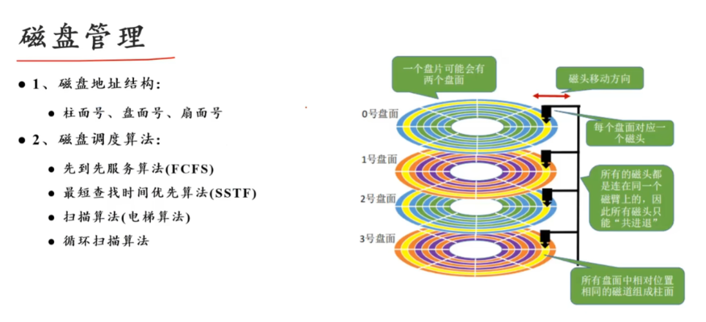

### 例题

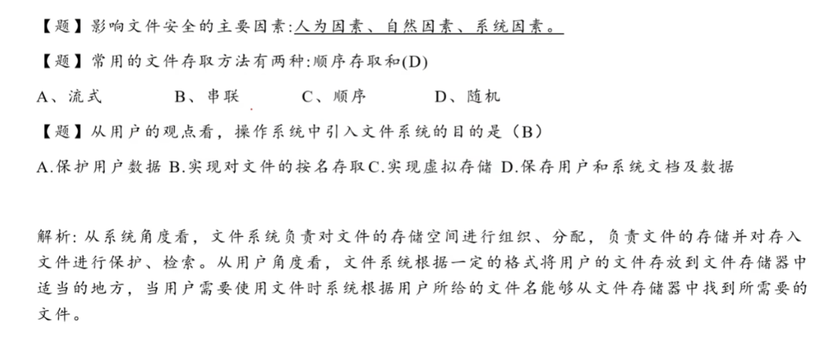
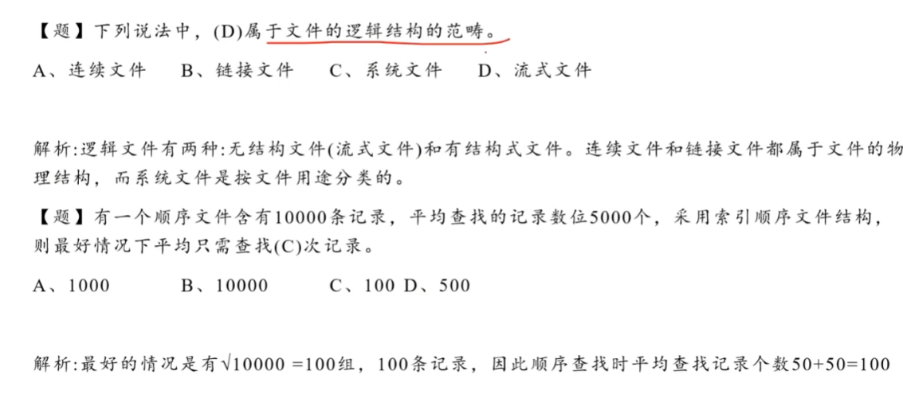
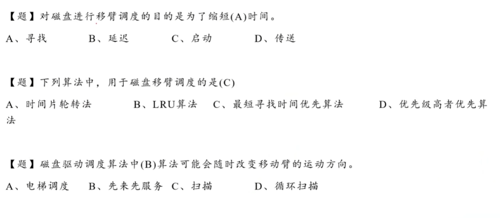
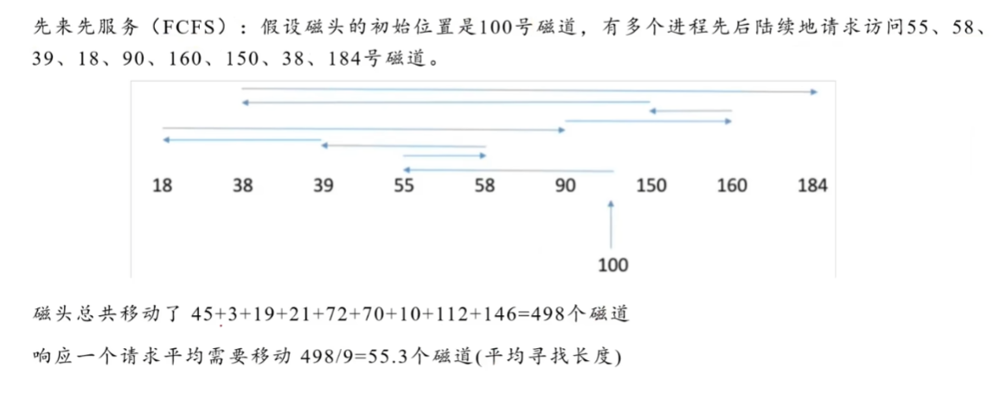
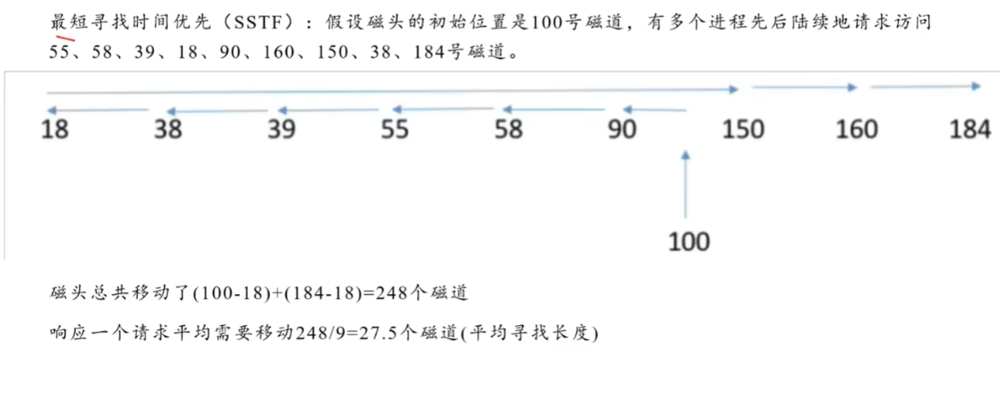
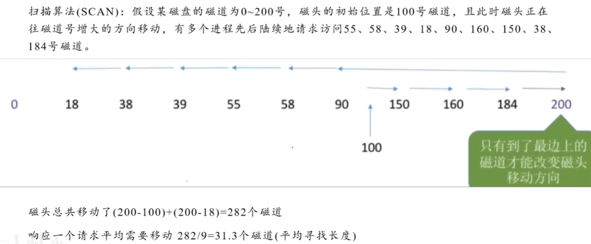


### 多级索引

“多级索引”的出现，完全是被逼出来的。上一节我们刚讲过“索引分配”，它的核心是拿出一个物理块当“目录表”。但问题来了：如果你的文件特别特别大，一个物理块根本装不下这么长的目录，怎么办？

操作系统的解决办法和现实生活中一模一样：**给目录再建一个目录**（这就像一本书太厚了，不仅有章目录，还有节目录）。
#### 一、 核心计算逻辑大解剖

题目里给出了三个关键数字：

- **磁盘块大小**：1KB（也就是 1024 字节）
- **索引项大小**：4B（也就是写一个指针需要占 4 字节）
- **采用两层索引**：求最大文件长度

**第一步：算出一个物理块能装多少个“指针”（这个数称为 $N$）**

既然一个块有 1024 字节，写一个指针要 4 字节，那一个块最多能写：
$$1024 \div 4 = 256 \text{ 个索引项}$$
（_通俗理解：一张目录纸上，最多只能写 256 行条目。_）

**第二步：算两层索引能指向多少个“数据块”**

- **单层索引**：一张目录纸，直接指向 256 个数据块。
- **两层（多级）索引**：你手里有一张“总目录纸”（顶级索引块），上面写了 256 行。但这 256 行指的不是数据，而是**另外 256 张“分目录纸”**（二级索引块）。而这每一张“分目录纸”上，又能写 256 行指向真实数据的指针。
- **总共能指向的数据块数量**：$$256 \times 256 = 65536 \text{ 个数据块}$$
**第三步：算出文件最大长度**

既然你能管理 65536 个数据块，而每个数据块的大小是 1KB，那么：
$$最大文件长度 = 65536 \times 1\text{KB} = 65536\text{KB}$$
再除以 1024，就等于 **64MB**。

#### 二、 考前极简笔记（直接抄，只记公式）

在期末考试中，遇到多级索引的计算题，直接默写下面这套公式连招，绝不丢分：

**【核心参数 $N$（单块索引项数）】**

$$N = \frac{\text{磁盘块大小}}{\text{每个索引项大小}}$$

_(注意坑点：必须统一单位，通常把 KB 换算成 Byte)_

**【最大文件长度公式（闭眼套用）】**

- **一级索引最大长度** = $N \times \text{磁盘块大小}$
- **二级索引最大长度** = $N^2 \times \text{磁盘块大小}$
- **三级索引最大长度** = $N^3 \times \text{磁盘块大小}$
- **$k$ 级索引最大长度** = $N^k \times \text{磁盘块大小}$

**【必背优缺点（常考选择/简答）】
- **优点**：大大提高了系统支持的最大文件长度。
- **缺点**：访问速度变慢了！比如读二级索引里的数据，必须访问 **3次** 磁盘（第1次读顶级索引块，第2次读二级索引块，第3次才读到真正的数据块）。
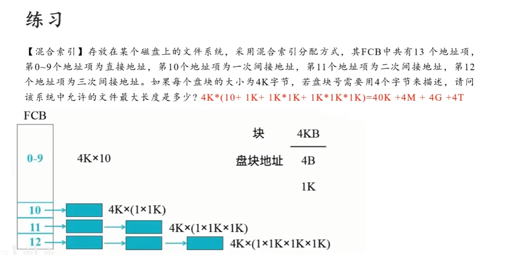


# 5 I/O设备管理


进入“I/O 设备管理”这一章，你的思路要完全转换一下。

这部分的**绝对核心主线，就是一部“如何解放 CPU”的血泪史。**

早期的计算机，CPU 就像个事必躬亲的微操大师，外设干点啥它都要盯着；后来外设越来越快，CPU 发现自己被 I/O 拖垮了，于是不断放权。

### 一、 I/O 设备分类（考前扫一眼即可）

这里面只会考一个知识点：**块设备 vs 字符设备**。

- **块设备**：数据是一块一块传输的，支持**随机访问**。**典型代表：磁盘（硬盘）**。
    
- **字符设备**：数据是一个字符一个字符传输的，**不支持**随机访问。**典型代表：键盘、鼠标、打印机**。
    

### 二、 四种 I/O 控制方式（重中之重：解放 CPU 进化史）

这四种方式，每一次进化都是为了减少 CPU 的干预，让 CPU 能去干更有价值的计算工作。

#### 1. 程序直接控制方式（轮询 / 查状态）—— “死盯微操”

- **通俗理解**：CPU 安排打印机打字，然后 CPU 什么都不干了，就死死盯着打印机问：“打完了吗？打完了吗？打完了吗？”直到打印机说“打完了”，CPU 才去干下一件事。
    
- **极简笔记（考点）**：
    
    - **干预频率**：极高（一直轮询）。
        
    - **数据流向**：设备 $\rightarrow$ **CPU** $\rightarrow$ 内存。（注意：数据必须经过 CPU 倒手！）
        
    - **缺点**：CPU 利用率极低，CPU 和 I/O 设备只能串行工作。
        

#### 2. 中断控制方式 —— “事后汇报（按字节）”

- **通俗理解**：CPU 安排打印机打字，然后自己去打游戏了（执行其他进程）。打印机每打完**一个字节**，就拍一下 CPU 的肩膀（发中断），CPU 暂停游戏，把这个字节放进内存，然后再回去打游戏。
    
- **极简笔记（考点）**：
    
    - **干预频率**：高。每次传输**一个字/字节**就中断一次。
        
    - **数据流向**：设备 $\rightarrow$ **CPU** $\rightarrow$ 内存。（数据依然要经过 CPU 的寄存器倒手！）
        
    - **优点**：CPU 和 I/O 设备可以并行工作了。
        
    - **致命缺点**：如果传输大量数据（比如传个几个 G 的电影），CPU 的肩膀会被拍烂，一直处于处理中断的状态。
        

#### 3. DMA 控制方式（直接内存访问）—— “项目经理打包汇报” （绝对高频考点）

- **通俗理解**：CPU 实在受不了了，于是雇了一个叫 DMA 的项目经理。CPU 对 DMA 说：“你去把硬盘里的 1 个 G 电影搬到内存里，搬完了再叫我。”DMA 自己指挥数据传输，等**整整一个数据块**全搬完了，才拍一次 CPU 的肩膀。
    
- **极简笔记（考点）**：
    
    - **干预频率**：低。仅在**一个或多个数据块**传输的开始和结束时才需要 CPU 干预。
        
    - **数据流向**：设备 $\rightarrow$ **内存**。（**划重点：数据直接走总线进内存，彻底绕开 CPU！**）
        
    - **传输单位**：数据块。
        

#### 4. I/O 通道控制方式 —— “成立独立分公司”

- **通俗理解**：DMA 虽好，但只能搬运连续的数据块。于是 CPU 成立了 I/O 分公司（通道），通道本质上是一个**弱鸡版的 CPU**，它有自己的指令系统。主 CPU 直接把一长串复杂的 I/O 任务清单扔给通道，通道自己执行，甚至能控制好几个设备，全部搞定后才通知主 CPU。
    
- **极简笔记（考点）**：
    
    - **干预频率**：极低。一组数据或多组数据才中断一次。
        
    - **与 DMA 的区别（常考辨析）**：DMA 只能执行一条 I/O 指令，而通道可以执行由多条 I/O 指令组成的“通道程序”；DMA 只能控制一台设备传输连续数据，通道可以控制多台设备传输不连续数据。


### 三、 缓冲区 (Buffer)

**1. 通俗理解**

CPU 是一秒钟能做一万个汉堡的超级厨师，而打印机/硬盘是半天才慢吞吞拿走一个汉堡的顾客。如果没有“出餐台（缓冲区）”，厨师做完一个汉堡就得站在那里等顾客拿走，效率极低。

有了出餐台，厨师一口气疯狂做，做满一桌子就去干别的事；顾客慢慢拿，拿空了再叫厨师。

**2. 【考前极简笔记】**

- **引入缓冲区的目的（简答/填空题必背）**：
    
    1. 缓和 CPU 与外设**速度不匹配**的矛盾。（最核心目的）
        
    2. 提高 CPU 与外设之间的**并行性**。
        
    3. 减少对 CPU 的**中断次数**。（比如原本传一个字节中断一次，现在攒满一个缓冲区才中断一次）。
        
- **三种设置方式的考点辨析**：
    
    - **单缓冲**：只能“装满 $\rightarrow$ 拿空 $\rightarrow$ 再装”。
        
    - **双缓冲**：有两个出餐台。最大优势是允许“厨师往 A 台放汉堡的**同时**，顾客从 B 台拿汉堡”，真正实现了输入和输出的**并行操作**。
        
    - **多缓冲**：应对那种“突然来一大波数据（阵发性）”的场景。
        

### 四、 设备分配技术（SPOOLing 是绝对主角）

这部分的概念非常直白，独占设备就是“公用电话亭（一次进一人）”，共享设备就是“大马路（大家一起走）”。

但在期末考试中，这部分 **90% 的分值都会砸在第三个概念上：虚拟分配技术（SPOOLing 技术）**。

**1. 通俗理解 SPOOLing 技术**

假设公司只有一台打印机（独占设备）。如果没有这项技术，程序员 A 在打印时，程序员 B 哪怕只打印一页纸，也得被系统无情拒绝：“设备正忙，请稍后再试”。

**SPOOLing 怎么做？** 操作系统在磁盘上划出了一块空间充当“假打印机”。A 和 B 同时点打印，系统把他们俩的文件都光速接收了，存到磁盘队列里，然后告诉他们：“打印成功！”（骗他们的）。接着，系统后台再慢慢地把磁盘里的文件排队发给真正的打印机。

**2. 【考前极简笔记：SPOOLing 假脱机技术】**

遇到 SPOOLing，卷面上直接往这几个词上靠：

- **核心定义**：利用多道程序技术，将一台**独占设备**改造成多台逻辑上的**共享设备**。
    
- **别名**：假脱机操作。
    
- **经典应用场景（必考例子）**：**共享打印机**。在用户看来，就好像每个人都拥有了一台“虚拟”的打印机。
    
- **构成要素（选择题常考）**：它需要在**磁盘**上开辟“输入井”和“输出井”，并在**内存**中开辟“输入缓冲区”和“输出缓冲区”来配合工作。


