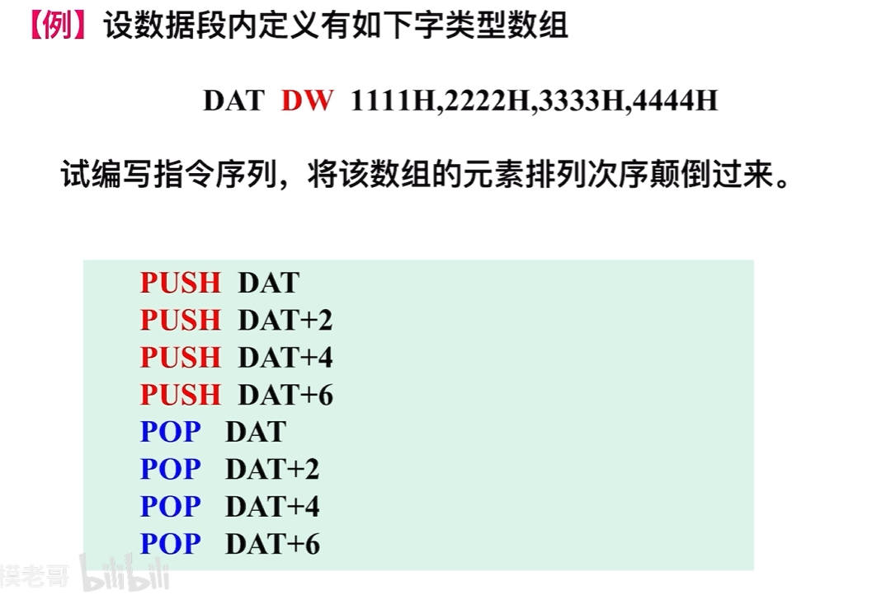
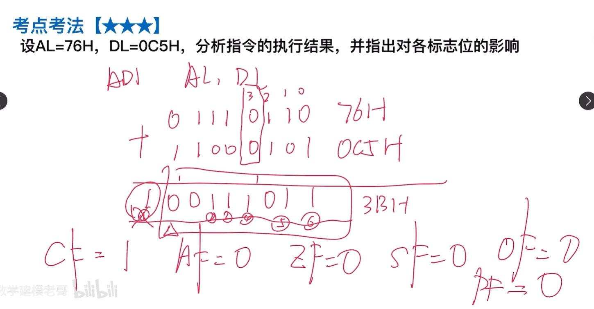
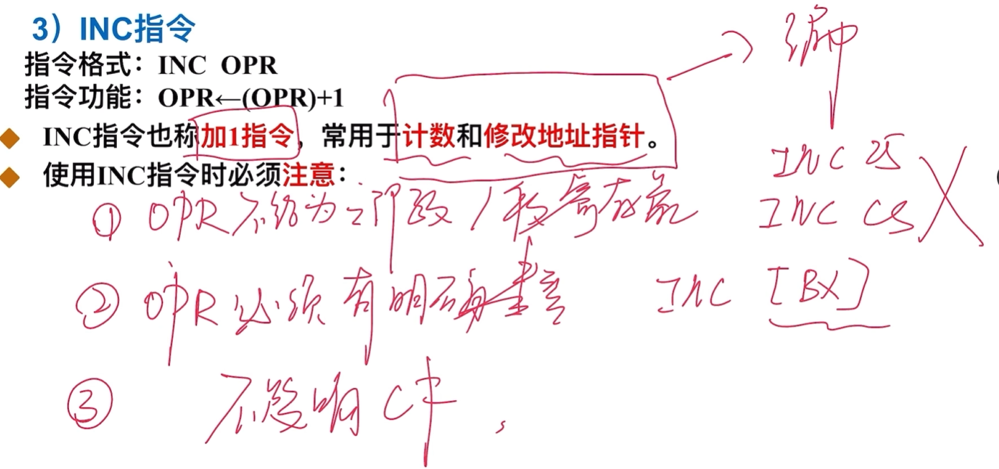
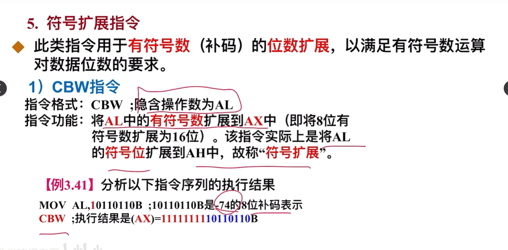
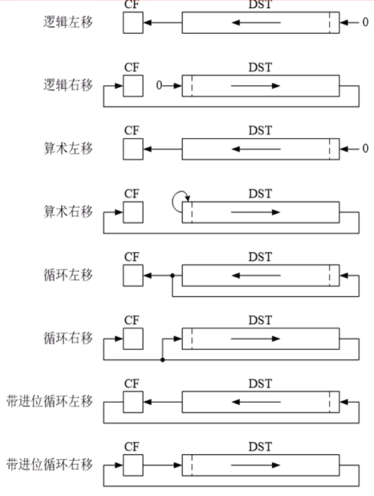
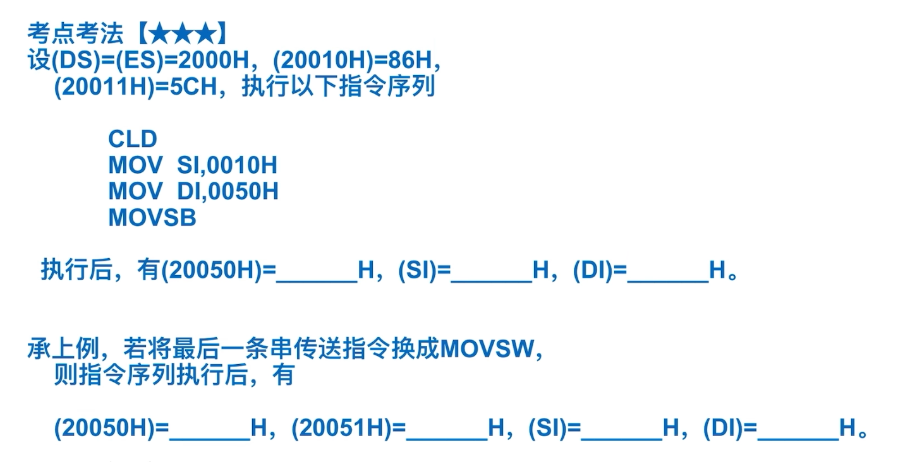

## 1. 通用寄存器

一个典型的CPU由运算器、控制器、寄存器等器件组成，这些器件笔**内部总线**相连。寄存器（Register）：处理器内部用于暂时存放程序执行过程中的代码和数据的高速存储单元。

**程序可见寄存器分为：通用寄存器、专用寄存器（段寄存器）**

#### 通用寄存器（BP\SI\DI）

- BP是一个不能分解的16位寄存器，可以存放16位的数据，也可以生成个存储器地址。
- SI、DI寄存器：也是不能分解的16位寄存器，可以存放16位的数据，某些指令中被指定使用。

#### 专用寄存器(SP\IP\FLAGS)

- SP：堆栈指针，是16位寄存器，存放的是堆栈栈顶指针，内容随着出栈入栈动态改变；
- IP：指令指针，是16位寄存器，用来提供下一条执行的指令的地址；
- FLAGS寄存器（标志寄存器）
  - CF (Carry Flag)：**进位**标志位（无符号数溢出）。加(减)法运算时，若**最高位**有进(借)位则CF=1；没有进位，CF=0。
  - PF(Parity Flag)：**奇偶**标志位。运算结果的低8位中“1”的个数为**偶数**时PF=1；为奇数时，PF=0。
  - AF (Auxiliary Carry Flag)：**辅助进位**标志位。加（减)操作中，若Bit3向Bit4有进位（借位），AF=1；没有进位，AF=0。
  - ZF(Zero Flag)：**零**标志位。当运算结果为零时ZF=1；不为零时，ZF=0。
  - SF(Sign Flag)：**符号**标志位。当运算结果是负数时，SF=1；运算结果是正数，SF=0。
  - OF (Overflow Flag)：**溢出**标志位（有符号数溢出）。当算术运算的结果超出了有符号数的可表达范围时，OF=|；未超出时，OF=0。
  
#### 段寄存器。
CS(Code)：
DS(Data)：
ES(Extra)：
SS(Stack)：  


### 必考题：


## 2. 汇编语句结构

**\[名字项\]     操作项    \[操作数项\]      \[；注释项\]**

其中，\[  \]表示为可选项。


1. **伪指令语句**
   伪指令语句用来说明程序运行的处理器平台，进行段定义、变量与常量定义、过程定义、宏定义以及源程序的开始与结束定义等。伪指令语句作用于汇编过程，用来指示汇编程序如何进行源程序汇编。

2. **指令语句**
   指令语句包含一条汇编语言指令。程序的操作功能是由指令语句来实现的

3. **宏指令语句(函数)**
   宏指令是宏汇编语言允许程序员自定义的一种特殊形式的指令。宏指令语句用来描述宏指令的使用。

- 
1. **名字项**
   名字项是一个符合特定规则的字符串，其最大长度不超过31个字符,组成名字项的字符规定为：26个英文字母(不分大小写)，数字符0~9，以及?, ·, '\_, @, \$等。

   **数字不能作为名字项的第一个字符。.只能作为名字项第一个字符用。**

2. **操作项**
   操作项是一条语句中必不可少的部分。

3. **操作数项**
   可以是一个、两个或没有，可以是常量、变量、寄存器、指令标号、过程名、段名或表达式

### 变量定义与存储空间分配

DB-定义字节类型
DW-定义字类型
DD-定义双字类型
DQ-定义四字类型
DT-定义十字节类型
DUP 操作符：重复次数 DUP (数据项)

举例：
```asm
; [变量名] 类型 数据项
VAR1 DB 46H
VAR2 DW 2A05H
VAR3 DB 26*3,-53,00101001B
VAR4 DW 12H, 0A186H
VAR5 DB ?,?,?,?,?,?,?,?,?,?
VAR5 DB 10 DUP (?)
```


### 属性运算符

1）OFFSET：用于取变量或标号的段内偏移地址
```asm
OFFSET 变量或标号
```

2）SEG：用于取变量或标号的段地址
```asm
SEG 变量或标号
```

3）PTR：用于重新指定变量、标号或地址表达式的访问类型
```asm
新类型 PTR 变量或标号或地址表达式
```

可重新定义的类型有：BYTE\WORD\DWORD\NEAR\FAR
举例：(1)OFFSET VAR1 (2）OFFSET VAR2+1 (3)SEG VAR3 （4）WORD PTR VAR3

### 替代符定义伪指令

1）EQU伪指令定义替代符
```asm
替代符 EQU 表达式
```

2）=伪指令定义替代符
```asm
替代符=表达式
```

*=伪指令定义替代符可在同一个源程序中重复定义，有效范围是从被定义开始到下一次被定义替代符与变量有本质的区别：变量需要分配存储空间，但替代符不会，他只是某个表达式的别名，汇编程序在对其进行汇编时，会用表达式的值置换。


### 段内偏移地址指针设置伪指令

段内偏移地址指针$
段内偏移地址指针设置伪指令ORG
例：
```asm
DSEG SEGMENT
DATE1 DB 14H DUP(?)
ORG 100H
DATE2 DW1375H,2468H
DSEG ENDS
```

### 例题

#### 1. 
画出存储空间映像：
```asm
DSEG SEGMENT
VAR1 DB 46H
VAR2 2 DW2A05H
VAR3 DB 26*3,-53,00101001B
VAR4 DW 12H， 0A186H
DSEG ENDS
```

在上一题的基础上，分析表达式：
(1)OFFSETVAR1
(2）OFFSET VAR2+1
(3) SEG VAR3
(4)WORD PTR VAR3

#### 2. 
分析下列语句中，段内偏移地址指针的作用
```asm
DSEG SEGMENT
DAT1 DB 7FH,0DH,20H,33H,49H,0C6BH,10 DUP(?)
N1 = $-DAT1           ;DAT1的元素个数
DAT2 DW1023H,0B5H,4587H,356H,7096H
N2 = ($-DAT2)/2       ;DAT2的元素个数
DSEG ENDS
```

## 3. 寻址方式

寻址方式：指令指定操作数的位置，即给出地址信息，在执行时需要根据这个地址信息找到需要的操作数。这种寻找操作数的过程称为寻址,而寻找操作数的方法称为寻址方式。

立即数：指令中操作数字段实质上是指出操作数存放于何处。一般来说，操作数可以跟随在指令操作码之后，称为立即数；

寄存器操作数：操作数也可以存放在CPU内部的寄存器中：存储器操作数：绝大多数的操作数存放在内存储器中。

### 1. 寄存器寻址

参加操作的操作数在CPU的通用寄存器中。例：MOV AX，BX

### 2.立即寻址

指令中的源操作数是立即数，即源操作数是参加操作的数据本身：例：MOV BX，2400H

### 3. 存储器寻址：

直接寻址、寄存器间接寻址、寄存器相对寻址基址变址寻址、相对基址变址寻址

#### 1）直接寻址

指令中直接给出操作数的偏移地址
例：
```asm
MOV AX，[1200H];【默认在数据段】

```

#### 2）寄存器间接寻址

参与操作的操作数存放在内存中，其偏移地址为指令中的寄存器的内容。
例：设BX=2400H，MOV AX，\[BX\]
16位寻址时可用的寄存器是BX，DI，SI和BP；

#### 3）寄存器相对寻址

操作数的有效地址为基址寄存器或变址寄存器的内容和指令中指定的位移量之和，有效地址由两种成分组成。
例：
```asm
MOV AX，COUNT[SI]
MOV AX, [COUNT(+SI)]
```

16位寻址可用的寄存器是BX，DI，SI和BP；

#### 4）基址变址寻址

操作数的有效地址是一个基址寄存器和一个变址寄存器的内容之和，所以有效地址由两种成分组成。
例：
```asm
MOV AX，[BX][DI]
MOV AX, [BX+DI]
```

基址寄存器是BX，段寄存器默认DS；基址寄存器是BP时，段寄存器默认SS

#### 5)相对基址变址寻址

操作数的有效地址是一个基址寄存器与一个变址寄存器的内容和指令中指定的位移量之和，所以有效地址由三种成分组成。
例：
```asm
MOV AX，D[BX[SI]
MOV AX,D[BX+SI]
MOV AX，[D+BX+SI]
```

基址寄存器是BX，段寄存器默认DS；基址寄存器是BP时，段寄存器默认SS

### 4. 隐含寻址

在8086指令系统中，有些指令默认操作数存放在某个特定的寄存器中，从而可省略对该操作数的描述，称为隐含寻证。

例：MUL BX

### 例题


<table>
  <tr>
    <th>寻址方式</th>
    <th>源操作数典型格式</th>
    <th>有效地址 EA 计算</th>
  </tr>
  <tr>
    <td>立即寻址</td>
    <td>直接写数字（如<code>3069H</code>）</td>
    <td>无（就是常数本身）</td>
  </tr>
  <tr>
    <td>寄存器寻址</td>
    <td>纯寄存器名（如<code>BH</code>）</td>
    <td>无（寄存器内部操作）</td>
  </tr>
  <tr>
    <td>直接寻址</td>
    <td><code>[数值]</code></td>
    <td>EA = 括号内的固定数值</td>
  </tr>
  <tr>
    <td>寄存器间接寻址</td>
    <td><code>[单个寄存器]</code></td>
    <td>EA = 寄存器内存储的值</td>
  </tr>
  <tr>
    <td>寄存器相对寻址</td>
    <td><code>常量[单寄存器]</code></td>
    <td>EA = 常量 + 单寄存器的值</td>
  </tr>
  <tr>
    <td>基址变址寻址</td>
    <td><code>[基址][变址]</code></td>
    <td>EA = 基址寄存器值 + 变址寄存器值</td>
  </tr>
  <tr>
    <td>相对基址变址寻址</td>
    <td><code>常量[基址][变址]</code></td>
    <td>EA = 常量 + 基址值 + 变址值</td>
  </tr>
</table>


## 4. 指令系统

### 4.1 数据传送类

- `MOV`
- `XCHG OPR1,OPR2`：将操作数OPR1和OPR2的内容互换
- `LEA SI,[BX+6]`： SI<—BX+6的偏移地址
- `XLAT`:  AL←(BX)+(AL)(查表指令) 
- `PUSH`和`POP`: 

- `IN`和`out`

#### 错误用法！！！

##### 1) 内存与内存的隔离（总线瓶颈）

CPU 无法在一条指令中完成两次内存访问（一次读，一次写）。
- **错误：两个操作数不能同时为内存单元。**
    - **反面教材**：`MOV [BX], [SI]`
    - **正确做法**：必须用通用寄存器中转。`MOV AX, [SI]` 然后 `MOV [BX], AX`。

##### 2) 段寄存器的严格限制（安全与机制）

段寄存器（`CS`、`DS`、`ES`、`SS`）是内存寻址的基石，操作它们有特殊的规矩。
- **错误 1：立即数不能直接送入段寄存器。**
    - **反面教材**：`MOV DS, 1000H`
    - **正确做法**：用通用寄存器中转。`MOV AX, 1000H` 然后 `MOV DS, AX`。
- **错误 2：段寄存器之间不能直接相互传送。
    - **反面教材**：`MOV DS, ES`
    - **正确做法**：同样需要通用寄存器中转。`MOV AX, ES` 然后 `MOV DS, AX`。
- **错误 3：`CS` 绝对不能作为目的操作数。**
    - **反面教材**：`MOV CS, AX`
    - **原因**：`CS` 配合 `IP` 指向下一条要执行的代码。随意修改 `CS` 会导致程序直接跑飞。只有转移指令（如 `JMP FAR`、`CALL FAR` 等）或中断机制能隐式修改 `CS`。但注意，`CS` 可以作为源操作数（如 `MOV AX, CS` 是合法的）。

##### 3) 操作数类型的硬性匹配（数据一致性）

- **错误 1：源操作数与目的操作数尺寸不一致。**
    - **反面教材**：`MOV AL, BX` （8 位对 16 位，错误）
- **错误 2：立即数作为目的操作数。**
    - **反面教材**：`MOV 1000H, AX` （数字不能被赋值）
- **错误 3：内存向内存传送立即数时，尺寸不明确（Ambiguous operands）。**
    - **反面教材**：`MOV [BX], 0` （CPU 不知道是要存入 8 位的 `00H` 还是 16 位的 `0000H`）。
    - **正确做法**：必须加 `PTR` 伪指令声明尺寸。`MOV BYTE PTR [BX], 0` 或 `MOV WORD PTR [BX], 0`。

##### 4) 寄存器间接寻址的专属规矩

在 8086 中，方括号 `[]` 里的寄存器是挑剔的，不能随便放。

- **错误 1：使用非法的通用寄存器进行寻址。**
    - **反面教材**：`MOV AX, [CX]` 或 `MOV AX, [DX]` 或 `MOV AX, [AX]`。
    - **规则**：8086 中，只有 **`BX`、`BP`、`SI`、`DI`** 这四个寄存器可以放进方括号里寻址。
- **错误 2：非法组合基址和变址寄存器。**
    - **反面教材**：`MOV AX, [BX+BP]` （两个基址寄存器不能组合）或 `MOV AX, [SI+DI]` （两个变址寄存器不能组合）。
    - **规则**：合法的二维组合只能是“一个基址” + “一个变址”，例如 `[BX+SI]`、`[BP+DI]` 等。

##### 5) 禁区寄存器

- **错误：不能对指令指针 `IP` 和标志寄存器 `PSW` (Flags) 直接使用 `MOV`。
    - **反面教材**：`MOV IP, 1000H`
    - **原因**：`IP` 只能由跳转/调用指令修改；修改标志位需使用专用指令（如 `STC`、`CLC`）或算术/逻辑运算。


#### 【考点考法】

1. 要将字节型变量VAR5的数据传送给字节型变量VAR4,写出使用的指令：
  
2. 交换字节型变量VAR8和VAR9的数据，写出使用的指令：


### 4.2 算术运算类

1. ADD、ADC

2. INC（加一）

3. SUB、SBB
4. DEC（减一）
5. CMP（比较）
6. NEG（求相反数）
7. MUL（乘法）

| **乘法类型**   | **被乘数<br>（默认）** | **乘数<br>（代码里写的）**      | **结果存放位置<br>（自动）** |
| ---------- | --------------- | ---------------------- | ------------------ |
| **8 位乘法**  | **`AL`**        | 任意 8 位寄存器/内存 (如 `BL`)  | **`AX`**           |
| **16 位乘法** | **`AX`**        | 任意 16 位寄存器/内存 (如 `BX`) | **`DX:AX`**        |

8. IMUL
9. DIV（除法）

| **除数大小<br>（代码里写的）** | **被除数位置<br>（默认）** | **商存放位置<br>（自动）** | **余数存放位置<br>（自动）** |
| ------------------- | ----------------- | ----------------- | ------------------ |
| **8 位** (如 `BL`)    | **`AX`** (16位)    | **`AL`**          | **`AH`**           |
| **16 位** (如 `BX`)   | **`DX:AX`** (32位) | **`AX`**          | **`DX`**           |
10. IDIV（有符号法）
11. CBW
    
12. CWD


#### 【考点考法】

##### 1. 编写指令程序，完成32位数相加：20008A04H+23459D00H

```asm
MOV AX, 8A04H
MOV DX, 2000H
MOV CX, 9D00H
MOV BX, 2345H
ADD AX, CX
ADC DX, BX
MOV ...
```

##### 2. 编写指令，完成无符号数乘法：345×60

```asm
MOV AX, 345
MOV BX, 60
MUL BX
```

##### 3. 编写指令，完成无符号数除法：5000÷2

```asm
MOV AX, 5000
MOV DX, 0
MOV BX,2
DIV BX
```

### 4.3 逻辑运算与移位操作类

#### 4.3.1 逻辑运算

- AND(考如何置零)
- OR
- XOR
- NOT
- TEST(测试指令，执行与运算)

#### 4.3.2 移位运算

- 逻辑左移指令：`SHLDST,CNT`
- 逻辑右移指令：`SHR DST,CNT`
- 算术左移指令：`SAL DST,CNT`
- 算术右移指令：`SAR DST,CNT`
- 循环左移指令：`ROL DST,CNT`
- 循环右移指令：`ROR DST,CNT`
- 带进位循环左移指令：`RCL DST,CNT`
- 带进位循环右移指令：`RCR DST,CNT`

**快速记忆：**

| **指令前缀** | **核心单词**                  | **动作类型**           |
| -------- | ------------------------- | ------------------ |
| **SH**_  | **Sh**ift                 | 逻辑（空位纯补0）          |
| **SA**_  | **S**hift **A**rithmetic  | 算术（右保持符号位）         |
| **RO**_  | **Ro**tate                | 普通循环（数据自己转圈）       |
| **RC**_  | **R**otate with **C**arry | 带进位循环（带着 `CF` 一起转） |

**图解：**



#### 【考点考法】

##### 1. 写出指令，将AL寄存器的第2位清零(置一)，其他位保持不变

```asm
AND AL, 1111_1011B
```

```asm
OR AL, 0000_0100B
```

##### 2. 写出指令，将AL寄存器的低4位取反，高4位不变

(任何数与 `0` 异或，结果不变；任何数与 `1` 异或，结果翻转)
```asm
XOR AL, 0000_1111B
```

##### 3. 写出指令，将AL的高四位与低四位互换

```asm
MOV CL, 4
ROL AL, CL
```

##### 4. 写出指令，将DX:AX中的32位无符号数×2

```asm
SHL AX, 1
RCL DX, 1
```

### 4.4 程序控制类

#### 4.4.1 简单条件转移

| **指令**            | **跳转条件**     | **核心功能说明**        |
| ----------------- | ------------ | ----------------- |
| **`JMP`**         | 无            | 强制无条件跳转到指定位置      |
| **`JC`**          | **`CF = 1`** | 有进位/借位时跳转         |
| **`JNC`**         | **`CF = 0`** | 无进位/借位时跳转         |
| **`JZ` / `JE`**   | **`ZF = 1`** | 结果为零 / 两数相等时跳转    |
| **`JNZ` / `JNE`** | **`ZF = 0`** | 结果不为零 / 两数不等时跳转   |
| **`JS`**          | **`SF = 1`** | 结果为负数（符号位为1）时跳转   |
| **`JNS`**         | **`SF = 0`** | 结果为正数（符号位为0）时跳转   |
| **`JO`**          | **`OF = 1`** | 运算发生溢出时跳转         |
| **`JNO`**         | **`OF = 0`** | 运算未发生溢出时跳转        |
| **`JP` / `JPE`**  | **`PF = 1`** | 1的个数为偶数（偶校验成功）时跳转 |
| **`JNP` / `JPO`** | **`PF = 0`** | 1的个数为奇数（奇校验成功）时跳转 |

#### 4.4.2 无符号数条件转移

| **指令组合** | **跳转条件**            | **逻辑含义** | 记忆                     |
| -------- | ------------------- | -------- | ---------------------- |
| `JA`     | **`CF=0` 且 `ZF=0`** | （$>$）    | **A**bove              |
| `JAE`    | **`CF=0`**          | （$\ge$）  | **A**bove or **E**qual |
| `JB`     | **`CF=1`**          | （$<$）    | **B**elow              |
| `JBE`    | **`CF=1` 或 `ZF=1`** | （$\le$）  | **B**elow or **E**qual |
#### 4.4.3 有符号数条件转移

| **指令组合**  | **跳转条件**              | **逻辑含义** | **记忆**                   |
| --------- | --------------------- | -------- | ------------------------ |
| **`JG`**  | `SF = OF` 且 `ZF = 0`  | ($>$)    | **G**reater              |
| **`JGE`** | `SF = OF`             | ($\ge$)  | **G**reater or **E**qual |
| **`JL`**  | `SF != OF`            | ($<$)    | **L**ess                 |
| **`JLE`** | `SF != OF` 或 `ZF = 1` | ($\le$)  | **L**ess or **E**qual    |
#### 4.4.4 循环

| **指令组合**                | **继续循环条件**           | **逻辑含义**              | **记忆**                                      |
| ----------------------- | -------------------- | --------------------- | ------------------------------------------- |
| **`LOOP`**              | `CX != 0`            | 计数器没到0就继续             | **Loop**（循环）                                |
| **`LOOPE` / `LOOPZ`**   | `CX != 0` 且 `ZF = 1` | 没到0 且 **相等/为0** 则继续   | **Loop** while **E**qual / **Z**ero         |
| **`LOOPNE` / `LOOPNZ`** | `CX != 0` 且 `ZF = 0` | 没到0 且 **不相等/不为0** 则继续 | **Loop** while **N**ot **E**qual / **Z**ero |

#### 【考点考法】

##### 1. 编写指令序列(检测AL寄存器的第2位是否为0。如为0，则置变量D2为0，否则置D2为1。

 ```asm
 TEST AL, 0000_0100B
 JNE NEXT
 MOV D2, 0
 JMP FINISH
 
 NEXT: MOV D2, 1
 FINISH:
 ```

##### 2. 设A、B、C均为无符号字节类型变量，试编写指令序列，求出其中的最小值，并存入字节类型变量MIN。

 ```asm
MOV AL, A       ; 先假设A最小
CMP AL, B       ; 和B比较
JBE CHECK_C     ; 如果A <= B，继续
MOV AL, B       ; 否则B更小

CHECK_C:
CMP AL, C       ; 和C比较
JBE DONE        ; 如果当前 <= C，结束
MOV AL, C       ; 否则C最小

DONE:
MOV MIN, AL
 
 
 ```

```c
min=a;
if(b<min) min=b;
if(c<min) min=c;
```

##### 3. 设数据段内定义了一个无符号字节类型数组SCORE，存放有50个学生的“汇编语言程序设计”课程考试成绩。编写指令序列，统计其中获得“优秀”(90分以上）的人数，并将统计结果存入字节类型变量NUM。

```asm
LEA SI,SCORE
MOV NUM,0
MOV CX,50
CONT: MOV AL,[SI]
CMP AL,90
JB NEXT
INC NUM
NEXT: INC SI
LOOP CONT
```


### 4.5 串操作类

#### 4.5.1 基本串操作指令串传送

##### 1. 基本串操作

- **`MOVS`（串传送）**：**内存 $\rightarrow$ 内存**。把 `DS:SI` 的内容复制到 `ES:DI`，两把尺子一起挪。
- **`CMPS`（串比较）**：**内存 $-$ 内存**。拿 `DS:SI` 减去 `ES:DI` 只改标志位，用来看两段内存是否相同，两把尺子一起挪。
- **`SCAS`（串搜索）**：**寄存器 $-$ 内存**。拿 `AL/AX` 减去 `ES:DI` 只改标志位，用来在内存里找特定值，**只有 `DI` 挪**。
- **`STOS`（串存数）**：**寄存器 $\rightarrow$ 内存**。把 `AL/AX` 的值批量刷入 `ES:DI`，常用于**内存清零/初始化**，**只有 `DI` 挪**。
- **`LODS`（串取数）**：**内存 $\rightarrow$ 寄存器**。把 `DS:SI` 的内容读入 `AL/AX`，很少加 `REP` 重复前缀，**只有 `SI` 挪**。

**总结：**

> 凡是**去内存**（写/比），必看 **`ES:DI`**；
> 凡是**出内存**（读/比），必看 **`DS:SI`**；
> 寄存器里当判官的，永远是 **`AL/AX`**。

#### 【考点考法】

##### 1. 


##### 2. 编写指令序列，将数据段偏移地址从0020H开始的连续100字清零

```asm
; 1. 段寄存器
MOV AX, DS      ; 因为 STOS 只认 ES:DI，所以要把当前数据段 DS 的基址给 ES
MOV ES, AX      ; 注意：8086 不允许直接 MOV ES, DS，必须用 AX 中转

; 2. 设置目的地址指针
MOV DI, 0020H   ; 目的指针 DI 设为起始偏移地址 0020H

; 3. 设置重复次数
MOV CX, 100     ; CX = 100 (十进制)。如果要写十六进制，就是 MOV CX, 64H

; 4. 设置要写入的数据（清零）
MOV AX, 0000H   ; 因为是处理“字”，所以把 0 放入 16 位的 AX 寄存器

; 5. 设置方向标志并执行
CLD             ; 清除方向标志位 (DF=0)，保证地址是从低到高递增
REP STOSW       ; 重复存入字数据，直到 CX 减到 0 为止
```


##### 3. 设数据段偏移地址0010H和0060H处各有一个长度为50的字符串，编写指令，判断两串是否相同

```asm
; --- 1. 解决段寄存器重合问题（满分关键） ---
MOV AX, DS      ; 用 AX 做中转
MOV ES, AX      ; 强行让附加段 ES 和数据段 DS 重合

; --- 2. 准备指针和计数器 ---
MOV SI, 0010H   ; 源串首地址指针 (DS:SI)
MOV DI, 0060H   ; 目的串首地址指针 (ES:DI)
MOV CX, 50      ; 循环次数 (十进制的 50)

; --- 3. 设置方向并开始比较 ---
CLD             ; 清方向标志 (DF=0)，从左到右正向比较
REPE CMPSB      ; 核心指令：如果相等 (ZF=1) 且 CX!=0，就一直比下去

; --- 4. 查验结果（收尾判断） ---
JZ  MATCH       ; JZ = Jump if Zero (即 ZF=1)。如果停下时 ZF=1，说明全都相等，跳到 MATCH 处
                
; 如果代码顺着走到这里（没有跳走），说明是因为 ZF=0 停下的，两串【不相同】
; 可以在这里写不相同的处理逻辑，比如 MOV AL, 0...
JMP END_PROG    ; 处理完后跳到结束

MATCH:
; 如果跳到了这里，说明两串【完全相同】
; 可以在这里写相同的处理逻辑，比如 MOV AL, 1...

END_PROG:
; 程序继续往下执行...
```


##### 4. 设数据段偏移地址0010H有一个长度为50的字符串，编写指令，在这个字符串中搜索字符“x”。

```asm
; --- 1. 解决段寄存器重合问题（SCASB 只认 ES:DI） ---
MOV AX, DS      ; 用 AX 作为中转站
MOV ES, AX      ; 将数据段的基址赋给附加段，让 ES 和 DS 完全重合

; --- 2. 准备指针和计数器 ---
MOV DI, 0010H   ; 目的指针 DI 设为字符串的首地址 0010H
MOV CX, 50      ; 字符串长度为 50，所以循环计数器 CX 设为 50
MOV AL, 'x'     ; 将要搜索的目标字符 'x' 放入 AL 寄存器 
                ; （注意：也可以写成 MOV AL, 78H，'x' 的 ASCII 码是 78H）

; --- 3. 设置方向并开始疯狂搜索 ---
CLD             ; 清方向标志 (DF=0)，保证搜索方向是从左到右（地址递增）
REPNE SCASB     ; 核心大招：只要没找到 'x' 并且没找完，就一直往下找

; --- 4. 查验结果（收尾判断） ---
JZ  FOUND       ; JZ = Jump if Zero (即 ZF=1)。如果停下来时 ZF=1，说明找到了！
                
; 如果代码走到这里（没跳走），说明 CX 减到了 0，整个字符串里根本没有 'x'
JMP NOT_FOUND   ; 跳到没找到的处理逻辑

FOUND:
; 如果跳到了这里，说明成功找到了 'x'
; 此时你可以做进一步处理...

NOT_FOUND:
; 程序继续执行...
```

## 5 中断
### 5.1 中断基本流程

- **中断请求**：外设或内部向 CPU 发出“求助信号”。
- **中断响应**：CPU 满足条件后，决定放下手头的活，答应请求。
- **中断处理（服务）**：CPU 执行一段专用的代码（中断服务程序）来解决问题。
- **中断返回**：执行一条特殊的返回指令（`IRET`），让 CPU 回到主程序断点处继续运行。

### 5.2 中断向量表的地址计算

在做题前，你只需要在脑子里贴上这**三张“护身符（核心公式）”**：

1. **乘 4 定律**：中断号 $n$ 对应的存放首地址永远是 $n \times 4$。
2. **先 IP 后 CS**：这 4 个字节里，前两个字节存偏移地址 `IP`，后两个字节存段地址 `CS`。
3. **小端模式**：低地址存低位字节，高地址存高位字节。

我们直接拿三道经典的期末例题来“开盲盒”：

#### 🟢 例题 1：正向地址推导（最常见的填空题）

> **题目：** 设某系统的中断类型码为 `21H`，请问它的中断向量（即处理程序的入口地址）存放在物理内存的什么范围内？其中 `CS` 的值存放在哪个物理地址？

**【极速破局步骤】：**

1. **算起点**：直接套公式，首地址 = $21H \times 4$。
    _十六进制乘法口算小技巧：$21H \times 2 = 42H$，$42H \times 2 = \mathbf{84H}$。
    所以首地址是物理地址 `00084H`。
2. **算范围**：一个中断向量雷打不动占 **4 个字节**。
    所以范围是：`00084H` ~ `00087H`。
3. **找 CS**：根据“先 IP 后 CS”的规矩：
    - `00084H` 和 `00085H` 存的是 `IP`。
    - **`00086H` 和 `00087H` 存的就是 `CS`。**

**答案：** 范围是 `00084H`~`00087H`；`CS` 存放在 `00086H` (低字节) 和 `00087H` (高字节)。

#### 🔵 例题 2：逆向反推类型码（拔高题）

> **题目：** 在调试程序时，发现某中断程序的段地址 `CS` 存放在物理地址 `000B2H` 和 `000B3H` 中，求该中断的中断类型码。

**【极速破局步骤】：**

1. **找回首地址**：题目给的是 `CS` 的地址（后两个字节）。那存放 `IP` 的首地址必须往前退 2 个字节，也就是 `000B2H - 2 = 000B0H`。
2. **除以 4 还原**：首地址是 $n \times 4$ 算出来的，那 $n = \text{首地址} / 4$。
    _算十六进制除法：$B0H$ 就是十进制的 $11 \times 16 = 176$。$176 / 4 = 44$。把十进制的 44 转回十六进制，就是 $\mathbf{2CH}$。

**答案：** 该中断的中断类型码是 `2CH`。

#### 🔴 例题 3：小端模式的微观填坑（必杀大坑）

> **题目：** 已知 `10H` 号中断（BIOS 视频中断）的入口地址为 `F000:1234H`。请画出该中断向量在物理内存中的存放状态（精确到每个字节存的十六进制数）。

**【极速破局步骤】：**

1. **算物理地址区间**：$10H \times 4 = 40H$。区间为 `00040H` ~ `00043H`。
2. **拆解数据**：入口地址 `F000:1234H` 意味着 $CS = F000H$，$IP = 1234H$。
3. **按规则填坑**（先 IP 后 CS，且**低字节放低地址**）：
    - `IP = 1234H` $\rightarrow$ 低字节是 `34`，高字节是 `12`。
    - `CS = F000H` $\rightarrow$ 低字节是 `00`，高字节是 `F0`。

**最终内存视图答案：**

- 物理地址 `00040H` 存：**`34H`** (IP的低字节)
- 物理地址 `00041H` 存：**`12H`** (IP的高字节)
- 物理地址 `00042H` 存：**`00H`** (CS的低字节)
- 物理地址 `00043H` 存：**`F0H`** (CS的高字节)

### 5.3 DOS 系统功能调用 `INT 21H`。

你可以把它理解为 8086 给我们准备好的“系统 API 库”。调用这些 API 的**黄金三步曲**永远是固定的：

1. **点菜**：把你需要的功能号放进 `AH` 寄存器。
2. **备料**：根据功能的要求，把参数放到指定的寄存器里（比如 `DL` 或 `DX`）。
3. **呼叫服务员**：执行 `INT 21H`。

只要死记硬背下面这**四大金刚功能号**，这部分的试卷你就能横着走：

#### 1 `AH = 01H`：键盘输入 1 个字符

- **功能**：程序会暂停，等你在键盘上敲一个键。敲完后，字符会显示在屏幕上。
- **参数**：无（不需要备料）。
- **结果（重点！）**：你敲入字符的 **ASCII 码会被自动存放到 `AL` 寄存器中**。

代码段

```asm
MOV AH, 01H
INT 21H       ; 执行完后，输入的字符的 ASCII 码就在 AL 里了
```

#### 2 `AH = 02H`：屏幕输出 1 个字符

- **功能**：在屏幕光标处打印一个字符。
- **参数**：必须把你想要打印的字符的 ASCII 码，**提前放进 `DL` 寄存器**。

代码段

```asm
MOV DL, 'A'   ; 把字符 'A' (ASCII 41H) 放入 DL
MOV AH, 02H
INT 21H       ; 屏幕上就会打印出一个 A
```

#### 3 `AH = 09H`：屏幕输出一长串字符 (⭐⭐⭐)

- **功能**：打印一个字符串。
- **参数**：必须把字符串的首地址（偏移地址）**放进 `DX` 寄存器**。
- **🔥 致命陷阱**：8086 怎么知道字符串哪儿结束？它不认 C 语言里的 `\0`，**它只认美元符号 `$`**！你的字符串末尾必须以 `$` 结尾，否则它会一直打印乱码直到内存尽头。

代码段

```asm
; 假设数据段定义了: MSG DB 'Hello World!$'
MOV DX, OFFSET MSG  ; 取字符串首地址放进 DX
MOV AH, 09H
INT 21H             ; 屏幕打印 Hello World!
```

#### 4 `AH = 4CH`：安全退出程序

- **功能**：告诉系统程序跑完了，把控制权交还给 DOS。
- **参数**：通常把 `AL` 设为 `00H`，表示正常退出。

代码段

```asm
MOV AH, 4CH
MOV AL, 00H   ; 合起来也可以简写为 MOV AX, 4C00H
INT 21H       ; 程序结束
```

#### 🎯 满分实战：期末必考经典大题

我们直接用 emu8086 里最常练的一道经典 10 分大题，把上面这几个功能串起来：

> **题目**：编写一段程序，要求用户从键盘输入一个**小写字母**，程序自动将其转换为**大写字母**，并在屏幕上输出。

**【破题逻辑】：**

1. 接收输入（用 `01H`）。
2. ASCII 码转换：小写字母和大写字母的 ASCII 码差了 32（也就是十六进制的 `20H`）。小写转大写，就是 **`AL - 20H`**。
3. 打印输出（用 `02H`）。
4. 退出程序（用 `4CH`）。

**【满分代码默写板】：**

代码段

```asm
; 1. 等待键盘输入
MOV AH, 01H
INT 21H         ; 输入的字符此时在 AL 中

; 2. 转换大小写
SUB AL, 20H     ; 小写字母的 ASCII 码减去 20H，就变成了大写字母

; 3. 准备输出
MOV DL, AL      ; 02H 功能要求必须把待打印的数据放在 DL 里！
MOV AH, 02H
INT 21H         ; 打印出大写字母

; 4. 程序结束
MOV AX, 4C00H   
INT 21H
```

_如果你想让输出结果更好看一点（比如换一行再输出），可以在步骤 2 和 3 之间，加一段输出回车（`0DH`）和换行（`0AH`）的代码。_

## 6 宏