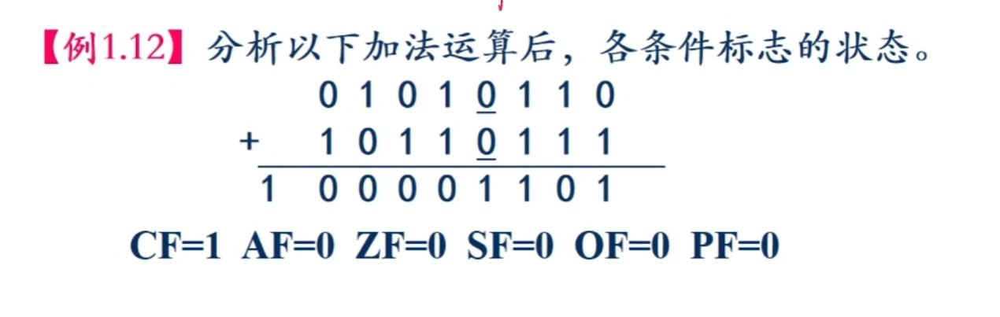
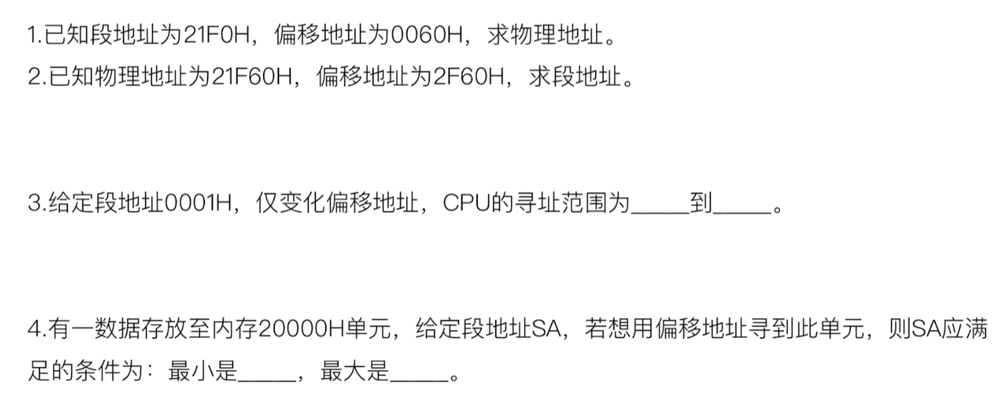
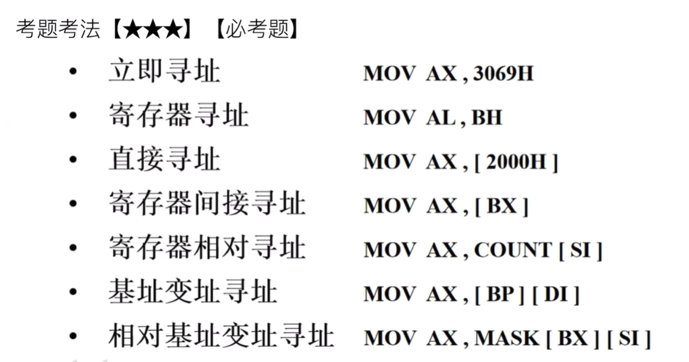

## 1. 通用寄存器

一个典型的CPU由运算器、控制器、寄存器等器件组成，这些器件笔**内部总线**相连。寄存器（Register）：处理器内部用于暂时存放程序执行过程中的代码和数据的高速存储单元。

**程序可见寄存器分为：通用寄存器、专用寄存器（段寄存器）**

#### 通用寄存器（BP\SI\DI）

- BP是一个不能分解的16位寄存器，可以存放16位的数据，也可以生成个存储器地址。
- SI、DI寄存器：也是不能分解的16位寄存器，可以存放16位的数据，某些指令中被指定使用。

#### 专用寄存器(SP\IP\FLAGS)

- SP：堆栈指针，是16位寄存器，存放的是堆栈栈顶指针，内容随着出栈入栈动态改变；
- IP：指令指针，是16位寄存器，用来提供下一条执行的指令的地址；
- FLAGS寄存器（标志寄存器）
  - CF (Carry Flag)：**进位**标志位（无符号数溢出）。加(减)法运算时，若**最高位**有进(借)位则CF=1；没有进位，CF=0。
  - PF(Parity Flag)：**奇偶**标志位。运算结果的低8位中“1”的个数为**偶数**时PF=1；为奇数时，PF=0。
  - AF (Auxiliary Carry Flag)：**辅助进位**标志位。加（减)操作中，若Bit3向Bit4有进位（借位），AF=1；没有进位，AF=0。
  - ZF(Zero Flag)：**零**标志位。当运算结果为零时ZF=1；不为零时，ZF=0。
  - SF(Sign Flag)：**符号**标志位。当运算结果是负数时，SF=1；运算结果是正数，SF=0。
  - OF (Overflow Flag)：**溢出**标志位（有符号数溢出）。当算术运算的结果超出了有符号数的可表达范围时，OF=|；未超出时，OF=0。
  
#### 段寄存器。
CS(Code  )：
DS(Data)：
ES(Extra)：
SS(Stack)：  


### 必考题：


## 2. 汇编语句结构

**\[名字项\]     操作项    \[操作数项\]      \[；注释项\]**

其中，\[  \]表示为可选项。


1. **伪指令语句**
   伪指令语句用来说明程序运行的处理器平台，进行段定义、变量与常量定义、过程定义、宏定义以及源程序的开始与结束定义等。伪指令语句作用于汇编过程，用来指示汇编程序如何进行源程序汇编。

2. **指令语句**
   指令语句包含一条汇编语言指令。程序的操作功能是由指令语句来实现的

3. **宏指令语句(函数)**
   宏指令是宏汇编语言允许程序员自定义的一种特殊形式的指令。宏指令语句用来描述宏指令的使用。

- 
1. **名字项**
   名字项是一个符合特定规则的字符串，其最大长度不超过31个字符,组成名字项的字符规定为：26个英文字母(不分大小写)，数字符0~9，以及?, ·, '\_, @, \$等。

   **数字不能作为名字项的第一个字符。.只能作为名字项第一个字符用。**

2. **操作项**
   操作项是一条语句中必不可少的部分。

3. **操作数项**
   可以是一个、两个或没有，可以是常量、变量、寄存器、指令标号、过程名、段名或表达式

### 变量定义与存储空间分配

DB-定义字节类型
DW-定义字类型
DD-定义双字类型
DQ-定义四字类型
DT-定义十字节类型
DUP 操作符：重复次数 DUP (数据项)

举例：
```asm
; [变量名] 类型 数据项
VAR1 DB 46H
VAR2 DW 2A05H
VAR3 DB 26*3,-53,00101001B
VAR4 DW 12H, 0A186H
VAR5 DB ?,?,?,?,?,?,?,?,?,?
VAR5 DB 10 DUP (?)
```


### 属性运算符

1）OFFSET：用于取变量或标号的段内偏移地址
```asm
OFFSET 变量或标号
```

2）SEG：用于取变量或标号的段地址
```asm
SEG 变量或标号
```

3）PTR：用于重新指定变量、标号或地址表达式的访问类型
```asm
新类型 PTR 变量或标号或地址表达式
```

可重新定义的类型有：BYTE\WORD\DWORD\NEAR\FAR
举例：(1)OFFSET VAR1 (2）OFFSET VAR2+1 (3)SEG VAR3 （4）WORD PTR VAR3

### 替代符定义伪指令

1）EQU伪指令定义替代符
```asm
替代符 EQU 表达式
```

2）=伪指令定义替代符
```asm
替代符=表达式
```

*=伪指令定义替代符可在同一个源程序中重复定义，有效范围是从被定义开始到下一次被定义替代符与变量有本质的区别：变量需要分配存储空间，但替代符不会，他只是某个表达式的别名，汇编程序在对其进行汇编时，会用表达式的值置换。


### 段内偏移地址指针设置伪指令

段内偏移地址指针$
段内偏移地址指针设置伪指令ORG
例：
```asm
DSEG SEGMENT
DATE1 DB 14H DUP(?)
ORG 100H
DATE2 DW1375H,2468H
DSEG ENDS
```

### 例题

#### 1. 
画出存储空间映像：
```asm
DSEG SEGMENT
VAR1 DB 46H
VAR2 2 DW2A05H
VAR3 DB 26*3,-53,00101001B
VAR4 DW 12H， 0A186H
DSEG ENDS
```

在上一题的基础上，分析表达式：
(1)OFFSETVAR1
(2）OFFSET VAR2+1
(3) SEG VAR3
(4)WORD PTR VAR3

#### 2. 
分析下列语句中，段内偏移地址指针的作用
```asm
DSEG SEGMENT
DAT1 DB 7FH,0DH,20H,33H,49H,0C6BH,10 DUP(?)
N1 = $-DAT1           ;DAT1的元素个数
DAT2 DW1023H,0B5H,4587H,356H,7096H
N2 = ($-DAT2)/2       ;DAT2的元素个数
DSEG ENDS
```

## 3. 寻址方式

寻址方式：指令指定操作数的位置，即给出地址信息，在执行时需要根据这个地址信息找到需要的操作数。这种寻找操作数的过程称为寻址,而寻找操作数的方法称为寻址方式。

立即数：指令中操作数字段实质上是指出操作数存放于何处。一般来说，操作数可以跟随在指令操作码之后，称为立即数；

寄存器操作数：操作数也可以存放在CPU内部的寄存器中：存储器操作数：绝大多数的操作数存放在内存储器中。

### 1. 寄存器寻址

参加操作的操作数在CPU的通用寄存器中。例：MOV AX，BX

### 2.立即寻址

指令中的源操作数是立即数，即源操作数是参加操作的数据本身：例：MOV BX，2400H

### 3. 存储器寻址：

直接寻址、寄存器间接寻址、寄存器相对寻址基址变址寻址、相对基址变址寻址

1）直接寻址
指令中直接给出操作数的偏移地址
```asm
MOVAX，[1200H]【默认在数据段】

```
例：
2）寄存器间接寻址
参与操作的操作数存放在内存中，其偏移地址为指令中的寄存器的内容。
例：设BX=2400H，MOV AX，\[BX\]
16位寻址时可用的寄存器是BX，DI，SI和BP；

3）寄存器相对寻址
操作数的有效地址为基址寄存器或变址寄存器的内容和指令中指定的位移量之和，有效地址由两种成分组成。
例：
```asm
MOV AX，COUNT[SI]
MOV AX, [COUNT(+SI)]
```

16位寻址可用的寄存器是BX，DI，SI和BP；

4）基址变址寻址
操作数的有效地址是一个基址寄存器和一个变址寄存器的内容之和，所以有效地址由两种成分组成。
例：
```asm
MOV AX，[BX][DI]
MOV AX, [BX+DI]
```

基址寄存器是BX，段寄存器默认DS；基址寄存器是BP时，段寄存器默认SS

5)相对基址变址寻址
操作数的有效地址是一个基址寄存器与一个变址寄存器的内容和指令中指定的位移量之和，所以有效地址由三种成分组成。
例：
```asm
MOV AX，D[BX[SI]
MOV AX,D[BX+SI]
MOV AX，[D+BX+SI]
```

基址寄存器是BX，段寄存器默认DS；基址寄存器是BP时，段寄存器默认SS

### 4. 隐含寻址

在8086指令系统中，有些指令默认操作数存放在某个特定的寄存器中，从而可省略对该操作数的描述，称为隐含寻证。

例：MUL BX

### 例题


<table>
  <tr>
    <th>寻址方式</th>
    <th>源操作数典型格式</th>
    <th>有效地址 EA 计算</th>
  </tr>
  <tr>
    <td>立即寻址</td>
    <td>直接写数字（如<code>3069H</code>）</td>
    <td>无（就是常数本身）</td>
  </tr>
  <tr>
    <td>寄存器寻址</td>
    <td>纯寄存器名（如<code>BH</code>）</td>
    <td>无（寄存器内部操作）</td>
  </tr>
  <tr>
    <td>直接寻址</td>
    <td><code>[数值]</code></td>
    <td>EA = 括号内的固定数值</td>
  </tr>
  <tr>
    <td>寄存器间接寻址</td>
    <td><code>[单个寄存器]</code></td>
    <td>EA = 寄存器内存储的值</td>
  </tr>
  <tr>
    <td>寄存器相对寻址</td>
    <td><code>常量[单寄存器]</code></td>
    <td>EA = 常量 + 单寄存器的值</td>
  </tr>
  <tr>
    <td>基址变址寻址</td>
    <td><code>[基址][变址]</code></td>
    <td>EA = 基址寄存器值 + 变址寄存器值</td>
  </tr>
  <tr>
    <td>相对基址变址寻址</td>
    <td><code>常量[基址][变址]</code></td>
    <td>EA = 常量 + 基址值 + 变址值</td>
  </tr>
</table>