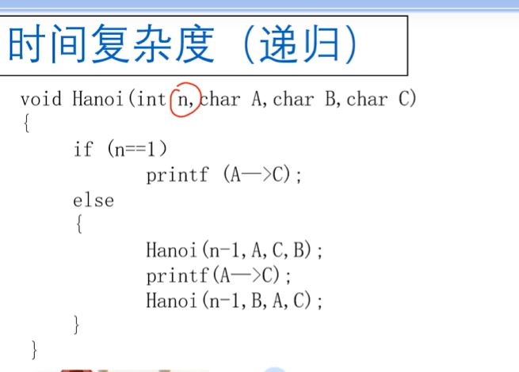
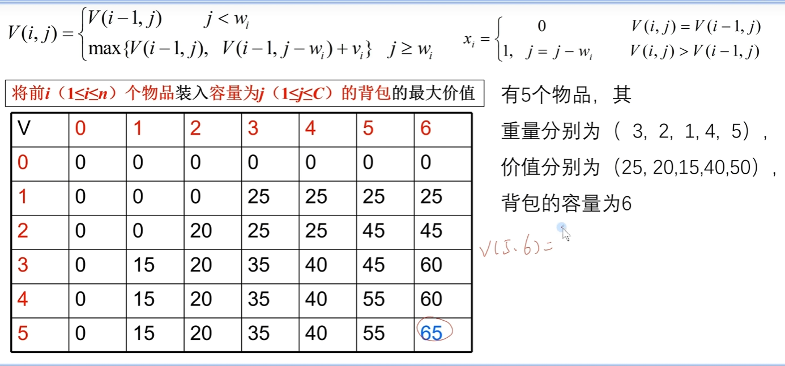
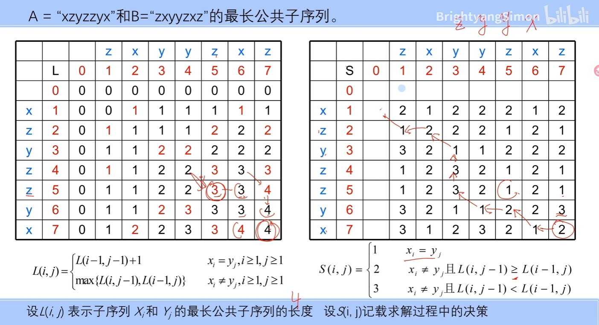
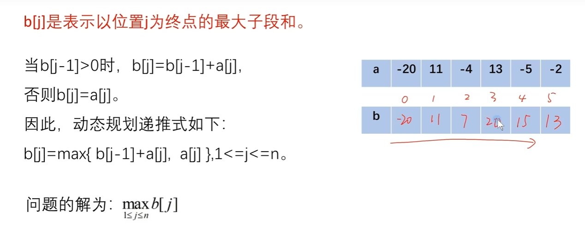
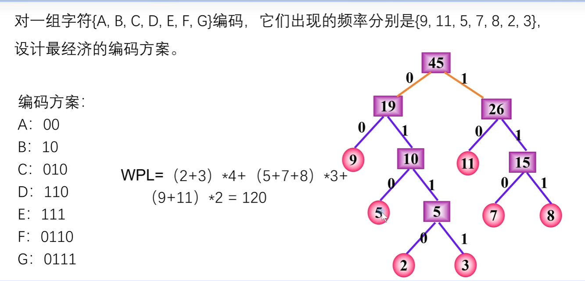
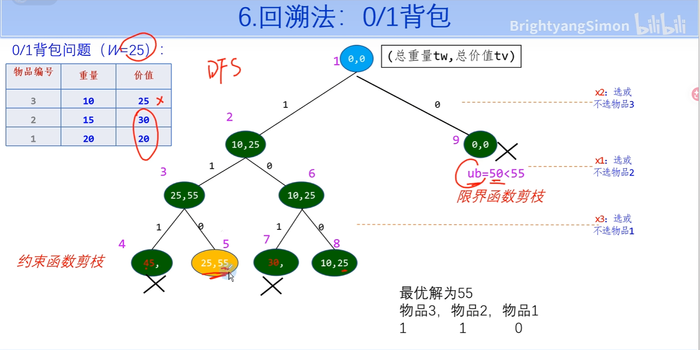
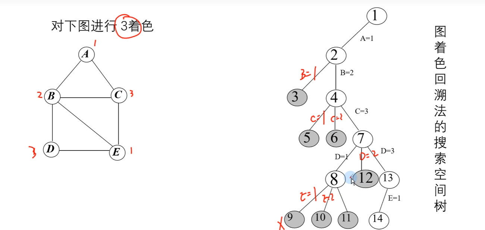
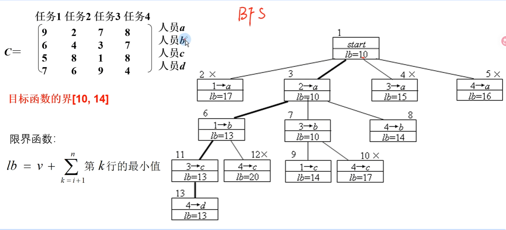
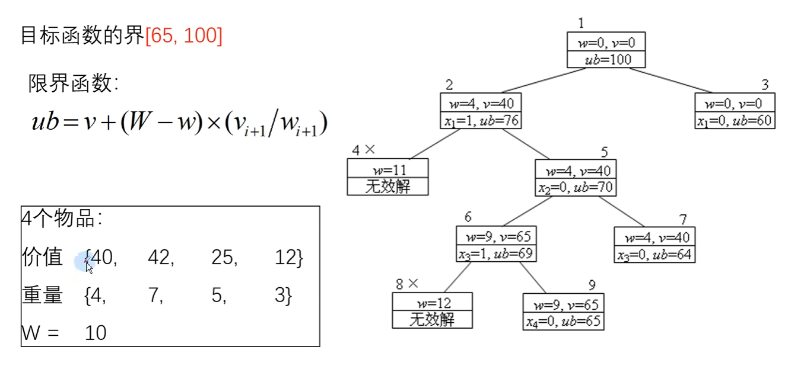

# 1 基础

# 2 穷举

# 3 分治

## 3.1 最大子段和

例：求数组 `[4, -3, 5, -2, -1, 2, 6, -2]` 的最大子段和

- **左半边：** `[4, -3, 5, -2]`
- **右半边：** `[-1, 2, 6, -2]`

根据分治的核心思想，最大的那段连续和，只可能藏在以下三个地方之一：
### 1. 完全在左半边

我们在左半边 `[4, -3, 5, -2]` 内部继续套用同样的方法找，最后能揪出来的最大子段是 `[4, -3, 5]`，加起来和是 **$6$**。

### 2. 完全在右半边

我们在右半边 `[-1, 2, 6, -2]` 内部找，能揪出来的最大子段是 `[2, 6]`，加起来和是 **$8$**。

### 3. 跨过分界线（既占左边，又占右边）

- **从切口向左扫描（必须包含 `-2`）：**
    - 只看 `-2` $\rightarrow$ 和为 $-2$
    - 加上 `5` $\rightarrow$ `[5, -2]` 和为 $3$
    - 再加上 `-3` $\rightarrow$ `[-3, 5, -2]` 和为 $0$
    - 再加上 `4` $\rightarrow$ `[4, -3, 5, -2]` 和为 $4$
    - _结论：向左能摸到的最大和是 **$3$**_。
- **从切口向右扫描（必须包含 `-1`）：**
    - 只看 `-1` $\rightarrow$ 和为 $-1$
    - 加上 `2` $\rightarrow$ `[-1, 2]` 和为 $1$
    - 再加上 `6` $\rightarrow$ `[-1, 2, 6]` 和为 $7$
    - 再加上 `-2` $\rightarrow$ `[-1, 2, 6, -2]` 和为 $5$
    - _结论：向右能摸到的最大和是 **$7$**_。
- **合体：** 把左边能拿到的最大值 $3$ 和右边能拿到的最大值 $7$ 拼起来，得到跨界的最大和是 $3 + 7 =$ **$10$**。

### 最后

- 左边最强：$6$
- 右边最强：$8$
- 跨中间最强：$10$
三者取最大的，最终结果就是 **$10$**（对应的子段其实就是 `[5, -2, -1, 2, 6]`）。

### 总结

> **分治求最大子段和：**
> 1. **切两半：** 扔给左右子问题去递归（耗时 $2T(\frac{n}{2})$）。
> 2. **算跨界：** 从中间往两边死磕，分别找出左边最大和右边最大，拼起来（耗时 $O(n)$）。
> 3. **三取大：** 左边、右边、跨界，谁大选谁。
> 4. **记规模：** 结构等同归并排序，时间复杂度 **$O(n \log n)$**。

## 3.2 快速排序

采取快速排序，写出做升序排序时的每一趟的结果。
已知序列{17，18，60，40，7，32，73，65，85}

{7, **17**, 60, 40, 18, 32, 73, 65, 85}
{7, **17**, 32, 40, 18, **60**, 73, 65, 85}
{7, **17**, 18, **32**, 40, **60**, 65, **73**, 85}

# 4 动态规划

## 4.0 动态规划的基本步骤

### 1. 划分阶段与定义状态（核心核心！）

这是最关键的一步。你需要把原问题按时间或空间特征分解为若干个互相衔接的“阶段”，并用一个数学符号（通常是数组 `dp[i]` 或 `dp[i][j]`）来表示某个阶段所处的**状态**。
- **大白话：** 明确 `dp[x]` 代表的究竟是什么含义（例如：`dp[i]` 表示凑齐金额为 `i` 时所需的最少硬币数）。
### 2. 确定状态转移方程（数学骨架）

找出从前一个阶段的状态演变到当前阶段状态的数学规律。也就是写出一个递推公式，说明当前格子的值如何由前面几个格子的值计算而来。

- **大白话：** 找出 `dp[i]` 和 `dp[i-1]`、`dp[i-2]` 之间的勾连公式（例如斐波那契数列的 $dp[i] = dp[i-1] + dp[i-2]$）。
### 3. 设定边界条件与初始化（安全出口）

状态转移方程是递推的，必须有起点。你需要直接给出最简单、最底层子问题的解，并将其填入状态表（DP 表）中，防止程序陷入死循环或越界。

- **大白话：** 把最基础的常识填进去（例如：`dp[0] = 0`，金额为0时需要0枚硬币）。
### 4. 确定计算顺序并迭代填表（自底向上）

根据状态转移方程的依赖关系，确定是从前到后、从上到下还是从小到大。按照这个顺序，用循环（Loop）一行行、一格格地把状态表填满。

- **大白话：** 按照画好的表格，从小问题开始一路往大问题算，利用已经算好的历史记录直接得出新格子的值。
### 5. 构造最优解并返回（最终收网）

当整个状态表（或最后一层状态）计算完毕后，根据题目的要求，从表格的特定位置（通常是最后一个格子 `dp[n]` 或 `dp[m][n]`）直接读取答案。如果题目要求写出具体路径，还需要根据表格逆向追踪回去。
### 总结

> **动规五步走，高分不用愁：**
> 1. **定状态**（`dp` 数组代表啥）。
> 2. **列方程**（大问题怎么拆成小问题）。
> 3. **给初始**（最底层的边界值）。
> 4. **忙填表**（自底向上循环迭代）。
> 5. **拿答案**（终点位置取最优解）。

## 4.1 0/1背包

用动态规划法求0/1背包的最优解：有5个物品，重量分别为（3，2，1，4，5）价值分别为（25,20,15,40,50），背包的容量为6。

## 4.2 最长公共子序列

## 4.3 最大子段和

# 5 贪心

## 5.1 背包问题

给定$n$种物品和—个容量为C的背包，物品$i$的重量是$w_i$，其价值为$v_i$，背包问题是如何选择装入背包的物品，使得装入背包中物品的总价值最大？（背包问题可以将某种物品的一部分装入背包）

## 5.2 哈夫曼树

# 6 回溯

## 6.1 0/1背包

## 4.2 图着色

# 7 分支限界

## 7.1 任务分配问题

## 7.2 01背包

