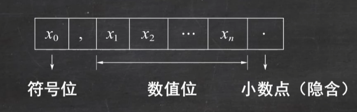
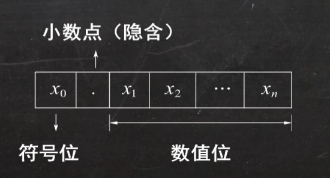
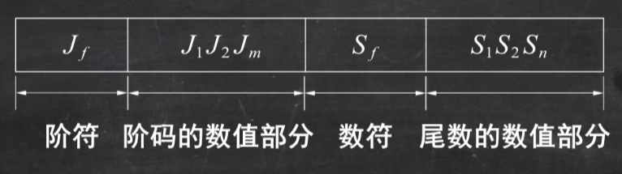

## 1 计算机概述

### 1.1 计算机系统

#### 冯·诺依曼计算机的特点：
1. 计算机由五大部件组成：**运算器、控制器、存储器、输入设备、输出设备**。
2. 指令和数据以同等地位存于存储器，可按地址寻访
3. 指令和数据用二进制表示
4. 指令由操作码和地址码组成
5. 存储程序
6. **以运算器为中心**

#### 相关概念
- 存储元：即存储二进制的电子元件，每个存储元可存储1bit。
- 存储单元：每个存储单元存放一串二进制代码。
- 存储字：存储单位中二进制代码的组合。
- 存储字长：存储单元中二进制代码的位数。
- 1字节(Byte)=8 bit，1B=1个字节，  1b=1位二进制。

现代计算机：

### 1.2 计算机系统的层次结构

### 1.3 计算机的性能指标

#### 1.3.1 存储器
##### （1）存储器的容量
$$\text{存储器的容量} = \text{存储单元个数} \times \text{存储字长} (bit) = \text{存储单元个数} \times \frac{\text{存储字长}}{8} (Byte)$$

---

##### （2）相关概念

-  $n$ 位二进制可表示 $2^n$ 种状态，

   **例如：** 2 位二进制可表示 4 种状态：$00$，$01$，$10$，$11$

-  **在存储容量相关题中：**
   $1K = 2^{10} = 1024$，$1M = 2^{20}$，$1G = 2^{30}$，$1T = 2^{40}$

   **在与时间相关题中（如传输速率）：**
   $1K = 10^3$，$1M = 10^6$，$1G = 10^9$，$1T = 10^{12}$

#### 1.3.2 CPU

1. $CLK$: CPU时钟周期
2. $CPU \text{主频（时钟频率）}= \frac{1}{CLK}$
3. $CPI$：执行一条指令所需的时钟周期数
4. $IPS$：每秒执行的指令条数=$\frac{主频}{平均CPI}$
5. $FLOPS$：每秒执行的浮点运算次数
6. 执行一条指令的耗时=CPI×CPU时钟周期
7. $$\text{CPU执行时间（整个程序的耗时）}=\frac{\text{CPU时钟周期数}}{\text{CPU时钟周期数主频}}=\frac{\text{指令条数}\times CPI}{\text{主频}}$$

## 2 数据的表示

### 2.1 数制与编码

#### 2.1.1 数制

二进制`B` 八进制`O` 十进制`D` 十六进制`H/0x`

#### 2.1.2 编码

BCD码，ASCII码

#### 2.1.3 校验码

**概念**
校验码是指能够发现或能自动校正错误的数据编码，其原理是通过增加一些冗余码，来检验或纠错编码。

**奇偶校验码**
1. 基本原理：由若干位信息位再加一位二进制位组成校验码。
2. 奇校验码：整个校验码（有效信息位和校验位）中“1”的个数为奇数。
3. 偶校验码：整个校验码（有效信息位和校验位）中“1”的个数为偶数。

#### 2.1.4 定点数的表示

1. 定点整数

2. 定点小数

3. 原、反、补、移码之间的转换
- **原码表示法**
  用机器数的最高位表示该数的符号（0：正；1：负），其余各位表示数的绝对值。
  注：真值零的原码表示有2种：$[+0]_原=0,000$ 和 $[-0]_原=1,000$
- **反码表示法**
  正数：反码与原码相同；
  负数：原码符号位不变，数值部分全部取反
  注：真值零的反码表示有2种，$[+0]_反=0,000$ 和 $[-0]_反=1,111$
- **补码表示法**
  正数：补码与原码相同；
  负数：原码符号位不变，数值部分全部取反 ，末位加1（即“取反加1”）。
  ①此方法也可逆着用，由补码求原码
  ②真值零的补码表示只有1种，$[0]_补=0,000$
- **移码表示法**
  将补码的符号位取反即得到移码
  ①移码只能用来表示定点整数（移码多用于表示浮点数的阶码）
  ②真值零的移码表示只有1种，$[0]_移=1,000$

#### 2.1.4 浮点数的表示

**浮点数的表示为**：$N = r^E \times M$

其中，$r$ 是浮点数阶码的底（隐含），与尾数的基数相同，通常 $r = 2$。$E$ 和 $M$ 都是有符号的定点数，$E$ 称为阶码，$M$ 称为尾数。即浮点数由阶码和尾数两部分组成，如下图所示。

**规格化浮点数**

①浮点数规格化形式：为了提高运算精度，充分利用尾数的有效数位，规定尾数的最高数位上保证是一个有效值。

②左规：当浮点数运算的结果为非规格化时，要进行规格化处理，将尾数算术左移一位，阶码减1的方法称为左规。左规可能要进行多次。

③右规：当浮点数运算的结果尾数出现溢出（双符号位为01或10）时，将尾数算术右移一位，阶码加1的方法称为右规。右规只需进行一次。

注：当 $r=2$ 时，规格化浮点数的尾数 $M$ 满足 $\frac{1}{2} \leq |M| \leq 1$。

## 3 数据的运算

### 3.1 定点数的运算

**算术移位**：针对带符号的移位操作，对于不同表示法的机器码，规则不同，具体如下：

| 数符  | 码制     | 符号位 | 右移 MSB 位填补值 | 左移 LSB 位填补值 |
| --- | ------ | --- | ----------- | ----------- |
| 正数  | 原/反/补码 | 0   | 0           | 0           |
| 负数  | 原码     | 1   | 0           | 0           |
| 负数  | 补码     | 1   | 1           | 0           |
| 负数  | 反码     | 1   | 1           | 1           |

#### 1. 截断法 (Truncation) —— 铁面无私，直接切断

**规则**：不管小数点后面是什么，直接把小数点后面的数字擦掉。

- 例子 A (正数)：010.1 (十进制约 2.5)
  - 截断后变成：010 (十进制的 2)
  - 误差：-0.5 (变小了)

- 例子 B (负数)：110.1 (十进制约 -2.5)
  - 截断后变成：110 (十进制的 -2)
  - 误差：+0.5 (在补码体系下，这其实是向负无穷方向取整，数值代表的绝对值变小了，但在数轴上是向左或向右取大于编码，总体上它让所有数都往一个方向偏)。

#### 2. 传统四舍五入 (Half Up) —— 满 0.5 就进位

**规则**：在二进制里，小数位第一位如果是 1 (代表 0.5)，就往前加 1。

**硬件的小技巧**：强行在低位加一个 0.1 (十进制的 0.5)，然后直接截断。

- 例子 A (进位)：010.1 (2.5)
  - 第一步，加上 0.1 → 010.1 + 0.1 = 011.0 (3.0)
  - 第二步，截断掉小数 → 变成 011 (十进制的 3)
  - 误差：+0.5

- 例子 B (不进位)：010.0 (2.0)
  - 第一步，加上 0.1 → 010.0 + 0.1 = 010.1
  - 第二步，截断掉小数 → 变成 010 (十进制的 2)
  - 误差：0

**直观感受**：这符合我们的日常习惯。但是它有个统计学漏洞：每当遇到 .5 的时候，它永远在向上进位。如果你的系统里刚好有大量 .5 的数据，大家都往上进，结果总和就会偏大 (正向偏置)。

#### 3. 奇偶舍入 (Nearest Even) —— 遇 5 看奇偶，绝不偏心

**规则**：如果是 .5，看看留下的最后一位 (最低有效位 LSB)。如果是奇数就进位，如果是偶数就舍去，目标是让留下的最后一位变成偶数 (即二进制的 0)。

我们来看两个连续的 .5 数据：

- 数据一：010.1 (十进制的 2.5)
  - 小数点最后一位是 0 (偶数)。
  - 处理：保持偶数，直接舍去小数 → 变成 010 (十进制的 2)。

- 数据二：011.1 (十进制的 3.5)
  - 小数点最后一位是 1 (奇数)。
  - 处理：进位变成偶数 → 变成 100 (十进制的 4)。

**直观感受**：两者的误差刚好抵消了！在处理音频信号、雷达数据时，这种互相抵消的特性可以保证整体信号不失真。

#### 4. 贾米尔舍入 (Jamming) —— 简单粗暴的"流氓"无偏置

**规则**：硬件根本看小数，也不用加法器。它直接把留下的最后一位强行变成 1。

- 例子 A：010.1 (2.5)
  - 原本最后一位是 0，强行改成 1 → 变成 011 (十进制的 3，变大了)。

- 例子 B：011.1 (3.5)
  - 原本最后一位就是 1，强行改成 1 → 变成 011 (十进制的 3，变小了)。

**直观感受**：这个方法聪明在它不需要任何数学计算 (不需要昂贵的加法器电路)，只需要把那一根电线强行接通。而且由于有时变大 (例子 A)，有时变小 (例子 B)，它在统计学上也做到了误差相互抵消。虽然单看某个数的精度有点粗糙，但在追求极速、省面积的芯片设计里非常受欢迎。

### 3.2 浮点数的运算

### 3.3 加法器与ALU

## 4 指令系统
## 5 中央处理器