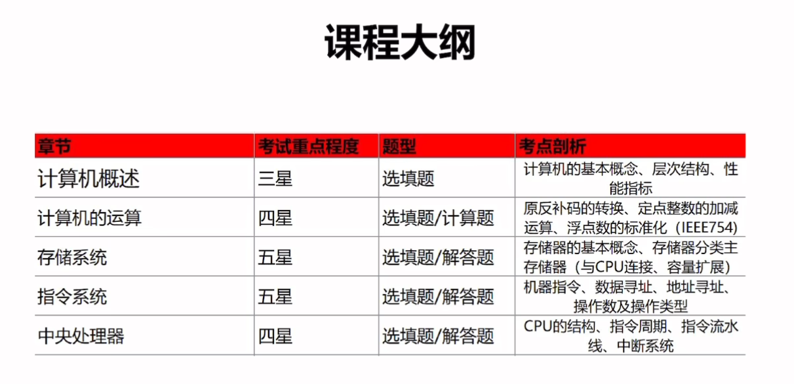
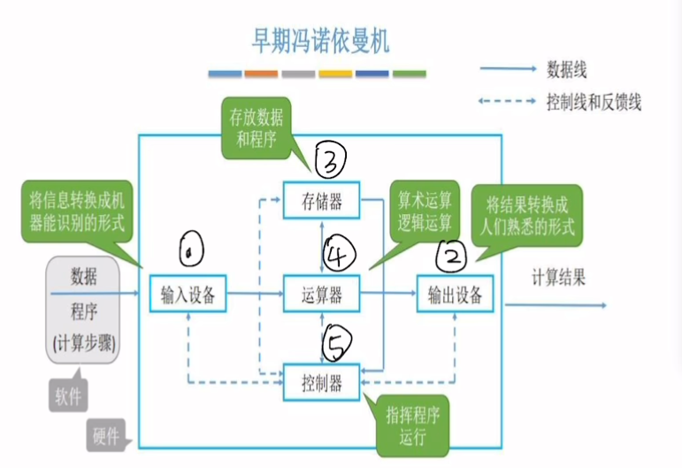
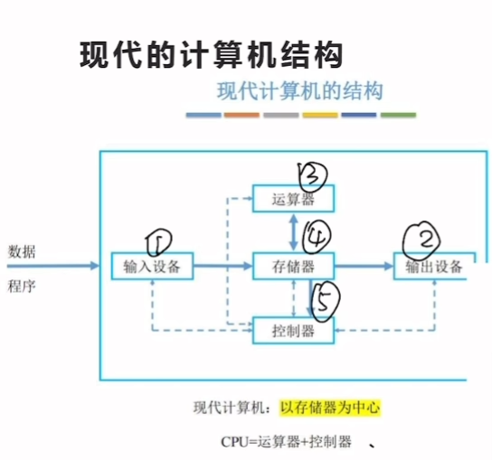
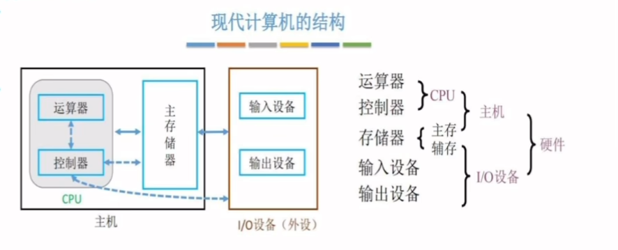

## 1 计算机概述

### 1.1 计算机系统

#### 冯·诺依曼计算机的特点：
1. 计算机由五大部件组成：**运算器、控制器、存储器、输入设备、输出设备**。
2. 指令和数据以同等地位存于存储器，可按地址寻访
3. 指令和数据用二进制表示
4. 指令由操作码和地址码组成
5. 存储程序
6. **以运算器为中心**

#### 相关概念
- 存储元：即存储二进制的电子元件，每个存储元可存储1bit。
- 存储单元：每个存储单元存放一串二进制代码。
- 存储字：存储单位中二进制代码的组合。
- 存储字长：存储单元中二进制代码的位数。
- 1字节(Byte)=8 bit，1B=1个字节，  1b=1位二进制。

现代计算机：

### 1.2 计算机系统的层次结构

### 1.3 计算机的性能指标

#### 1.3.1 存储器
##### （1）存储器的容量
$$\text{存储器的容量} = \text{存储单元个数} \times \text{存储字长} (bit) = \text{存储单元个数} \times \frac{\text{存储字长}}{8} (Byte)$$

---

##### （2）相关概念

① $n$ 位二进制可表示 $2^n$ 种状态，

**例如：** 2 位二进制可表示 4 种状态：$00$，$01$，$10$，$11$

② $2^0 = 1$，$2^1 = 2$，$2^2 = 4$，$2^3 = 8$，$2^4 = 16$，$2^5 = 32$，$2^6 = 64$，$2^7 = 128$，

$2^8 = 256$，$2^9 = 512$，$2^{10} = 1024$

③ **在存储容量相关题中：**
$1K = 2^{10} = 1024$，$1M = 2^{20}$，$1G = 2^{30}$，$1T = 2^{40}$

**在与时间相关（如传输速率）题中：**
$1K = 10^3$，$1M = 10^6$，$1G = 10^9$，$1T = 10^{12}$

#### 1.3.2 CPU

1. $CLK$: CPU时钟周期
2. $CPU \text{主频（时钟频率）}= \frac{1}{CLK}$
3. $CPI$：执行一条指令所需的时钟周期数
4. $IPS$：每秒执行的指令条数=$\frac{主频}{平均CPI}$
5. $FLOPS$：每秒执行的浮点运算次数
6. 执行一条指令的耗时=CPI×CPU时钟周期
7. $$\text{CPU执行时间（整个程序的耗时）}=\frac{\text{CPU时钟周期数}}{\text{CPU时钟周期数主频}}=\frac{\text{指令条数}\times CPI}{\text{主频}}$$

## 2 计算机的运算
## 3 存储系统
## 4 指令系统
## 5 中央处理器