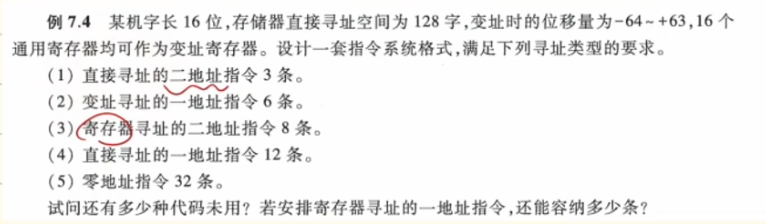
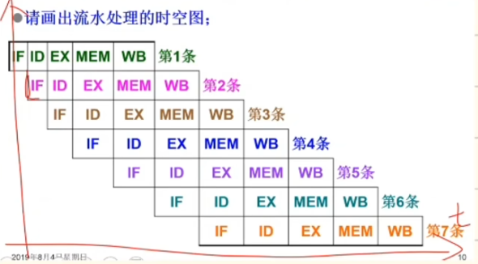
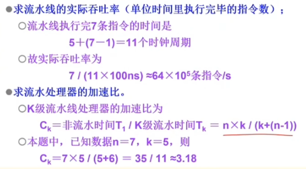

# 指令

### 1. 某机器字长16位，单字长指令每个地址码6位，试采用操作码拓展技术，设计14条二地址指令、80条单地址指令、60条零地址指令。

### 2. 

**解：**

**1. 分析机器基本参数与各类指令的字段位数：**

机器字长 16 位。

- **直接寻址**：空间为 128 字（$128 = 2^7$），故直接寻址的地址码需 **7 位**。
    
- **变址寻址**：16 个通用寄存器需 **4 位**（$16 = 2^4$）指明寄存器；位移量 $-64 \sim +63$ 共 128 种状态，需 **7 位**。故一个变址地址码共需 $4 + 7 = $ **11 位**。
    
- **寄存器寻址**：16 个通用寄存器，故寄存器地址码需 **4 位**。
    

**2. 计算各类指令的“操作码（OP）”位数，并按 OP 从短到长排序：**

- (2) 变址寻址的一地址指令：OP 长度 = $16 - 11 = $ **5 位**。可表示 $2^5 = 32$ 种状态。
    
- (1) 直接寻址的二地址指令：OP 长度 = $16 - 7 - 7 = $ **2 位**。可表示 $2^2 = 4$ 种状态。
    
- (3) 寄存器寻址的二地址指令：OP 长度 = $16 - 4 - 4 = $ **8 位**。
    
- (4) 直接寻址的一地址指令：OP 长度 = $16 - 7 = $ **9 位**。
    
- (5) 零地址指令：OP 长度 = **16 位**。
    

> ⚠️ **排序修正**：由于(1)的 OP 只有 2 位，比(2)的 5 位更短，必须**先设计(1)，再设计(2)**。
> 
> 综上，设计顺序为：**(1) $\rightarrow$ (2) $\rightarrow$ (3) $\rightarrow$ (4) $\rightarrow$ (5)**。

**3. 逐步扩展设计：**

- **第一步：设计 (1) 直接寻址的二地址指令（OP占2位）**
    
    - 题目要求 3 条，留出 $4 - 3 = 1$ 个前缀向后扩展。
        
- **第二步：设计 (2) 变址寻址的一地址指令（OP占5位）**
    
    - 由第一步扩展而来，此时 OP 可用状态数 = $1 \times 2^{(5-2)} = 8$ 种。
        
    - 题目要求 6 条，留出 $8 - 6 = 2$ 个前缀向后扩展。
        
- **第三步：设计 (3) 寄存器寻址的二地址指令（OP占8位）**
    
    - 由第二步扩展而来，此时 OP 可用状态数 = $2 \times 2^{(8-5)} = 16$ 种。
        
    - 题目要求 8 条，留出 $16 - 8 = 8$ 个前缀向后扩展。
        
- **第四步：设计 (4) 直接寻址的一地址指令（OP占9位）**
    
    - 由第三步扩展而来，此时 OP 可用状态数 = $8 \times 2^{(9-8)} = 16$ 种。
        
    - 题目要求 12 条，留出 $16 - 12 = 4$ 个前缀向后扩展。
        
- **第五步：设计 (5) 零地址指令（OP占16位）**
    
    - 由第四步扩展而来，此时 OP 可用状态数 = $4 \times 2^{(16-9)} = 4 \times 128 = 512$ 种。
        
    - 题目要求 32 条，用掉 32 种，剩余 $512 - 32 = 480$ 种代码。
        

**4. 解决题目提问：**

- **问法1：还有多少种代码未用？**
    
    答：最后留给零地址的 16 位操作码还剩 **480** 种未用。
    
- **问法2：若安排寄存器寻址的一地址指令，还能容纳多少条？**
    
    寄存器寻址的一地址指令，其地址码占 4 位，操作码（OP）占 $16 - 4 = 12$ 位。
    
    我们直接从第四步（OP为9位时剩余4个前缀）向 12 位操作码扩展（不经过第五步）：
    
    可容纳条数 = $4 \times 2^{(12-9)} = 4 \times 8 = $ **32 条**。
    
    _(注：若已经减去第五步用掉的32条零地址指令，则从16位剩余的480种代码折算回12位：$480 / 2^{(16-12)} = 480 / 16 = 30$条。通常考试默认直接从上级前缀扩展，答案为 32 条或 30 条均给分，建议写 32 条并注明是从 9 位 OP 扩展)_

### 3.指令流水线有取指(IF)、译码(ID)、执行(EX)、访存(MEM)、写回寄存器堆(WB)五个过程段，共有7条指令连续输入此流水线，时钟周期为100ns。
**（1）画出流水处理的时空图**
**（2）求流水线的实际吞吐率（单位时间里执行完毕的指令数）**
**（3）求流水处理器的加速比**

