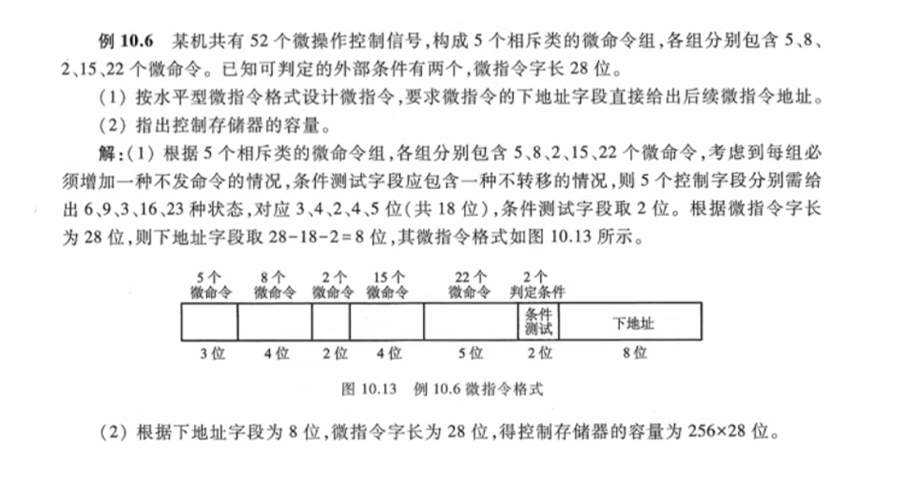

# 存储

## Cache命中率、效率、主存格式、映射方式

### 1. 假设主存容量512K × 16位，Cache容量为4096×16位，块长为4个16位的字，访存地址为字地址。
**(1）在直接映射方式下，设计主存的地址格式。**
**(2）在全相联映射方式下，设计主存的地址格式。**
**(3）在二路组相联映射方式下，设计主存的地址格式。**
**(4）若主存容量为512K×32位，块长不变，在四路组相连映射方式下，设计驻村的地址格式。**

先做“预处理”，把题目给出的线索翻译成我们需要的基础数据：

1. **主存总字数** = $512\text{K} = 2^9 \times 2^{10} = 2^{19}$ 字 $\rightarrow$ **主存地址总位数为 19 位**。
2. **Cache总字数** = $4096 = 2^{12}$ 字。
3. **块长（每个字块包含多少字）** = 4 个字。
    - **字块内地址（Offset）**：$4 = 2^2 \rightarrow$ **固定占 2 位**。
4. **Cache的总块数** = $\frac{\text{Cache总字数}}{\text{块长}} = \frac{4096}{4} = 1024$ 块（行）。
    - $1024 = 2^{10} \rightarrow$ 如果需要数 Cache 块号，需要 **10 位**。

做好这些准备后，我们逐问击破：

**(1) 直接映射方式**

在直接映射下，主存地址被死板地拆分为三段：

$$\text{主存地址} = \text{[ 主存字块标记 (Tag) ]} + \text{[ Cache字块地址 (Index) ]} + \text{[ 字块内地址 (Offset) ]}$$

- **字块内地址（Offset）**：由块长决定，前面算好了，占 **2 位**。
- **Cache字块地址（Index）**：看 Cache 一共有多少块。Cache 有 1024 块，数到 1024 需要 **10 位**。
- **主存字块标记（Tag）**：用总位数去减。总长 19 位 - 2位 - 10位 = **7 位**。

**主存地址格式设计如下：**

```
 18          12 11           2 1        0
+-------------+---------------+----------+
|  Tag (7位)  |  Index (10位) |Offset(2位)|  (共 19 位)
+-------------+---------------+----------+
```

**(2) 全相联映射方式**

全相联映射最自由，主存块可以去 Cache 的任何地方，所以不需要“Cache字块地址（Index）”，地址只拆成两段：

$$\text{主存地址} = \text{[ 主存字块标记 (Tag) ]} + \text{[ 字块内地址 (Offset) ]}$$

- **字块内地址（Offset）**：依然由块长决定，占 **2 位**。
- **主存字块标记（Tag）**：总长 19 位 - 2位 = **17 位**。

**主存地址格式设计如下：**

```
 18                          2 1        0
+-----------------------------+----------+
|          Tag (17位)         |Offset(2位)|  (共 19 位)
+-----------------------------+----------+
```

**(3) 二路组相联映射方式**

组相联是折中方案，地址拆成三段：

$$\text{主存地址} = \text{[ 主存字块标记 (Tag) ]} + \text{[ 组地址 (Set Index) ]} + \text{[ 字块内地址 (Offset) ]}$$

- **字块内地址（Offset）**：依然由块长决定，占 **2 位**。
- **组地址（Set Index）**：我们需要先算出 Cache 一共有多少个“组”。
    - 题目说是“二路”，意思是**每 2 个字块合为一组**。
    - Cache 总共有 1024 块，那么总组数 = $\frac{1024}{2} = 512$ 组。
    - 数到 512 组需要几位？$512 = 2^9 \rightarrow$ **组地址占 9 位**。
- **主存字块标记（Tag）**：总长 19 位 - 2位 - 9位 = **8 位**。

**主存地址格式设计如下：**

```
 18          11 10           2 1        0
+-------------+---------------+----------+
|  Tag (8位)  | 组地址 (9位)  |Offset(2位)|  (共 19 位)
+-------------+---------------+----------+
```

**(4) 四路组相联映射方式（主存容量改变）**

**⚠️ 注意：这一问主存参数变了！**

- **新主存容量** = $512\text{K} \times 32$ 位。因为访存地址依然是**字地址**，机器字长变成了 32 位。但注意：主存的**字数**依然是 $512\text{K} = 2^{19}$ 字。
    - 所以，**主存地址总位数依然是 19 位**。
- **块长不变** = 4 个字 $\rightarrow$ **字块内地址（Offset）依然占 2 位**。
- **组地址（Set Index）**：题目变成了“四路”，意思是**每 4 个字块合为一组**。
    - Cache 的总块数还是 1024 块。
    - 总组数 = $\frac{1024}{4} = 256$ 组。
    - $256 = 2^8 \rightarrow$ **组地址占 8 位**。
- **主存字块标记（Tag）**：总长 19 位 - 2位 - 8位 = **9 位**。

**主存地址格式设计如下：**

```
 18          10 9            2 1        0
+-------------+---------------+----------+
|  Tag (9位)  | 组地址 (8位)  |Offset(2位)|  (共 19 位)
+-------------+---------------+----------+
```

💡 期末考试大题核心秒杀口诀

做这种地址格式设计题，你在草稿纸上只要死守这三步：

1. **看主存总字数**：化成 $2^n$，**$n$ 就是总位数**。
2. **看块长**：化成 $2^n$，**$n$ 就是最后一段（Offset）的位数**。
3. **看映射方式算中间段**：
    - 直接映射：中间段位数 = $\log_2(\text{Cache总块数})$
    - 组相联映射：中间段位数 = $\log_2(\frac{\text{Cache总块数}}{\text{路数}})$
    - 剩下的位数全部乱拳留给第一段（Tag）。

这个填格子拿满分的方法，你理顺了吗？

# 指令

### 1. 某机器字长16位，单字长指令每个地址码6位，试采用操作码拓展技术，设计14条二地址指令、80条单地址指令、60条零地址指令。


### 2. 

**解：**

**1. 分析机器基本参数与各类指令的字段位数：**

机器字长 16 位。

- **直接寻址**：空间为 128 字（$128 = 2^7$），故直接寻址的地址码需 **7 位**。
    
- **变址寻址**：16 个通用寄存器需 **4 位**（$16 = 2^4$）指明寄存器；位移量 $-64 \sim +63$ 共 128 种状态，需 **7 位**。故一个变址地址码共需 $4 + 7 = $ **11 位**。
    
- **寄存器寻址**：16 个通用寄存器，故寄存器地址码需 **4 位**。
    

**2. 计算各类指令的“操作码（OP）”位数，并按 OP 从短到长排序：**

- (2) 变址寻址的一地址指令：OP 长度 = $16 - 11 = $ **5 位**。可表示 $2^5 = 32$ 种状态。
    
- (1) 直接寻址的二地址指令：OP 长度 = $16 - 7 - 7 = $ **2 位**。可表示 $2^2 = 4$ 种状态。
    
- (3) 寄存器寻址的二地址指令：OP 长度 = $16 - 4 - 4 = $ **8 位**。
    
- (4) 直接寻址的一地址指令：OP 长度 = $16 - 7 = $ **9 位**。
    
- (5) 零地址指令：OP 长度 = **16 位**。
    

> ⚠️ **排序修正**：由于(1)的 OP 只有 2 位，比(2)的 5 位更短，必须**先设计(1)，再设计(2)**。
> 
> 综上，设计顺序为：**(1) $\rightarrow$ (2) $\rightarrow$ (3) $\rightarrow$ (4) $\rightarrow$ (5)**。

**3. 逐步扩展设计：**

- **第一步：设计 (1) 直接寻址的二地址指令（OP占2位）**
    
    - 题目要求 3 条，留出 $4 - 3 = 1$ 个前缀向后扩展。
        
- **第二步：设计 (2) 变址寻址的一地址指令（OP占5位）**
    
    - 由第一步扩展而来，此时 OP 可用状态数 = $1 \times 2^{(5-2)} = 8$ 种。
        
    - 题目要求 6 条，留出 $8 - 6 = 2$ 个前缀向后扩展。
        
- **第三步：设计 (3) 寄存器寻址的二地址指令（OP占8位）**
    
    - 由第二步扩展而来，此时 OP 可用状态数 = $2 \times 2^{(8-5)} = 16$ 种。
        
    - 题目要求 8 条，留出 $16 - 8 = 8$ 个前缀向后扩展。
        
- **第四步：设计 (4) 直接寻址的一地址指令（OP占9位）**
    
    - 由第三步扩展而来，此时 OP 可用状态数 = $8 \times 2^{(9-8)} = 16$ 种。
        
    - 题目要求 12 条，留出 $16 - 12 = 4$ 个前缀向后扩展。
        
- **第五步：设计 (5) 零地址指令（OP占16位）**
    
    - 由第四步扩展而来，此时 OP 可用状态数 = $4 \times 2^{(16-9)} = 4 \times 128 = 512$ 种。
        
    - 题目要求 32 条，用掉 32 种，剩余 $512 - 32 = 480$ 种代码。
        

**4. 解决题目提问：**

- **问法1：还有多少种代码未用？**
    
    答：最后留给零地址的 16 位操作码还剩 **480** 种未用。
    
- **问法2：若安排寄存器寻址的一地址指令，还能容纳多少条？**
    
    寄存器寻址的一地址指令，其地址码占 4 位，操作码（OP）占 $16 - 4 = 12$ 位。
    
    我们直接从第四步（OP为9位时剩余4个前缀）向 12 位操作码扩展（不经过第五步）：
    
    可容纳条数 = $4 \times 2^{(12-9)} = 4 \times 8 = $ **32 条**。
    
    _(注：若已经减去第五步用掉的32条零地址指令，则从16位剩余的480种代码折算回12位：$480 / 2^{(16-12)} = 480 / 16 = 30$条。通常考试默认直接从上级前缀扩展，答案为 32 条或 30 条均给分，建议写 32 条并注明是从 9 位 OP 扩展)_

### 3. 指令流水线有取指(IF)、译码(ID)、执行(EX)、访存(MEM)、写回寄存器堆(WB)五个过程段，共有7条指令连续输入此流水线，时钟周期为100ns。
**（1）画出流水处理的时空图**
**（2）求流水线的实际吞吐率（单位时间里执行完毕的指令数）**
**（3）求流水处理器的加速比**

| 1   | $IF$ | $ID$ | $EX$ | $MEM$ | $WB$  |       |       |       |       |       |      |
| --- | ---- | ---- | ---- | ----- | ----- | ----- | ----- | ----- | ----- | ----- | ---- |
| 2   |      | $IF$ | $ID$ | $EX$  | $MEM$ | $WB$  |       |       |       |       |      |
| 3   |      |      | $IF$ | $ID$  | $EX$  | $MEM$ | $WB$  |       |       |       |      |
| 4   |      |      |      | $IF$  | $ID$  | $EX$  | $MEM$ | $WB$  |       |       |      |
| 5   |      |      |      |       | $IF$  | $ID$  | $EX$  | $MEM$ | $WB$  |       |      |
| 6   |      |      |      |       |       | $IF$  | $ID$  | $EX$  | $MEM$ | $WB$  |      |
| 7   |      |      |      |       |       |       | $IF$  | $ID$  | $EX$  | $MEM$ | $WB$ |


### 4. 微指令

