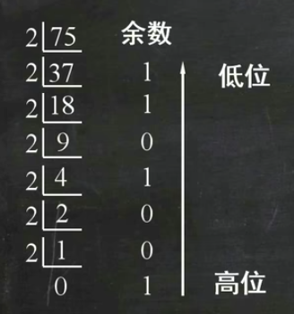
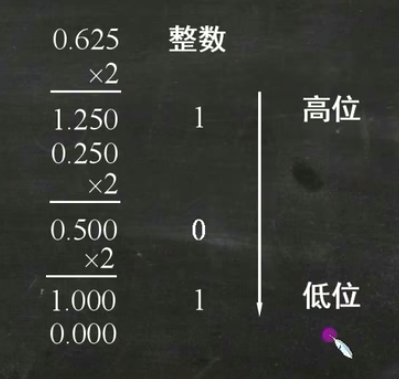
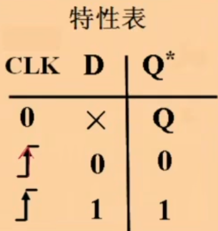
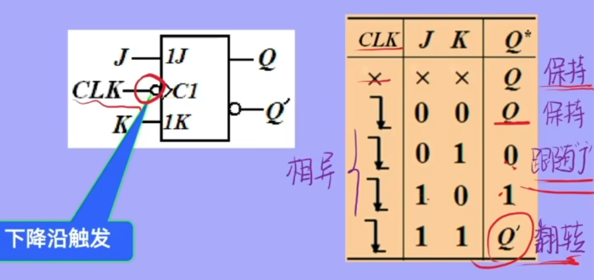
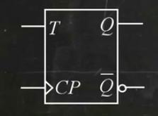
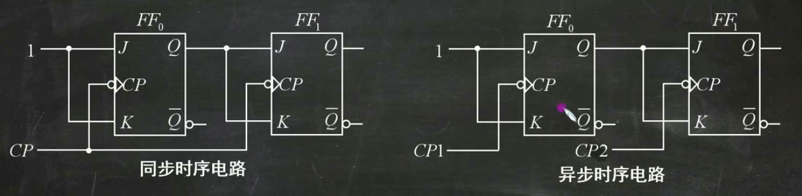

# 1 数制与编码

## 1.1 数制

### 1. 二进制与十进制

#### 二进制转十进制

**按权展开法：**
$$
(11001.011)_2 = 1 \times 2^4 + 1 \times 2^3 + 0 \times 2^2 + 0 \times 2^1 + 1 \times 2^0 + 0 \times 2^{-1} + 1 \times 2^{-2} + 1 \times 2^{-3}
$$
#### 十进制转二进制

$(75.625)_{10} = ( \quad )_2$

**整数部分：除 2 取余法**  

得：$1001011$

**小数部分：乘 2 取整法**  

得：$101$

$(75.625)_{10} = (1001011.101)_2$

### 2. 二进制与十六进制

四位分组

### 3. 二进制与八进制

三位分组

# 1.2 编码

##  BCD 编码

---

# 2 逻辑代数

## 2.1 逻辑门

## 2.2 常用形式

#### 1. 反演规则（德摩根定律）

$\overline{A \cdot B} = \overline{A} + \overline{B}$

$\overline{(A B) \cdot (C D)} = \overline{A B} + \overline{C D} = (\overline{A} + \overline{B}) + (\overline{C} + \overline{D})$

**反函数**：
或变与，与变或，所有变量取反

$$
\begin{aligned}
F &=A(\overline{B}+CD+EF)+A\overline{C}D \\
\overline{F} &= \overline{A(\overline{B} + C D + E F) + A \overline{C} D} \\
&= \overline{A(\overline{B} + C D + E F)} \cdot \overline{A \overline{C} D} \\
&= \left( \overline{A} + \overline{\overline{B} + C D + E F} \right) \cdot \left( \overline{A} + \overline{\overline{C} D} \right) \\
&= \left( \overline{A} + (B \cdot \overline{C D + E F}) \right) \cdot \left( \overline{A} + (C + \overline{D}) \right) \\
&= \left( \overline{A} + (B \cdot (\overline{C D} \cdot \overline{E F})) \right) \cdot \left( \overline{A} + (C + \overline{D}) \right) \\
&= \left( \overline{A} + (B \cdot ((\overline{C} + \overline{D}) \cdot (\overline{E} + \overline{F}))) \right) \cdot \left( \overline{A} + C + \overline{D} \right)
\end{aligned}
$$
#### 2. 对偶规则

1. 变量不变
2. 与或互换
3. 常数“0”与“1”互换

**对偶函数**：

$$
\begin{aligned}
F &=A(\overline{B}+CD+EF)+A\overline{C}D \\
F^* &= A + \overline{B} \cdot (C + D) \cdot (E + F) \cdot A + \overline{C} + D \\
&= A + \overline{B} \cdot (C + D) \cdot (E + F) + \overline{C} + D
\end{aligned}
$$

#### 3. 最小项

**题**：三变量逻辑函数 $Y = A + BC$ 的最小项表示为 _____

**解**：
$$
\begin{aligned}
Y &= A + BC \\
&= (ABC + AB\overline{C} + A\overline{B}C + A\overline{B}\,\overline{C}) + (ABC + \overline{A}BC) \\
&= m_7 + m_6 + m_5 + m_4 + m_7 + m_3 \\
&= \sum m(3,4,5,6,7)
\end{aligned} 
$$

---

# 5 触发器

## 5.1 基本RS触发器

$Q^{n} = S + \overline{R}Q$

## 5.2 同步触发器

### 1. RS触发器

#### 电平触发

R为置零，S为置一
RS同时有效，Q不定
RS同时无效，Q保持
R有效S无效，Q=0（置零）
R无效S有效，Q=1（置一）

### 2. D触发器

#### 电平触发

clk=0，Q保持前一个状态
clk=1，Q=D

#### 边沿触发

仅在CLK上升沿有效

### 3. JK触发器

#### 边沿触发

J=K=0，Q保持
J=K=1，Q翻转
J`!=`K，Q=J

### 4. T触发器

#### 边沿触发

T=0，Q保持
T=1，Q翻转

---

# 6 时序逻辑

## 6.1 时序逻辑电路的分类

共用一个时钟CP即为同步，使用多个时钟即为异步

## 6.2 时序逻辑电路的分析

### 基本步骤：

1. **写方程**：时钟方程、输出方程、驱动方程、状态方程
2. **列状态**：状态表、状态图、时序图
3. **说功能**：功能、是否自启动