# 1 线性表

| 函数名                     | 参数说明                                     | 功能描述    |
| ----------------------- | ---------------------------------------- | ------- |
| `InitList(&L)`          | `&L`: 线性表引用                              | 初始化表    |
| `Length(L)`             | `L`: 线性表                                 | 求表长     |
| `LocateElem(L, e)`      | `L`: 线性表<br>`e`: 待查找元素                   | 按值查找操作  |
| `GetElem(L, i)`         | `L`: 线性表<br>`i`: 位序                      | 按位查找操作  |
| `ListInsert(&L, i, e)`  | `&L`: 线性表引用<br>`i`: 插入位序<br>`e`: 待插入元素   | 插入操作    |
| `ListDelete(&L, i, &e)` | `&L`: 线性表引用<br>`i`: 删除位序<br>`&e`: 返回删除元素 | 删除操作    |
| `PrintList(L)`          | `L`: 线性表                                 | 输出操作    |
| `Empty(L)`              | `L`: 线性表                                 | 判断表是否为空 |
| `DestroyList(&L)`       | `&L`: 线性表引用                              | 销毁操作    |
- 逻辑上相邻的两个元素在物理位置上也相邻

### 静态分配

```c
#define MaxSize 50
typedef struct {
    ElemType data[MaxSize];
    int length;
} SqList;
```

### 动态分配

```c
#define InitSize 100
typedef struct {
    ElemType* data;
    int MaxSize, length;
} SeqList;
```

```c
L.data = (ElemType*)malloc(sizeof(ElemType) * lnitSize);
```

### 插入操作 $O(n)$

```c
bool Listlnsert(SqList& L, int i, ElemType e)
{
    if (i < 1 || i > L.length + 1)
        return false;
    for (int j = L.length; j >= i; j--)
        L.data[j] = L.data[j - 1];
    L.data[i - 1] = e;
    L.length++;
    return true;
}
```

### 删除操作 $O(n)$

```c
bool ListDelete(SqList& L, int i, ElemType& e)
{
    if (i < 1 || i > L.length)
        return false;
    e = L.data[i - 1];
    for (int j = i; j < L.length; j++)
        L.data[j - 1] = L.data[j];
    L.length--;
    return true;
}
```

### 按值查找 $O(n)$

```c
int LocateElem(SqList L, ElemType e)
{
    int i;
    for (i = 0; i < L.length; i++)
        if (L.data[i] == e)
            return i + 1;
    return 0;
}
```

### 按位查找 $O(1)$

```c
int GetElem(SqList L, int i)
{
    if (i < 1 || i > L.length)
        return;
    return L.data[i - 1];
}
```


---

# 2 链表

## 2.1 单链表

注：若未做特殊说明，均带头结点

```c
typedef struct LNode {
    ElemType data;
    struct LNode* next;
    LNode, *LinkList;
} LNode, *LinkList;
```

### 按位查找 $O(n)$

```c
LNode* GetElem(LinkList L, int i)
{
    int j = 1;
    LNode* p = L->next;
    if (i == 0) return L;
    if (i < 0)  return NULL;
    while (p && j < i) {
        p = p->next;
        j++;
    }
    return p;
}
```

### 按值查找 $O(n)$

```c
LNode* GetElem(LinkList L, ElemType e)
{
    LNode* p = L->next;
    while (p != NULL && p->data != e) {
        p = p->next;
    }
    return p;
}
```

### 插入

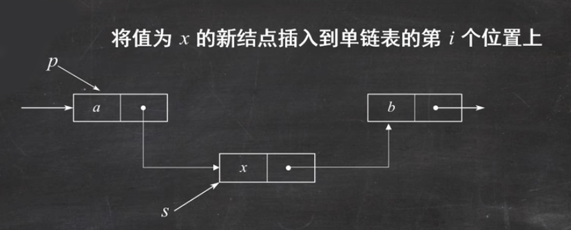

```c
s->next = p->next;
p->next = s;
```

### 删除

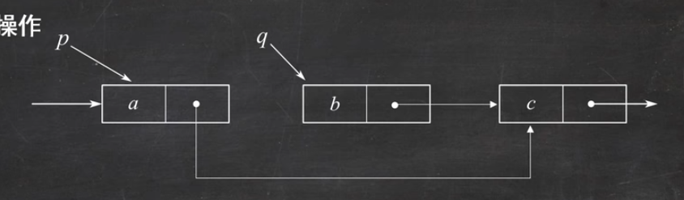

```c
q = p->next;
p->next = q->next;
free(q);
```

## 2.2 双链表

```c
typedef struct DNode {
    ElemType data;
    struct DNode *prior, *next;
}DNode, *DLinkList;
```

### 插入

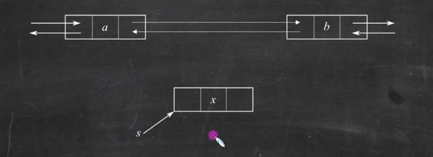

```c
s->next=p->next;
p->next->prior =s;
s->prior=p;
p->next =s;
```

### 删除

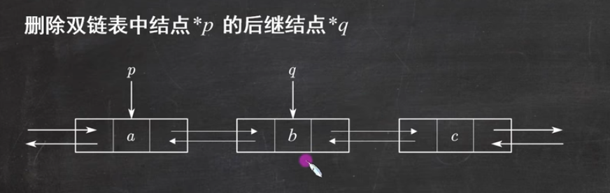

```c
p->next = q->next;
q->next->prior = p;
free(q);
```

## 2.3 循环链表

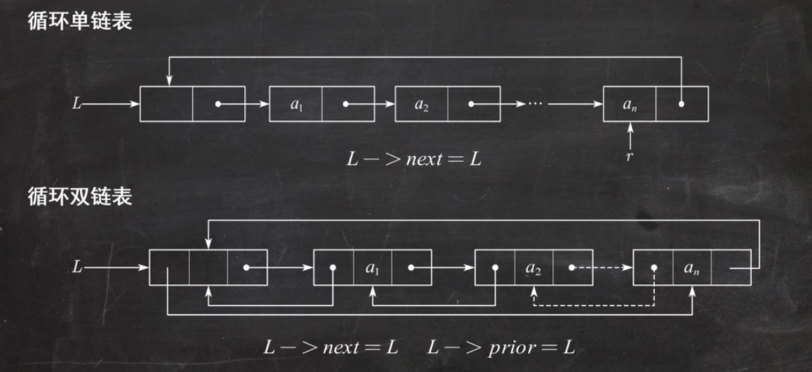


---

# 3 栈


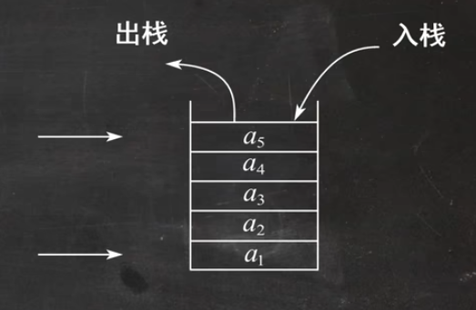

单个不同元素进栈，出栈元素不同排列的个数为：
$$
\frac{1}{n+1} C_{2n}^{n}
$$

## 3.1 顺序栈

```c
#define MaxSize 50
typedef struct {
    ElemType data[MaxSize];
    int top;
} SqStack;
```

### 初始化

```c
void InitStack(SqStack& S) {
    S.top = -1;
}
```

### 判空

```c
bool StackEmpty(SqStack S) {
    if (S.top == -1) return true;
    else return false;
}
```

### 进栈

```c
bool Push(SqStack& S, ElemType x)
{
    if (S.top == MaxSize - 1) // 判断是否栈满
        return false;
    S.data[++S.top] = x; // 栈顶指针先加1，再送值到栈顶元素
    return true;
}
```

### 出栈

```c
bool Pop(SqStack& S, ElemType& x)
{
    if (S.top == -1)
        return false;
    x = S.data[S.top--]; // 先取栈顶元素值，再将栈顶指针减1
    return true;
}
```

### 读栈顶元素

```c
bool GetTop(SqStack S, ElemType& x)
{
    if (S.top == -1)
        return false;
    x = S.data[S.top];
    return true;
}
```

## 3.2 链式栈

```c
typedef struct LinkNode {
    ElemType data;
    struct LinkNode* next;
}* LiStack;
```
## 3.3 共享栈

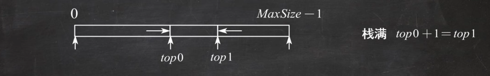

---

# 4 队列

## 4.1 队列

```c
#define MaxSize 50
typedef struct {
    ElemType data[MaxSize];
    int front, rear;
} SqQueue;
```

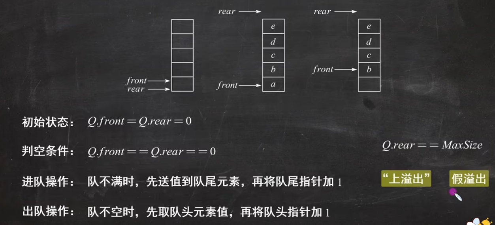

## 4.2 循环队列

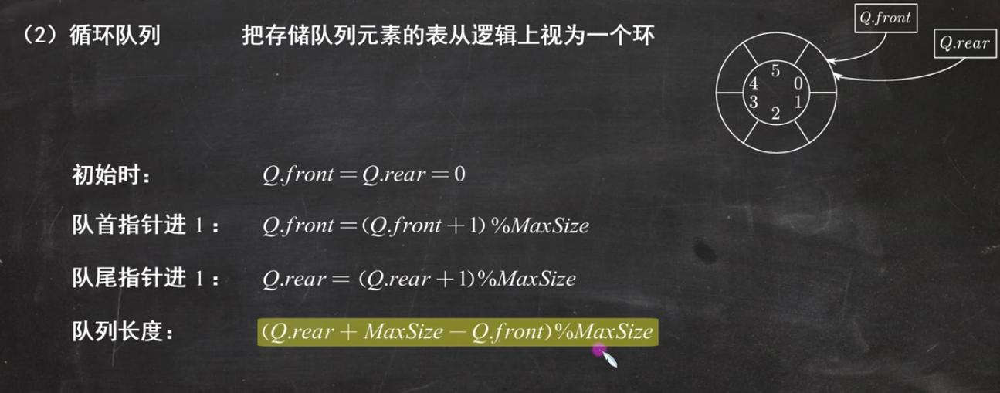

**队空条件**：`Q.front == Q.rear`

**队满条件**：`(Q.rear + 1) % MaxSize == Q.front`（牺牲一个单元来区分队空和队满）

**队列中元素的个数**：`(Q.rear - Q.front + MaxSize) % MaxSize`


---

# 5 串和矩阵

## 5.1 串的基本操作

| 函数名                            | 操作说明                                       |
| ------------------------------ | ------------------------------------------ |
| `StrCopy(&T, S)`               | 复制串 `S` 到串 `T`                             |
| `StrEmpty(S)`                  | 判断串 `S` 是否为空串                              |
| `StrCompare(T, S)`             | 比较串 `T` 和串 `S` 的大小（按ASCII码比较）              |
| `StrLength(S)`                 | 返回串 `S` 的长度                                |
| `SubString(&Sub, S, pos, len)` | 从串 `S` 的 `pos` 位置开始，截取长度为 `len` 的子串到 `Sub` |
| `Concat(&T, S1, S2)`           | 将串 `S1` 和串 `S2` 连接成新串 `T`                  |
| `Index(S, T)`                  | 返回子串 `T` 在串 `S` 中首次出现的位置（若不存在则返回 0）        |
|                                |                                            |

## 5.2 矩阵的压缩存储


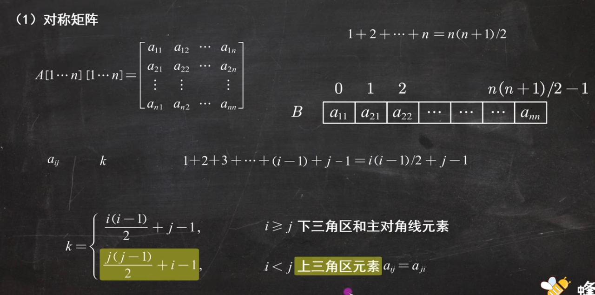

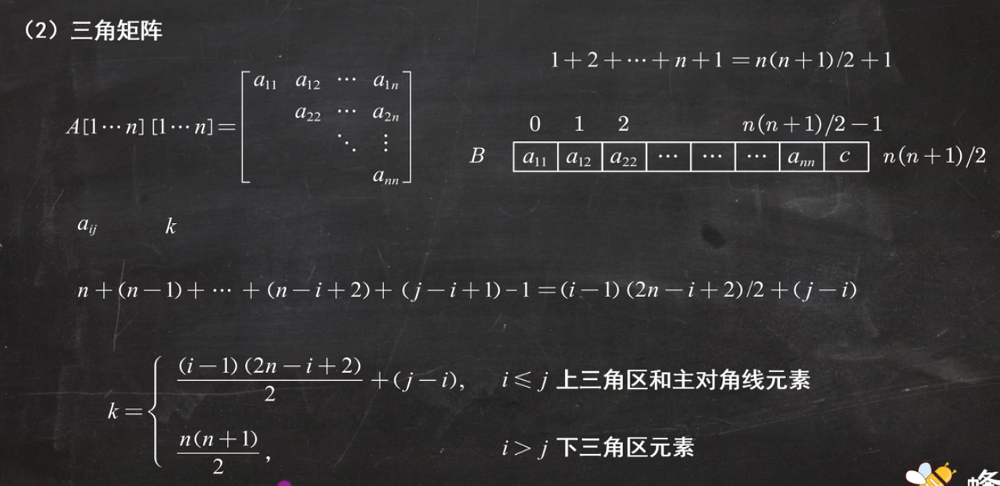

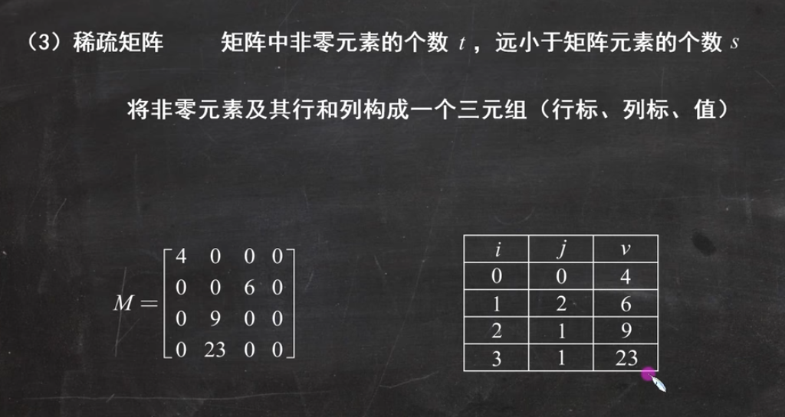


---

# 6 树

## 6.1 树的基本性质

1. 树中的结点数等于所有结点的度数加 1。  
   （每个结点对子结点的度数贡献 1，根结点额外计算）

2. 度为 $m$ 的树中第 $i$ 层上至多有 $m^{i-1}$ 个结点。

3. 高度为 $h$ 的 $m$ 叉树的结点个数至多为： 
$$
   1 + m + m^2 + \cdots + m^{h-1}=\frac{m^h - 1}{m - 1}
   $$

4. 具有 $n$ 个结点的 $m$ 叉树的最小高度为：$\lceil \log_m (n(m-1)+1) \rceil$
$$
(m^h - 1)/(m - 1) = n
$$
## 6.2 二叉树

### 6.2.1 特殊的二叉树

1. 满二叉树：结点数为：$2^h-1$
	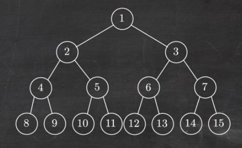

2. 完全二叉树：在满二叉树的基础上，去掉最右边的若干个叶子结点
	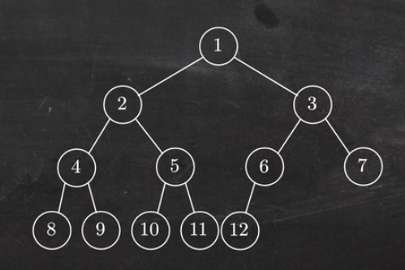

3. 平衡二叉树：树上任一结点的左子树和右子树的深度之差绝对值不超过1

### 6.2.2 性质

1. 非空二叉树上的叶子结点数等于度为 2 的结点数加 1，即 $n_0 = n_2 + 1$
	$n = n_0 + n_1 + n_2$
	$n = 0 \times n_0 + 1 \times n_1 + 2 \times n_2 + 1$

2. 非空二叉树上第 $k$ 层上至多有 $2^{k-1}$ 个结点

3. 高度为 $h$ 的二叉树至多有 $2^h - 1$ 个结点

4. 编号为 $i$ 的结点，他的双亲结点编号为 $\left\lfloor i/2 \right\rfloor$（向下取整）

### 6.2.3 存储结构

1. **顺序存储结构：**
	指用一组地址连续的存储单元依次自上而下、自左至右存储完全二叉树的结点元素，即将完全二叉树上编号为 $i$ 的结点元素存储在一维数组下标 $i-1$ 的分量中。
	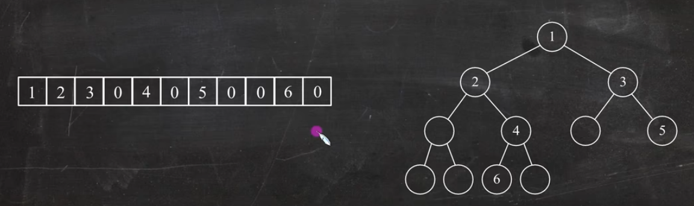

2. **链式存储：**
	
	**注：在含有 $n$ 个结点的二叉链表中，含有 $n+1$ 个空链域，含有 $n-1$ 个非空链域
	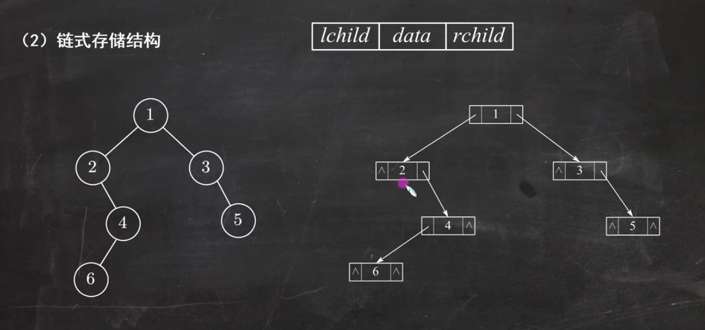
	
```c
typedef struct BiTNode {
    ElemType data;
    struct BiTNode *lchild, *rchild;
} BiTNode, *BiTree;
```

在含有n个结点的二叉链表中，含有n+1个空链域，含有n-1个非空链域

### 6.2.4 遍历

#### 1. 先序遍历（NLR)

（1）访问根结点
（2）先序遍历左子树
（3）先序遍历右子树

```c
void PreOrder(BiTree T)
{
    if (T != NULL) {
        visit(T);
        PreOrder(T->lchild);
        PreOrder(T->rchild);
    }
}
```

#### 2. 中序遍历（LNM)

（1）中序遍历左子树
（2）访问根结点
（3）中序遍历右子树

```c
void InOrder(BiTree T)
{
    if (T != NULL) {
        In0rder(T->lchild);
        visit(T);
        In0rder(T->rchild);
    }
}
```

#### 3. 后序遍历（LRN)

（1）后序遍历左子树
（2）后序遍历右子树
（3）访问根结点

```c
void PostOrder(BiTree T)
{
    if (T != NULL) {
        PostOrder(T->lchild);
        PostOrder(T->rchild);
        visit(T);
    }
}
```

#### 4. 层序遍历

```c
void LevelOrder(BiTree T)
{
    InitQueue(Q);
    BiTNode* p = T;
    EnQueue(Q, p);
    while (!IsEmpty(Q)) {
        DeQueue(Q, p);
        visit(p);
        if (p->lchild != NULL)
            EnQueue(Q, p->lchild);
        if (p->rchiId != NULL)
            EnQueue(Q, p->rchild);
    }
}
```

### 6.2.5 二叉排序树

（1）任一结点的左孩子的值**小于**该结点的值
（2）任一结点的右孩子的值**大于**该结点的值

**对二叉排序树进行中序遍历，可以得到升序的结果

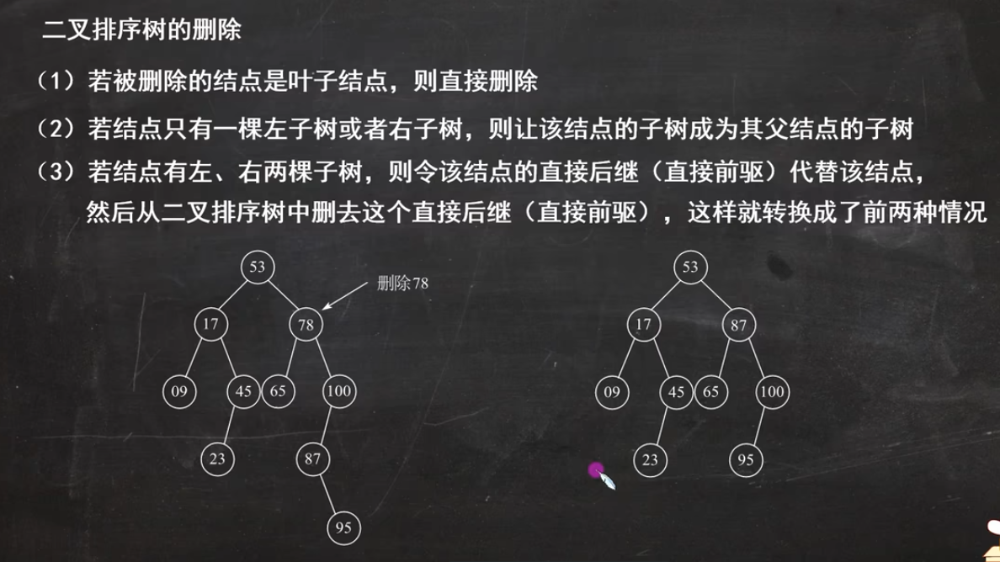

### 6.2.6 哈夫曼树

#### 1. 性质

**结点带权路径长度**：从树的根到任意结点的路径长度与该结点上权值的乘积
**树的带权路径长度**：树中所有叶结点的带权路径长度之和，记为 $WPL$
**哈夫曼树**：带权路径长度最小的二叉树（最优二叉树）

#### 2. 构造

例：设 $a, b, c, d, e$ 的权值分别为 $4,7,5,2,9$，构造哈夫曼树，要求左孩子小于右孩子。

（1）选取最小的两个数 $2,4$ 作为子节点，将他们的和作为根节点
	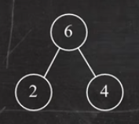

（2）将根节点 $6$ 添加进入权值序列中，并删除 $2,4$，得到 $6,7,5,9$

（3）重复 (1)(2) 操作，直至权值序列中仅剩1个
	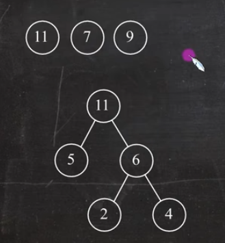
	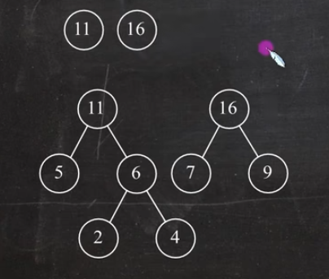
	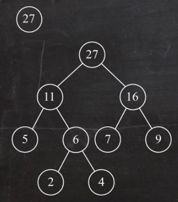

#### 3. 求哈弗曼编码

左孩子标为0，右孩子标为1
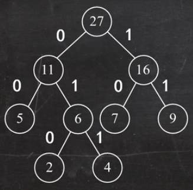

各字符对应的哈夫曼编码：
	$a(4)：011$
	$b(7)：10$
	$c(5)：00$
	$d(2)：010$
	$e(9)：11$

#### 4. 译码

译码 11000111000101011：

```
 11 00 011 10 00 10 10 11
 e  c  a   b  c  b  b  e
 ```
 
 得：ecabcbbe

#### 5. 求带权路径长度

即各叶子结点的 $\text{权重}×\text{路径长度}$ 之和：

$$
WPL= 5×2+2×3+4×3+7×2+9×2=60
$$

## 6.3 树与森林

### 6.3.1 转化

#### 将树转换成二叉树

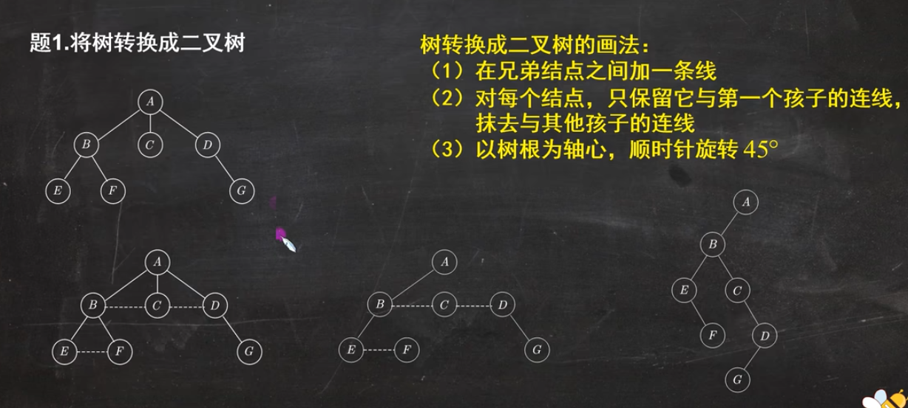

**注：由树转换成二叉树，其根结点的右子树总是空的

#### 将森林转化为二叉树

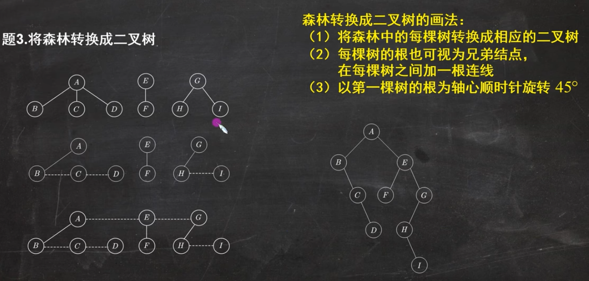

#### 将二叉树转化为森林

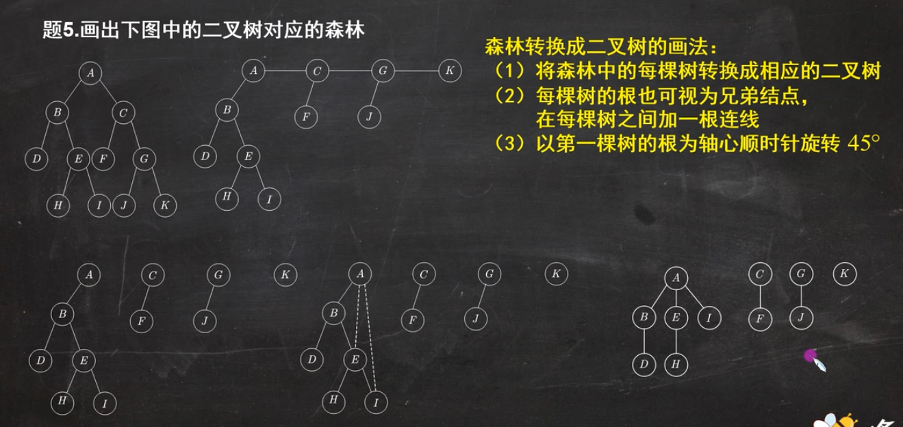

### 6.3.2 遍历

#### 先根遍历

顺序：先根后子树，等同于二叉树的**先序遍历**

#### 后根遍历

顺序：先子树后根，等同于二叉树的**中序遍历**


---

# 7 图

## 7.1 基本概念

#### 1. 有向图 $<u,v>$

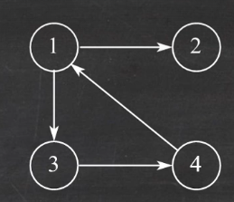

#### 2. 无向图 $(u,v)$  $(v,u)$

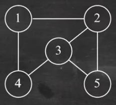

#### 3. 简单图

- 不存在重复边
- 不存在顶点到自身的边

#### 4. 多重图

除简单图以外的其他图

#### 5. 完全图（简单完全图）

- **无向完全图**：任意两个顶点之间都存在边  
$$
边数 = \frac{n(n-1)}{2}
$$

- **有向完全图**：任意两个顶点之间都存在方向相反的两条弧  
$$
边数 = n (n-1)
$$

#### 6. 子图与生成子图

- **子图**：从原图中选取部分顶点及相关的边构成的图。
- **生成子图**：包含原图全部顶点，但只包含部分边的子图。

#### 7. 连通性

- **连通**：图中两个顶点之间存在路径。
- **连通图**：图中任意两个顶点都是连通的。

#### 8. 极小连通子图

既要保持图连通又要使得边数最少的子图。

#### 9. 生成树

包含图中全部顶点的一个极小连通子图。

#### 10. 顶点的度、入度和出度

- **无向图**：全部顶点的度的和等于边数的两倍。

- **有向图**：
  - 顶点的度等于入度与出度之和。
  - 所有顶点的入度之和与出度之和相等，并且等于边数。

#### 11. 边的权和网

带有权值的图（带权图）称为**网**。

## 7.2 存储结构

邻接矩阵法、邻接表法、十字链表法、邻接多重表法

#### 1. 邻接矩阵法 $O(V^2)$

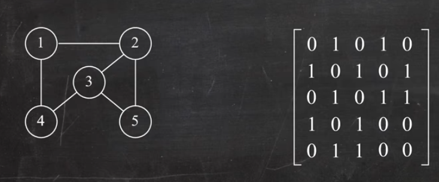

 **空间复杂度为 $O(V^2)$
 
#### 2. 邻接表法 

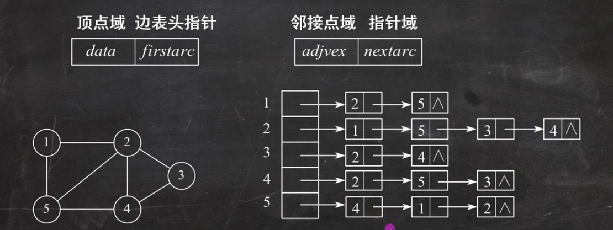

**空间复杂度：
- 无向图 $O(V+2E)$
- 有向图 $O(V+E)$

**邻接表的特点：
- 对于稀疏图，采用邻接表法能极大地节省存储空间。
- 图的邻接表表示不唯一。
- 在有向图的邻接表中，求一个给定顶点的出度只需计算其邻接表中的结点个数。

## 7.3 遍历

深度优先和广度优先