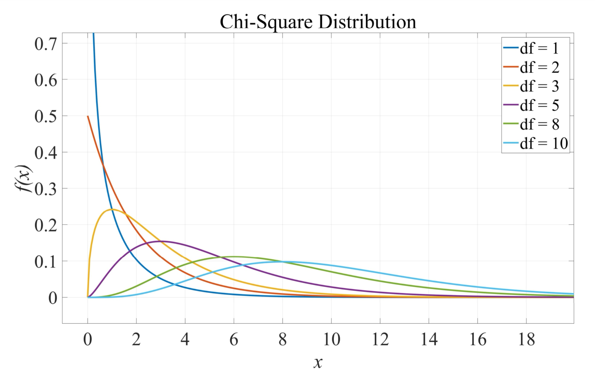
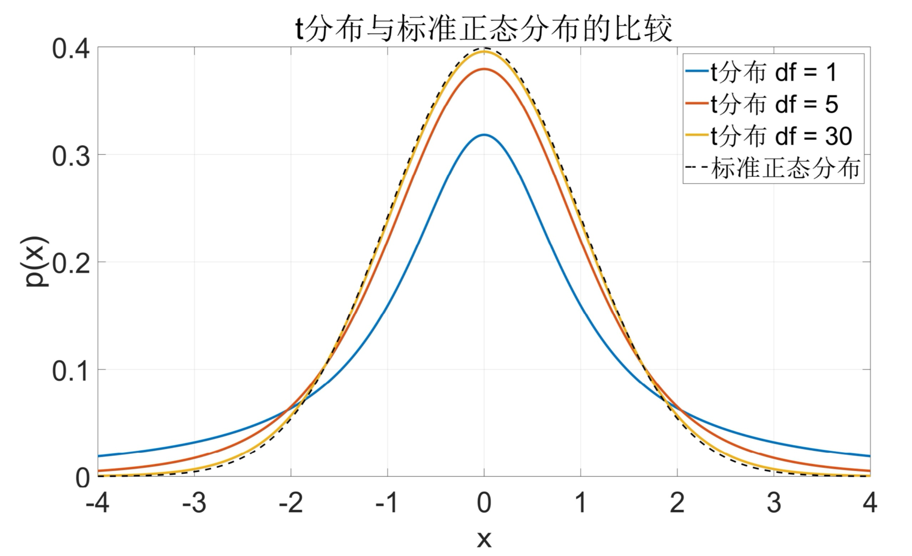
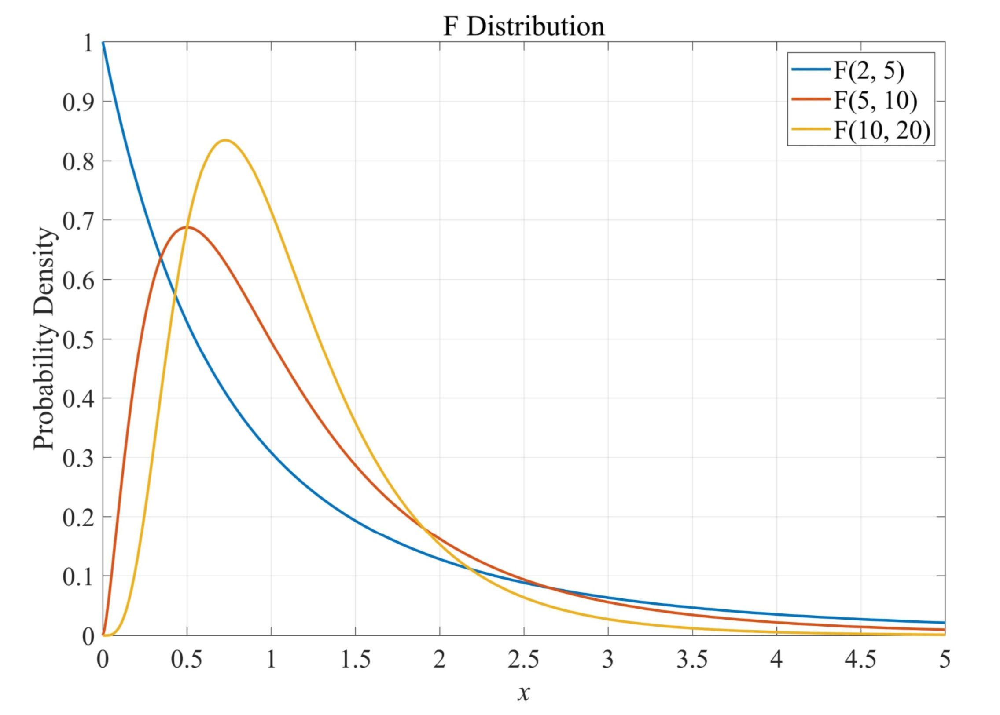

# 数理统计

## 样本统计量

从总体中抽出 $n$ 个独立同分布的个体 $X_1, X_2, \cdots, X_n$，记为样本（样本容量为 $n$）。  

样本均值：
$$
\bar{X} = \frac{1}{n} \sum_{i=1}^n X_i
$$

样本方差：
$$
S^2 = \frac{1}{n-1} \sum_{i=1}^n (X_i - \bar{X})^2
$$

## 三大抽样分布

### 1. $\chi^2$ 卡方分布  

  $n$ 个标准正态量的平方和 

$$
X = X_1^2 + X_2^2 + \cdots + X_n^2,\quad X_i \sim N(0,1) \quad
$$
相互独立

### 2. $t$ 分布  

$$
X = \frac{X_1}{\sqrt{X_2/n}}, \quad X_1 \sim N(0,1), \quad X_2 \sim \chi^2(n)
$$
  

### 3. $F$ 分布  

$$
X = \frac{X_1/n_1}{X_2/n_2}, \quad X_1 \sim \chi^2(n_1), \quad X_2 \sim \chi^2(n_2)
$$

