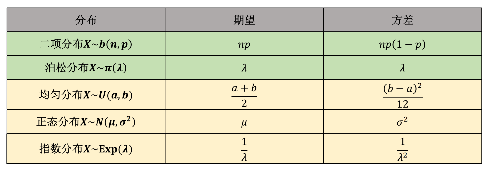

# 期望、方差、中心极限定理

## 期望

（1）离散随机变量  
$$
E(X) = \sum_{i=1}^{n} X_i P(X = X_i)
$$

（2）一维连续随机变量 $X$，其概率密度为 $f(x)$，期望值计算公式为：  
$$
E(X) = \int_{-\infty}^{+\infty} f(x) \cdot x \, dx
$$

（3）二维连续随机变量 $(X, Y)$，其概率密度为 $f(x, y)$，期望值计算公式为：  
$$
E(X) = \int_{-\infty}^{+\infty} \int_{-\infty}^{+\infty} f(x, y) \cdot x \, dx \, dy
$$
$$
E(Y) = \int_{-\infty}^{+\infty} \int_{-\infty}^{+\infty} f(x, y) \cdot y \, dx \, dy
$$
$$
E(XY) = \int_{-\infty}^{+\infty} \int_{-\infty}^{+\infty} f(x, y) \cdot xy \, dx \, dy
$$

---
## 方差

方差 $D$：用于衡量随机变量的分散程度，方差越大数据越分散。

（1）对于离散随机变量：

$$
D(X) = \text{Var}(X) = \sum_{k=1}^{\infty} [X_k - E(X)]^2 P(X = X_i)
$$

（2）对于连续随机变量 $X$：

$$
D(X) = \text{Var}(X) = \int_{-\infty}^{+\infty} [x - E(X)]^2 f(x) \, dx
$$

标准差（均方差） $\sigma$：$\sigma = \sqrt{D(x)}$

**方差的计算可以转化为 $D(X) = E(X^2) - [E(X)]^2$（内方减外方）

---
## 期望与方差的计算性质

期望值 $E$ 的重要性质：
- $E(CX) = C \cdot E(X),\; E(X + C) = E(X) + C$，$C$ 是常数。
- $E(X + Y) = E(X) + E(Y)$
- 如果 $X, Y$ 是独立变量，则有 $E(XY) = E(X) \cdot E(Y)$

方差 $D$ 的重要性质：
- $D(CX) = C^2 D(X),\; D(X + C) = D(X)$
- $D(X + Y) = D(X) + D(Y) + 2E\{[X - E(X)][Y - E(Y)]\}$；若 $X$ 与 $Y$ 独立，则 $D(X + Y) = D(X) + D(Y)$。

---
## 协方差

$E\{[X - E(X)][Y - E(Y)]\}$ 被称为随机变量 $X$, $Y$ 的协方差，记为 $\text{Cov}(X, Y)$。

1. $\text{Cov}(aX, bY) = ab \cdot \text{Cov}(X, Y)$，其中 $a, b$ 是常数。  
2. $\text{Cov}(X_1 + X_2, Y) = \text{Cov}(X_1, Y) + \text{Cov}(X_2, Y)$  

**协方差的公式还可以等价于:  $\text{Cov}(X, Y) = E(XY) - E(X)E(Y)$

### 协方差的应用：

1. 计算方差：
$$
D(X + Y) = D(X) + D(Y) + 2\text{Cov}(X, Y)
$$

2. 计算相关系数 $\rho_{xy}$ ：

$$
\rho_{xy} = \frac{\text{Cov}(X, Y)}{\sigma(X) \cdot \sigma(Y)} = \frac{E\{[X - E(X)][Y - E(Y)]\}}{\sqrt{D(X)} \sqrt{D(Y)}} = \frac{E(XY) - E(X)E(Y)}{\sqrt{D(X)} \sqrt{D(Y)}}
$$

- $\rho_{xy}$ 的取值介于 $[-1, 1]$ 之间，其越接近 $0$ 说明两者线性相关性越低（$\rho_{xy} = 0$ 则不相关），绝对值越大则越呈线性相关（$-1$ 是负相关，$+1$ 是正相关）。

- **注意：两变量不相关 $\neq$ 两变量独立，不相关不一定独立，但独立一定不相关。
  独立->不相关（相关指的是线性相关）