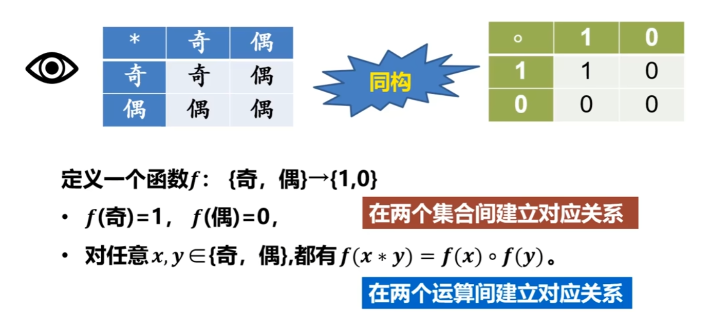
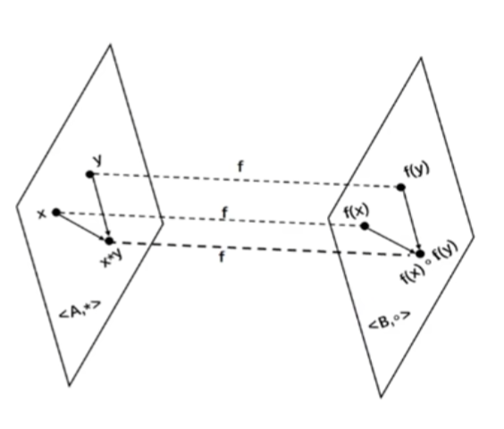
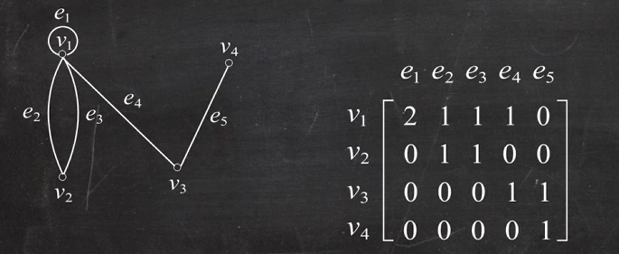
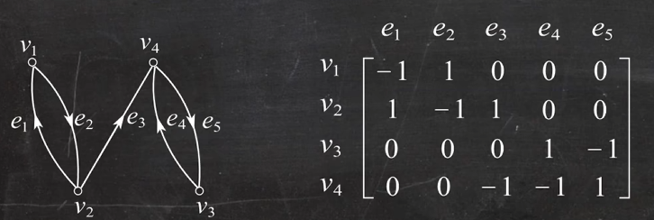
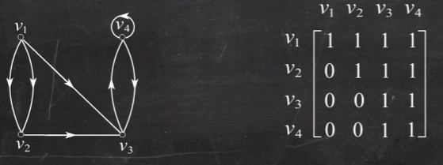

# 1 代数结构

代数系统：由集合和定义在集合上的运算构成

## 1.1 二元运算性质

#### 交换律 
$\forall x,y\in A$，有 $x \circ y = y \circ x$，则称 $\circ$ 满足交换律
#### 结合律
$\forall x,y,z\in A$，有 $(x \circ y) \circ z = x \circ (y \circ z)$，则称 $\circ$ 满足结合律
$\forall x,y,z\in A$，有 $\begin{cases}x \circ (y * z) = (x \circ y) * (x \circ z)\\(y * z) \circ x = (y * x) \circ (z * x)\end{cases}$，则称 $\circ$ 满足结合律
#### 幂等律
$\forall x\in A$，有 $x \circ x = x$，则称 $\circ$ 满足幂等律
$\exists a \in A$， 有 $a \circ a = a$，则称 $a$ 是 $\circ$ 的幂等元
#### 吸收律
$\forall x,y,z\in A$，有 $\begin{cases}x \circ (y * z) = x\\ x * (y \circ z) = x\end{cases}$ ，则称 $\circ$ 和 $*$ 满足吸收律
#### 消去律
$\forall x,y,z\in A$，有：
（1）$x \circ y = x \circ z$ 且 $x\neq\theta$，则 $y=z$
（2）$y \circ x = z \circ x$ 且 $x\neq\theta$，则 $y=z$
称 $\circ$ 满足消去律，其中(1)为左消去律，(2)为右消去律

#### 1. 单位元（幺元）

$\exists e_l, e_r \in A$，对 $\forall x \in A$，有
$$
e_l \circ x = x,\quad x \circ e_r = x
$$
 $e_l$：左单位元（左幺元）；$e_r$：右单位元（右幺元）。 
若 $e_l = e_r \triangleq e$，则 $e$ 为 $\circ$ 的单位元（幺元）。

#### 2. 零元

$\exists \theta_l, \theta_r \in A$，对 $\forall x \in A$，有
$$
\theta_l \circ x = \theta_l,\quad x \circ \theta_r = \theta_r 
$$
 $\theta_l$：左零元；$\theta_r$：右零元。 
 若 $\theta_l = \theta_r \triangleq \theta$，则 $\theta$ 为 $\circ$ 的零元。

#### 3. 逆元

$e$ 为单位元（幺元），$\forall x \in A$，$\exists y_l, y_r \in A$，有 
$$
y_l \circ x = e,\quad x \circ y_r = e 
$$
 $y_l$：左逆元；$y_r$：右逆元。 
 若 $y \triangleq y_l = y_r$，则 $y$ 是 $x$ 的逆元。
 
## 1.2 代数系统

**代数系统需要满足以下条件**：

① 有载体（集合 $A$ ）；② 定义运算 $f_1,f_2, \dots,f_k$；③ 运算在集合 $A$ 上封闭。

### 1. 子代数系统

设 $\langle  V, \circ_1, \dots, \circ_k \rangle$ 是代数系统，若 $B \subseteq V$，$B \neq \emptyset$， 运算 $\circ_1, \circ_2, \dots, \circ_k$ 对 $B$ 封闭，则 $\langle  B, \circ_1, \dots, \circ_k \rangle$ 也是代数系统，称为 $V$ 的**子代数系统**。
(若 $B \subset V$，称为**真**子代数系统)

最大的子代数是其本身，最小的子代数是，最大和最小的子代数统称为 **平凡的子代数**

### 2. 同类型的代数系统

如果两个代数系统中运算的个数相同，对应运算的元数相同，且代数常数的个数也相同，则称这两个代数系统**具有相同的构成成分**，也称它们是**同类型的代数系统**。

### 3. 积代数

设 $V_1=\langle A,\circ\rangle$ 和 $V_2=\langle B,\ast\rangle$ 是同类型的代数系统，$\circ$ 和 $\ast$ 为二元运算，在集合 $A\times B$ 上定义二元运算 $\cdot$ 如下： $$ \forall \langle a_1,b_1\rangle,\langle a_2,b_2\rangle \in A\times B $$ 有 $$ \langle a_1,b_1\rangle \cdot \langle a_2,b_2\rangle = \langle a_1 \circ a_2,\; b_1 \ast b_2\rangle $$ 称 $V=\langle A\times B,\;\cdot\rangle$ 为 $V_1$ 与 $V_2$ 的**积代数**，记作 $V_1\times V_2$。也称 $V_1$ 和 $V_2$ 为 $V$ 的**因子代数**

 **积代数的运算性质**：
 
 1. **运算律继承** 如果 $\circ$ 和 $\ast$ 运算具有可交换（可结合、幂等）性，那么积代数上的 $\cdot$ 运算也具有相同的性质。 
 
 2. **单位元与零元继承** - 若 $e_1$ 和 $e_2$ 分别为 $\circ$ 和 $\ast$ 运算的单位元，则 $\langle e_1,e_2\rangle$ 也是 $\cdot$ 运算的单位元。 
 - 若 $\theta_1$ 和 $\theta_2$ 分别为 $\circ$ 和 $\ast$ 运算的零元，则 $\langle \theta_1,\theta_2\rangle$ 也是 $\cdot$ 运算的零元。 
 
 3. **可逆元素继承** 如果 $x$ 和 $y$ 分别为 $\circ$ 和 $\ast$ 运算的可逆元素，那么 $\langle x,y\rangle$ 也是 $\cdot$ 运算的可逆元素，其逆元为 $\langle x^{-1},y^{-1}\rangle$。

### 4. 同态与同构

 设 $V_1=\langle A,\circ\rangle$ 和 $V_2=\langle B,\ast\rangle$ 是同类型的代数系统，$f:A\to B$，且对任意 $x,y\in A$ 有 $$ f(x\circ y)=f(x)\ast f(y) $$ 则称 $f$ 是 $V_1$ 到 $V_2$ 的**同态映射**，简称为**同态**。

| 分类                    | 核心条件                         | 性质与意义                                       |
| --------------------- | ---------------------------- | ------------------------------------------- |
| 同态 $V_1 \sim V_2$  | $f(x \circ y) = f(x) * f(y)$ | 保持运算的映射，是最基础的定义。                            |
| 单同态                   | 同态 + $f$ 是单射                 | 映射是一一对应的，$V_1$ 可以看作 $V_2$ 的一个"副本"子代数。       |
| 满同态                   | 同态 + $f$ 是满射                 | $V_2$ 是 $V_1$ 的"同态像"，$V_1$ 的运算性质可传递到 $V_2$。 |
| 同构 $V_1 \cong V_2$ | 同态 + $f$ 是双射                 | 两个代数系统在结构上完全相同，仅元素符号和运算符号不同。                |

**定理** 设 $f$ 是 $\langle A,\ast\rangle$ 到 $\langle B,\circ\rangle$ 的同态映射，那么 $\langle f(A),\circ\rangle$ 是 $\langle B,\circ\rangle$ 的子代数。

## 1.3 群

**定义**：半群、群：只有一个二元运算的代数系统

### 1. 半群

设 $V=\langle  S, \circ \rangle$ 是代数系统，$\circ$ 为二元运算。 
1. 若 $\circ$  是可结合的，则称 $V=\langle  S, \circ \rangle$ 是半群；
2. 半群 $V=\langle  S, \circ \rangle$ 中 $\circ$ 运算含有幺元，称 $V$ 为**幺半群 (独异点)**, 记作 $V=\langle  S, \circ, e \rangle$；
3. 半群 $V=\langle  S, \circ \rangle$ 中 $\circ$ 是可交换的，称 $V=\langle  S, \circ \rangle$ 为可交换半群； 
	独异点 $\langle  S, \circ, e \rangle$ 中 $\circ$ 是可交换的，称 $\langle  S, \circ, e \rangle$ 为可交换独异点。

### 2. 群

设 $V=\langle S, \circ \rangle$ 是代数系统，$\circ$ 为二元运算。 
1.  若 $\circ$ 是可结合的，$\exists$ 幺元 $e \in S$，且 $\forall x \in S$，有 $x^{-1} \in S$，称 $V$ 为群，通常记作 $G$。 
2.  群 $V=\langle S, \circ \rangle$ 中 $\circ$ 可交换，称 $V$ 为可交换群（阿贝尔群）

**定理$_1$** 设 $G$ 为群，则 $G$ 中的幂运算满足： 
3. $\forall a \in G,\; (a^{-1})^{-1} = a$ 
4. $\forall a,b \in G,\; (ab)^{-1} = b^{-1}a^{-1}$ 
5. $\forall a \in G,\; a^n a^m = a^{n+m},\; n,m \in \mathbb{Z}$ 
6. $\forall a \in G,\; (a^n)^m = a^{nm},\; n,m \in \mathbb{Z}$ 
7. 若 $G$ 为交换群，则 $(ab)^n = a^n b^n$

**定理$_2$** $G$ 为群，则 $G$ 中满足消去律。

**例**：在 $\mathbb{R}$ 中定义二元运算 $\circ$：$\forall a,b\in\mathbb{R}$，$a\circ b=a+b+ab$。证明：$\langle \mathbb{R}, \circ \rangle$ 构成独异点。

**证**：

1. **封闭性**  
   $\because \forall a,b\in\mathbb{R}$，$a\circ b=a+b+ab\in\mathbb{R}$  
   $\therefore \circ$ 封闭。
- 则 $\langle \mathbb{R}, \circ \rangle$ 是代数系统

2. **结合律**
   $\because$  
$$
   \begin{aligned}
   a\circ(b\circ c) &= a\circ(b+c+bc) \\
           &= a+(b+c+bc)+a(b+c+bc) \\
           &= a+b+c+bc+ab+ac+abc \\
           &= a+b+ab+c+ac+bc+abc \\
           &= (a+b+ab)+c+(a+b+ab)c \\
           &= (a\circ b)\circ c \\
   \end{aligned}
   $$
   $\therefore \circ$ 运算满足结合律。
- 则 $\langle \mathbb{R}, \circ \rangle$ 是半群

2. **单位元**
   对 $0\in\mathbb{R}$，$\forall x\in\mathbb{R}$，有 $0\circ x = 0+x+0\cdot x = x$
   对 $0\in\mathbb{R}$，$\forall x\in\mathbb{R}$，有 $x\circ 0 = x+0+x\cdot 0 = x$
   $\therefore 0$ 为单位元

**综上**，$\langle \mathbb{R}, \circ \rangle$ 构成独异点。

### 3. 子群

若 $\langle G, \circ \rangle$ 和 $\langle H, \circ \rangle$ 都为群，$H\subseteq G$，$H\neq\emptyset$，则称 $H$ 为 $G$ 的**子群**，记作 $H\leq G$。

其中，最小的子群是只含单位元的子群 $\langle \{e\}, \circ \rangle$，最大的子群是群本身 $\langle G, \circ \rangle$
	  两者称为 $\langle G, \circ \rangle$ 的**平凡子群**。

#### (1) 子群的判定条件

$G$ 为群，$H$ 是 $G$ 的非空子集，$H$ 是 $G$ 子群 $\iff$ $\begin{cases} \boldsymbol{①}\ \forall a,b\in H，有\ ab\in H\\ \boldsymbol{②}\ \forall a\in H，有\ a^{-1}\in H \end{cases}$

$G$ 为群，$H$ 是 $G$ 的非空子集，$H$ 是 $G$ 子群 $\iff$ $\forall a,b\in H$，有 $ab^{-1}\in H$ *（最常用）*

$G$ 为群，$H$ 是 $G$ 的非空子集，且 $H$ 是有限集，$H$ 是 $G$ 子群 $\iff$ $\forall a,b\in H$，有 $ab\in H$

#### (2) 生成子群

设 $G$ 是一个群，对 $\forall a\in G$，令 $S=\{a^n\mid n\in\mathbb{Z}\}$，则 $S$ 是 $G$ 的子群，称作由 $a$ 生成的子群，记作 $\langle a \rangle$

$\mathbb{Z}_n=\{0,1,\dots,n-1\}$ $\mathbb{Z}_6=\{0,1,2,3,4,5\}$ 
$\oplus$：模 $n$ 加法，$x\oplus y=(x+y)\mod n$

#### (3) 陪集

设 $\langle G,\ast\rangle$ 是群，$H$ 是其子群。对于 $a \in G$： 
- **左陪集**：$aH = \{a \ast h \mid h \in H\}$，称为 $H$ 相应于 $a$ 的左陪集 
- **右陪集**：$Ha = \{h \ast a \mid h \in H\}$，称为 $H$ 相应于 $a$ 的右陪集
当 $G$ 是交换群时，左、右陪集相等

##### 一、陪集的大小性质

1. 设 $G$ 是群，$H \leq G$，对任意 $a \in G$，左陪集 $aH$ 的基数等于子群 $H$ 的基数：$|aH| = |H|$
2. 同理，对任意 $a \in G$，右陪集 $Ha$ 的基数等于子群 $H$ 的基数：$|Ha| = |H|$。
3. 同一子群的任意两个左（右）陪集的大小相等：$\forall a,b \in G, |aH|=|bH|, |Ha|=|Hb|$。

##### 二、陪集的等价条件（必考核心）

###### 左陪集等价条件

$\forall a,b \in G$，以下命题相互等价：

1. $aH = bH$
2. $b^{-1}a \in H$
3. $a \in bH$
4. $aH \cap bH \neq \varnothing$

###### 右陪集等价条件

$\forall a,b \in G$，以下命题相互等价：

1. $Ha = Hb$
2. $ab^{-1} \in H$
3. $a \in Hb$
4. $Ha \cap Hb \neq \varnothing$

##### 三、陪集的划分性质

1. 群 $G$ 的子群 $H$ 的所有左陪集构成 $G$ 的一个划分：$G = \bigcup_{a\in G}aH$，且若 $aH \neq bH$，则 $aH \cap bH = \varnothing$。
2. 群 $G$ 的子群 $H$ 的所有右陪集构成 $G$ 的一个划分：$G = \bigcup_{a\in G}Ha$，且若 $Ha \neq Hb$，则 $Ha \cap Hb = \varnothing$。
3. 子群 $H$ 的左陪集的个数 = 右陪集的个数，称该个数为 $H$ 在 $G$ 中的**指数**，记作 $[G:H]$。

##### 四、与拉格朗日定理的关联

###### 1. 拉格朗日定理完整结论

设 $G$ 是**有限群**，$H \leq G$，则 $|G| = |H| \cdot [G:H]$。

> 核心含义：有限群的阶，等于其子群的阶 × 子群的指数。

###### 2. 定理与陪集的核心逻辑

$\boldsymbol{Lagrange}$ 定理是陪集性质的直接推论。

推导依据：群 $G$ 被 $H$ 的互不相交的等势左（右）陪集划分，陪集个数为 $[G:H]$，每个陪集大小为 $|H|$，故群的阶为二者乘积。

###### 3. 拉格朗日定理的重要推论

1. 有限群 $G$ 中，任意元素 $a$ 的阶 $|a|$ 是 $|G|$ 的正约数，即 $|a| \mid |G|$。
2. 素数阶群必为循环群，且素数阶群只有两个平凡子群 $\{e\}$ 和 $G$ 本身。
3. 对有限群 $G$，$\forall a \in G$，必有 $a^{|G|}=e$。

#### (4) 正规子群（不变子群）

如果对于所有的 $a \in G$ 都有 $aH = Ha$，那么称 $H$ 为 $G$ 的**正规子群**或**不变子群**，记作 $H \trianglelefteq G$
- 任何群 $G$ 都有正规子群，因为它的两个平凡子群 $\{e\}$ 和 $G$ 都是正规的。

### 4. 循环群

设 $G$ 是群。若存在 $a \in G$，使得 $G = \langle a \rangle = \{ a^n \mid n \in \mathbb{Z} \}$
则称 $G$ 为**循环群**，$a$ 称为 $G$ 的**生成元**。

若 $a$ 是 n 阶元

### 5. 环与域

**定义**：设 $\langle R, +, \cdot\rangle$ 是代数系统，$+$，$\cdot$ 为二元运算。
    若 ① $\langle R, +\rangle$ 为可交换群； ② $\langle R, \cdot\rangle$ 为半群； ③ $\cdot$ 对 $+$ 满足分配律。 
	则称 $\langle R, +, \cdot\rangle$ 为环。

1. 若环 $\langle R, +, \cdot\rangle$ 可交换、含幺、无零因子，称 $R$ 为**整环**。 
2. 若环 $\langle R, +, \cdot\rangle$ 至少含 $2$ 个元素且含幺、无零因子，并且 $\forall a\in R\ (a\neq 0)$ 有 $a^{-1}\in R$，称 $R$ 为**除环**。
3. 若环 $\langle R, +, \cdot\rangle$ 既是整环又是除环，称 $R$ 是**域**。

## 1.4 格与布尔代数

**定义**：设 $\langle S, \preceq\rangle$ 是偏序集，如果 $\forall x,y\in S$，$\{x,y\}$ 都有最小 上界和最大下界，称 $S$ 关于 $\preceq$ 构成一个格。 记为：格 $\langle S, \preceq\rangle$、格 $\langle S, \vee, \wedge\rangle$（$\vee$ 为最小上界，$\wedge$ 为最大下界）

**上下界**：若格 $\langle L, \wedge, \vee\rangle$ 中存在元素 $a$，对 $\forall b\in L$， 有 $a\preceq b$（$b\preceq a$），称 $a$ 为格 $L$ 的全下界（全上界）。

**有界格**：记为：$\langle L, \wedge, \vee, 0, 1\rangle$ （$0$：全下界，$1$：全上界） 

**补元**：对于有界格 $\langle L, \wedge, \vee, 0, 1\rangle$，$\forall a\in L$，若 $\exists b\in L$，使 $a\wedge b=0$，$a\vee b=1$，称 $b$ 为 $a$ 的补元。若每个元素都有补元，则称为有补格。

**分配格**：设 $(L, \vee, \wedge)$ 是一个格。若对任意 $a, b, c \in L$，满足以下两个分配律：
1. $a \wedge (b \vee c) = (a \wedge b) \vee (a \wedge c)$
2. $a \vee (b \wedge c) = (a \vee b) \wedge (a \vee c)$
则称 $L$ 为**分配格**。

**布尔格**：设 $(B, \vee, \wedge, ', 0, 1)$ 是有补分配格，则称 $B$ 为布尔格。

---

# 2 图

## 2.1 图的基本概念

### 1. 度数

无向图：顶点 $v$ 作为边的端点的次数，记作 $d(v)$
有向图：
- 出度：顶点 $v$ 作为边的始点的次数，记作 $d^+(v)$
- 入度：顶点 $v$ 作为边的终点的次数，记作 $d^-(v)$
-  $d(v)=d^+(v)+d^-(v)$

#### 握手定理

在任何图中，所有顶点的度数之和等于边数的2倍

推论：任何图中，奇度顶点的个数是偶数

#### 度数列

最大度：$\Delta(G)$     最小度：$\delta(G)$

非负整数列 $d=(d_1,d_2,\dots,d_n)$ 是可图化的 $\iff\displaystyle\sum_{i=1}^n d_i$ 为偶数。
非负整数列 $d=(d_1,d_2,\dots,d_n)$ 是简单可图化的  $\iff\begin{cases}\displaystyle\sum_{i=1}^n d_i 为偶数\\[8pt] \Delta(G)\le n-1\end{cases}$

### 2. 特殊图 

#### (1) 无向完全图

设 $G$ 为 $n$ 阶无向简单图，若 $G$ 中每个顶点均与其余的 $n-1$ 个顶点相邻，记作 $K_n\ (n\ge 1)$
$K_n\ (n\ge 1)$ 的边的条数为
$$
\frac{n(n-1)}{2}
$$
#### (2) k-正则图

如果一个无向图中 **每个顶点的度数都是 k**，那么这个图就称为 **k-正则图**。

#### (3) 子图与母图

设 $G$，$G'$ 为两个图， 
- 若 $V'\subseteq V$ 且 $E'\subseteq E$，则称 $G'$ 为 $G$ 的**子图**，$G$ 为 $G'$ 的**母图**，记作 $G'\subseteq G$。 
- 若 $V'\subset V$ 或 $E'\subset E$，则称 $G'$ 为 $G$ 的**真子图**。 
- 若 $V'=V$，$E'\subseteq E$，则称 $G'$ 为 $G$ 的**生成子图**。

| 类型   | 顶点集              | 边集                                    | 核心特征                                        |
| ---- | ---------------- | ------------------------------------- | ------------------------------------------- |
| 子图   | $V' \subseteq V$ | $E' \subseteq E$ 且 $E'$ 中边的端点均属于 $V'$ | 定义最宽泛，顶点、边均可取原图的任意子集，满足关联关系即可               |
| 生成子图 | $V' = V$         | $E' \subseteq E$                      | 顶点与原图**完全相同**，仅对边做删减                        |
| 导出子图 | $V' \subseteq V$ | $E'$ 包含原图中**所有**两端点都在 $V'$ 中的边        | 选定顶点子集后，边集是「被迫确定」的，不能增边、不能减边，是顶点子集的「完整关联边集」 |

### 3. 连通

**通路**：无向图 $G$ 中顶点与边的交替序列 $\Gamma = v_{i_0} e_{j_1} v_{i_1} e_{j_2} \dots e_{j_l} v_{i_l}$ 

**回路**：若 $v_{i_0} = v_{i_l}$，则称 $\Gamma$ 为**回路**。

#### (1) 点割集和边割集

**点割集**：删除图中的某些顶点 **以及顶点相邻的边**，图的连通分量数 **增加**。
- **最小点割集**（即最小顶点数能使图不连通）的大小称为**点连通度**，记为 $\kappa(G)$
- 如果 $\kappa(G) \ge k$，那么 $G$ 就是 $k$-连通图。 

**边割集**：删除图中的某些边（**不删除顶点**），图的连通分量数 **增加**。
- **最小边割集**的大小称为**边连通度**，记为 $\lambda(G)$
- 如果 $\lambda(G) \ge r$，那么 $G$ 就是 $r$ 边-连通图。

#### (2) 连通图

设 $G=\langle V,E\rangle$ 是有向图 
- **强连通图**：任意两个结点间是相互可达的 
- **单向连通图**：任意两个结点至少从一个结点到另一个结点是可达的 
- **弱连通图**：在略去有向边的方向后得到的无向图是连通的

**定理** 有向图 $D$ 是强连通图 $\iff$ $D$ 中存在经过每个顶点至少一次的回路

#### (3) 二部图

设无向图 $G=\langle V,E\rangle$，若能将 $V$ 划分成 $V_1$ 和 $V_2$，使得 $G$ 中的每条边的两个端点都是一个属于 $V_1$，另一个属于 $V_2$，则称 $G$ 为**二部图**。 

若 $G$ 是二部图，$V_1$ 中的每个顶点均与 $V_2$ 中的所有顶点相邻，则称 $G$ 为**完全二部图**，记为 $K_{r,s}$，其中 $r=|V_1|$，$s=|V_2|$。 

### 4. 图的矩阵表示

#### (1) 关联矩阵
##### 无向图

##### 有向图
设有向图 $G=\langle V,E\rangle$ 中无环
$$
m_{ij}= \begin{cases} 1, & v_i \text{ 为 } e_j \text{ 的始点} \\ 0, & v_i \text{ 与 } e_j \text{ 不关联} \\ -1, & v_i \text{ 是 } e_j \text{ 的终点} \end{cases} 
$$

#### (2) 邻接矩阵

设 $A$ 为有向图 $D$ 的邻接矩阵，$D$ 的顶点集 $V=\{v_1,v_2,\dots,v_n\}$，则 $A$ 的 $l$ 次幂 $A^l$ 中：

- 元素 $a_{ij}^{(l)}$ 为 $D$ 中 $v_i$ 到 $v_j$ 长度为 $l$ 的通路数 

- $a_{ii}^{(l)}$ 为 $v_i$ 到自身长度为 $l$ 的回路数 

- $\displaystyle\sum_{i=1}^n\sum_{j=1}^n a_{ij}^{(l)}$ 为 $D$ 中长度为 $l$ 的通路（含回路）总数 

- $\displaystyle\sum_{i=1}^n a_{ii}^{(l)}$ 为 $D$ 中长度为 $l$ 的回路总数

**示例**：
$$
A=\begin{bmatrix} 0 & 2 & 1 & 0 \\ 0 & 0 & 1 & 0 \\ 0 & 0 & 0 & 1 \\ 0 & 0 & 1 & 1 \end{bmatrix}, \quad A^2=\begin{bmatrix} 0 & 0 & 2 & 1 \\ 0 & 0 & 0 & 1 \\ 0 & 0 & 1 & 1 \\ 0 & 0 & 1 & 2 \end{bmatrix}, \quad A^3=\begin{bmatrix} 0 & 0 & 1 & 3 \\ 0 & 0 & 1 & 1 \\ 0 & 0 & 1 & 2 \\ 0 & 0 & 2 & 3 \end{bmatrix}, \quad A^4=\begin{bmatrix} 0 & 0 & 3 & 4 \\ 0 & 0 & 1 & 2 \\ 0 & 0 & 2 & 3 \\ 0 & 0 & 3 & 5 \end{bmatrix}
$$

**计算结果**：
- $v_2$ 到 $v_4$ 长度为 $1,2,3,4$ 的通路的条数：$0,1,1,2$ 
- $v_4$ 到自身长度为 $1,2,3,4$ 的回路的条数：$1,2,3,5$ 
- 长度小于等于 $4$ 的通路的条数：$53$ 
- 长度小于等于 $4$ 的回路的条数：$15$

#### (3) 可达矩阵

设 $D=\langle V,E\rangle$ 为有向图，令 $p_{ij}= \begin{cases} 1 & v_i \text{ 可达 } v_j \\ 0 & v_i \text{ 不可达 } v_j \end{cases}$ 

称 $(p_{ij})_{n\times n}$ 为 $D$ 的**可达矩阵**，记作 $P(D)$，简记为 $P$。

### 4. 同构

设 $G_1=\langle V_1,E_1\rangle$，$G_2=\langle V_2,E_2\rangle$ 为两个无向图，若边和顶点均能一一对应，则称 $G_1$ 与 $G_2$ **同构**，记作 $G_1\cong G_2$。

## 2.2 欧拉图与哈密顿图

### 欧拉图

1）欧拉通路：通过图中所有边一次且仅一次的通路
2）欧拉回路：通过图中所有边一次且仅一次的回路
3）欧拉图：具有欧拉回路的图
4）半欧拉图：具有欧拉通路而无欧拉回路的图
5）无向图G是欧拉图 $\iff$ G是连通图 且 没有奇度顶点
6）有向图D是欧拉图 $\iff$ D是强连通图 且 每个顶点的入度等于出度

### 哈密顿图

1）**哈密顿通路**：经过图中所有顶点一次且仅一次的通路 
2）**哈密顿回路**：经过图中所有顶点一次且仅一次的回路 
3）**哈密顿图**：具有哈密顿回路的图 
4）**半哈密顿图**：具有哈密顿通路但不具有哈密顿回路的图 
5）**哈密顿通路**：设 $G$ 是 $n$ 阶无向简单图，若对于 $G$ 中任意不相邻的顶点 $u,v$，均有 $d(u)+d(v)\ge n-1$，则 $G$ 中存在哈密顿通路。 
6）**哈密顿回路**：设 $G$ 是 $n(n\ge 3)$ 阶无向简单图，若对于 $G$ 中任意不相邻的顶点 $u,v$，均有  $d(u)+d(v)\ge n$，则 $G$ 中存在哈密顿回路。

### 最短路径问题

在带权图中，$\forall u,v\in V$，当 $u$ 和 $v$ 连通时，从 $u$ 到 $v$ 长度最短的路径，称其长度为从 $u$ 到 $v$ 的距离，记作 $d(u,v)$ 
- $d(u,u)=0$ 
- 当 $u$ 和 $v$ 不相邻时，$d(u,v)=+\infty$

---

# 3 平面图

## 1. 平面图的基本概念 

1）如果能将无向图 $G$ 画在平面上使得除顶点处外无边相交，则称 $G$ 为**可平面图**，简称为**平面图**。 

- a) $K_1,K_2,K_3,K_4$ 都是平面图，$K_5-e$（$K_5$ 删除任意一条边）也是平面图。 完全二部图 $K_{1,n}\ (n\ge 1)$，$K_{2,n}\ (n\ge 2)$ 也都是平面图。 

- b) $K_5$ 和 $K_{3,3}$ 它们都是非平面图。

2）给定平面图 $G$ 的平面嵌入，$G$ 的边将平面划分成若干个区域，每个区域都称作 $G$ 的一个**面**。 包围每个面的所有边的回路组称作该面的**边界**，边界的长度称作该面的**次数**。 

3）平面图所有面的次数之和等于边数的两倍。 

4）若在非平面图 $G$ 中任意删除一条边，所得的图是平面图，则称 $G$ 是**极小非平面图**。
- 若在简单平面图 $G$ 加一条边，所得图为非平面图，则称 $G$ 为**极大平面图**。

5）设 $G$ 是简单图，$G$ 中每个面指定一个新结点，两个面的公共边指定一条新边与其相交。新点、新边组成的图为 $G$ 的 **对偶图**，记为 $G^*$

## 2. 欧拉公式 

连通平面图 $G$ 的顶点数、边数和面数分别为 $n,m$ 和 $r$，则有 $n - m + r = 2$
- 推广：对于有 $k$ 个连通分支的平面图 $G$，有 $n - m + r = k + 1$

设 $G$ 是 $n(n\ge 3)$ 阶 $m$ 条边的简单平面图，则
$$
m \le 3n - 6
$$

