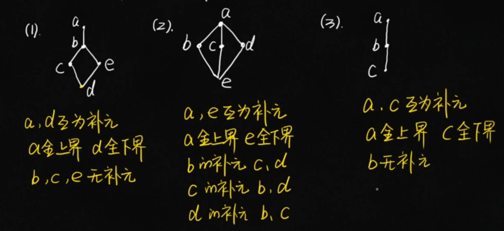
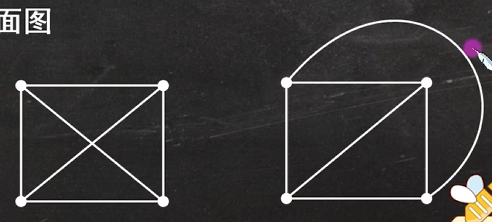

# 1 代数结构

代数系统：由集合和定义在集合上的运算构成

## 1.1 二元运算性质

#### 交换律 
$\forall x,y\in A$，有 $x \circ y = y \circ x$，则称 $\circ$ 满足交换律
#### 结合律
$\forall x,y,z\in A$，有 $(x \circ y) \circ z = x \circ (y \circ z)$，则称 $\circ$ 满足结合律
$\forall x,y,z\in A$，有 $\begin{cases}x \circ (y * z) = (x \circ y) * (x \circ z)\\(y * z) \circ x = (y * x) \circ (z * x)\end{cases}$，则称 $\circ$ 满足结合律
#### 幂等律
$\forall x\in A$，有 $x \circ x = x$，则称 $\circ$ 满足幂等律
$\exists a \in A$， 有 $a \circ a = a$，则称 $a$ 是 $\circ$ 的幂等元
#### 吸收律
$\forall x,y,z\in A$，有 $\begin{cases}x \circ (y * z) = x\\ x * (y \circ z) = x\end{cases}$ ，则称 $\circ$ 和 $*$ 满足吸收律
#### 消去律
$\forall x,y,z\in A$，有：
（1）$x \circ y = x \circ z$ 且 $x\neq\theta$，则 $y=z$
（2）$y \circ x = z \circ x$ 且 $x\neq\theta$，则 $y=z$
称 $\circ$ 满足消去律，其中(1)为左消去律，(2)为右消去律

#### 1. 单位元（幺元）

$\exists e_l, e_r \in A$，对 $\forall x \in A$，有
$$
e_l \circ x = x,\quad x \circ e_r = x
$$
 $e_l$：左单位元（左幺元）；$e_r$：右单位元（右幺元）。 
若 $e_l = e_r \triangleq e$，则 $e$ 为 $\circ$ 的单位元（幺元）。

#### 2. 零元

$\exists \theta_l, \theta_r \in A$，对 $\forall x \in A$，有
$$
\theta_l \circ x = \theta_l,\quad x \circ \theta_r = \theta_r 
$$
 $\theta_l$：左零元；$\theta_r$：右零元。 
 若 $\theta_l = \theta_r \triangleq \theta$，则 $\theta$ 为 $\circ$ 的零元。

#### 3. 逆元

$e$ 为单位元（幺元），$\forall x \in A$，$\exists y_l, y_r \in A$，有 
$$
y_l \circ x = e,\quad x \circ y_r = e 
$$
 $y_l$：左逆元；$y_r$：右逆元。 
 若 $y \triangleq y_l = y_r$，则 $y$ 是 $x$ 的逆元。
 
## 1.2 代数系统

**代数系统需要满足以下条件**：

① 有载体（集合 $A$ ）；② 定义运算 $f_1,f_2, \dots,f_k$；③ 运算在集合 $A$ 上封闭。

设 $\langle  A, \circ_1, \dots, \circ_k \rangle$ 是代数系统，若 $B \subseteq A$，$B \neq \emptyset$， 运算 $\circ_1, \circ_2, \dots, \circ_k$ 对 $B$ 封闭，则 $\langle  B, \circ_1, \dots, \circ_k \rangle$ 也是代数系统，称为 $\langle  A, \circ_1, \dots, \circ_k \rangle$ 的**子代数系统**。
(若 $B \subset A$，称为**真**子代数系统)

## 1.3 群

#### 定义

半群、群：只有一个二元运算的代数系统

### 1. 半群

设 $V=\langle  S, \circ \rangle$ 是代数系统，$\circ$ 为二元运算。 
1. 若 $\circ$  是可结合的，则称 $V=\langle  S, \circ \rangle$ 是半群；
2. 半群 $V=\langle  S, \circ \rangle$ 中 $\circ$ 运算含有幺元，称 $V$ 为**含幺半群 (独异点)**, 记作 $V=\langle  S, \circ, e \rangle$；
3. 半群 $V=\langle  S, \circ \rangle$ 中 $\circ$ 是可交换的，称 $V=\langle  S, \circ \rangle$ 为可交换半群； 
	独异点 $\langle  S, \circ, e \rangle$ 中 $\circ$ 是可交换的，称 $\langle  S, \circ, e \rangle$ 为可交换独异点。

### 2. 群

设 $V=\langle S, \circ \rangle$ 是代数系统，$\circ$ 为二元运算。 
1.  若 $\circ$ 是可结合的，$\exists$ 幺元 $e \in S$，且 $\forall x \in S$，有 $x^{-1} \in S$，称 $V$ 为群，通常记作 $G$。 
2.  群 $V=\langle S, \circ \rangle$ 中 $\circ$ 可交换，称 $V$ 为可交换群（阿贝尔群）。

**例$_2$**：在 $\mathbb{R}$ 中定义二元运算 $\circ$：$\forall a,b\in\mathbb{R}$，$a\circ b=a+b+ab$。证明：$\langle \mathbb{R}, \circ \rangle$ 构成独异点。

**证**：

1. **封闭性**  
   $\because \forall a,b\in\mathbb{R}$，$a\circ b=a+b+ab\in\mathbb{R}$  
   $\therefore \circ$ 封闭。
- 则 $\langle \mathbb{R}, \circ \rangle$ 是代数系统

2. **结合律**
   $\because$  
$$
   \begin{aligned}
   a\circ(b\circ c) &= a\circ(b+c+bc) \\
           &= a+(b+c+bc)+a(b+c+bc) \\
           &= a+b+c+bc+ab+ac+abc \\
           &= a+b+ab+c+ac+bc+abc \\
           &= (a+b+ab)+c+(a+b+ab)c \\
           &= (a\circ b)\circ c \\
   \end{aligned}
   $$
   $\therefore \circ$ 运算满足结合律。
- 则 $\langle \mathbb{R}, \circ \rangle$ 是半群

2. **单位元**
   对 $0\in\mathbb{R}$，$\forall x\in\mathbb{R}$，有 $0\circ x = 0+x+0\cdot x = x$
   对 $0\in\mathbb{R}$，$\forall x\in\mathbb{R}$，有 $x\circ 0 = x+0+x\cdot 0 = x$
   $\therefore 0$ 为单位元

**综上**，$\langle \mathbb{R}, \circ \rangle$ 构成独异点。

### 3. 子群

若 $\langle G, \circ \rangle$ 和 $\langle H, \circ \rangle$ 都为群，$H\subseteq G$，$H\neq\emptyset$，则称 $H$ 为 $G$ 的**子群**，记作 $H\leq G$。

其中，最小的子群是只含单位元的子群 $\langle \{e\}, \circ \rangle$，最大的子群是群本身 $\langle G, \circ \rangle$
	  两者称为 $\langle G, \circ \rangle$ 的**平凡子群**。

#### 子群的判定条件

$G$ 为群，$H$ 是 $G$ 的非空子集，$H$ 是 $G$ 子群 $\iff$ $\begin{cases} \boldsymbol{①}\ \forall a,b\in H，有\ ab\in H\\ \boldsymbol{②}\ \forall a\in H，有\ a^{-1}\in H \end{cases}$

$G$ 为群，$H$ 是 $G$ 的非空子集，$H$ 是 $G$ 子群 $\iff$ $\forall a,b\in H$，有 $ab^{-1}\in H$ *（最常用）*

$G$ 为群，$H$ 是 $G$ 的非空子集，且 $H$ 是有限集，$H$ 是 $G$ 子群 $\iff$ $\forall a,b\in H$，有 $ab\in H$

#### 生成子群

设 $G$ 是一个群，对 $\forall a\in G$，令 $S=\{a^n\mid n\in\mathbb{Z}\}$，则 $S$ 是 $G$ 的子群，称作由 $a$ 生成的子群，记作 $\langle a \rangle$

$\mathbb{Z}_n=\{0,1,\dots,n-1\}$ $\mathbb{Z}_6=\{0,1,2,3,4,5\}$ 
$\oplus$：模 $n$ 加法，$x\oplus y=(x+y)\mod n$

### 4. 循环群

设 $G$ 是群。若存在 $a \in G$，使得 $G = \langle a \rangle = \{ a^n \mid n \in \mathbb{Z} \}$
则称 $G$ 为**循环群**，$a$ 称为 $G$ 的**生成元**。

若 $a$ 是 n 阶元

### 5. 环与域

**定义**：设 $\langle R, +, \cdot\rangle$ 是代数系统，$+$，$\cdot$ 为二元运算。
    若 ① $\langle R, +\rangle$ 为可交换群； ② $\langle R, \cdot\rangle$ 为半群； ③ $\cdot$ 对 $+$ 满足分配律。 
	则称 $\langle R, +, \cdot\rangle$ 为环。

1. 若环 $\langle R, +, \cdot\rangle$ 可交换、含幺、无零因子，称 $R$ 为**整环**。 
2. 若环 $\langle R, +, \cdot\rangle$ 至少含 $2$ 个元素且含幺、无零因子，并且 $\forall a\in R\ (a\neq 0)$ 有 $a^{-1}\in R$，称 $R$ 为**除环**。
3. 若环 $\langle R, +, \cdot\rangle$ 既是整环又是除环，称 $R$ 是**域**。

## 1.4 格与布尔代数

**定义**：设 $\langle S, \preceq\rangle$ 是偏序集，如果 $\forall x,y\in S$，$\{x,y\}$ 都有最小 上界和最大下界，称 $S$ 关于 $\preceq$ 构成一个格。 记为：格 $\langle S, \preceq\rangle$、格 $\langle S, \vee, \wedge\rangle$（$\vee$ 为最小上界，$\wedge$ 为最大下界）

**上下界**：若格 $\langle L, \wedge, \vee\rangle$ 中存在元素 $a$，对 $\forall b\in L$， 有 $a\preceq b$（$b\preceq a$），称 $a$ 为格 $L$ 的全下界（全上界）。

**有界格**：记为：$\langle L, \wedge, \vee, 0, 1\rangle$ （$0$：全下界，$1$：全上界） 

**补元**：对于有界格 $\langle L, \wedge, \vee, 0, 1\rangle$，$\forall a\in L$，若 $\exists b\in L$，使 $a\wedge b=0$，$a\vee b=1$，称 $b$ 为 $a$ 的补元。若每个元素都有补元，则称为有补格。

**分配格**：设 $(L, \vee, \wedge)$ 是一个格。若对任意 $a, b, c \in L$，满足以下两个分配律：
1. $a \wedge (b \vee c) = (a \wedge b) \vee (a \wedge c)$
2. $a \vee (b \wedge c) = (a \vee b) \wedge (a \vee c)$
则称 $L$ 为**分配格**。

**布尔格**：设 $(B, \vee, \wedge, ', 0, 1)$ 是有补分配格，则称 $B$ 为布尔格。

---

# 2 图

## 2.1 图的基本概念

#### 1. 度数

无向图：顶点 $v$ 作为边的端点的次数，记作 $d(v)$
有向图：
- 出度：顶点 $v$ 作为边的始点的次数，记作 $d^+(v)$
- 入度：顶点 $v$ 作为边的终点的次数，记作 $d^-(v)$
-  $d(v)=d^+(v)+d^-(v)$

#### 2. 握手定理

在任何图中，所有顶点的度数之和等于边数的2倍

推论：任何图中，奇度顶点的个数是偶数

#### 3. 度数列

最大度：$\Delta(G)$     最小度：$\delta(G)$

非负整数列 $d=(d_1,d_2,\dots,d_n)$ 是可图化的 $\iff\displaystyle\sum_{i=1}^n d_i$ 为偶数。
非负整数列 $d=(d_1,d_2,\dots,d_n)$ 是简单可图化的  $\iff\begin{cases}\displaystyle\sum_{i=1}^n d_i 为偶数\\[8pt] \Delta(G)\le n-1\end{cases}$

#### 4. 无向完全图 

设 $G$ 为 $n$ 阶无向简单图，若 $G$ 中每个顶点均与其余的 $n-1$ 个顶点相邻，记作 $K_n\ (n\ge 1)$
$K_n\ (n\ge 1)$ 的边的条数为
$$
\frac{n(n-1)}{2}
$$

#### 5. 通路与回路

**通路**：无向图 $G$ 中顶点与边的交替序列 $\Gamma = v_{i_0} e_{j_1} v_{i_1} e_{j_2} \dots e_{j_l} v_{i_l}$ 

若 $v_{i_0} = v_{i_l}$，则称 $\Gamma$ 为**回路**。

## 2.2 欧拉图与哈密顿图

### 欧拉图

1）欧拉通路：通过图中所有边一次且仅一次的通路
2）欧拉回路：通过图中所有边一次且仅一次的回路
3）欧拉图：具有欧拉回路的图
4）半欧拉图：具有欧拉通路而无欧拉回路的图
5）无向图G是欧拉图当且仅当G是连通图且没有奇度顶点
6）有向图D是欧拉图当且仅当D是强连通图的且每个顶点的入度等于出度

### 哈密顿图

1）**哈密顿通路**：经过图中所有顶点一次且仅一次的通路 
2）**哈密顿回路**：经过图中所有顶点一次且仅一次的回路 
3）**哈密顿图**：具有哈密顿回路的图 
4）**半哈密顿图**：具有哈密顿通路但不具有哈密顿回路的图 
5）**哈密顿通路**：设 $G$ 是 $n$ 阶无向简单图，若对于 $G$ 中任意不相邻的顶点 $u,v$，均有 $d(u)+d(v)\ge n-1$，则 $G$ 中存在哈密顿通路。 
6）**哈密顿回路**：设 $G$ 是 $n(n\ge 3)$ 阶无向简单图，若对于 $G$ 中任意不相邻的顶点 $u,v$，均有  $d(u)+d(v)\ge n$，则 $G$ 中存在哈密顿回路。

### 最短路问题

在带权图中，$\forall u,v\in V$，当 $u$ 和 $v$ 连通时，从 $u$ 到 $v$ 长度最短的路径，称其长度为从 $u$ 到 $v$ 的距离，记作 $d(u,v)$ 
- $d(u,u)=0$ 
- 当 $u$ 和 $v$ 不相邻时，$d(u,v)=+\infty$

---

# 3 平面图

## 1. 平面图的基本概念 

1）设无向图 $G=\langle V,E\rangle$，若能将 $V$ 划分成 $V_1$ 和 $V_2$（即 $V_1\cup V_2=V$，$V_1\cap V_2=\emptyset$ 且 $V_1\neq\emptyset$，$V_2\neq\emptyset$），使得 $G$ 中的每条边的两个端点都是一个属于 $V_1$，另一个属于 $V_2$，则称 $G$ 为**二部图**。 
若 $G$ 是二部图，$V_1$ 中的每个顶点均与 $V_2$ 中的所有顶点相邻，则称 $G$ 为**完全二部图**，记为 $K_{r,s}$，其中 $r=|V_1|$，$s=|V_2|$。 

2）如果能将无向图 $G$ 画在平面上使得除顶点处外无边相交，则称 $G$ 为**可平面图**，简称为**平面图**。 
a) $K_1,K_2,K_3,K_4$ 都是平面图，$K_5-e$（$K_5$ 删除任意一条边）也是平面图。 完全二部图 $K_{1,n}\ (n\ge 1)$，$K_{2,n}\ (n\ge 2)$ 也都是平面图。 
b) $K_5$ 和 $K_{3,3}$ 它们都是非平面图。

3）给定平面图 $G$ 的平面嵌入，$G$ 的边将平面划分成若干个区域，每个区域都称作 $G$ 的一个**面**。 包围每个面的所有边的回路组称作该面的**边界**，边界的长度称作该面的**次数**。 

4）平面图所有面的次数之和等于边数的两倍。 

5）若在非平面图 $G$ 中任意删除一条边，所得的图是平面图，则称 $G$ 是**极小非平面图**。 $K_5$ 和 $K_{3,3}$ 都是极小非平面图。

6）设 $G$ 是简单图，$G$ 中每个面指定一个新结点，两个面的公共边指定一条新边与其相交。新点、新边组成的图为 $G$ 的**对偶图**。
## 2. 欧拉公式 

连通平面图 $G$ 的顶点数、边数和面数分别为 $n,m$ 和 $r$，则有 $n - m + r = 2$

设 $G$ 是 $n(n\ge 3)$ 阶 $m$ 条边的简单平面图，则
$$
m \le 3n - 6
$$

